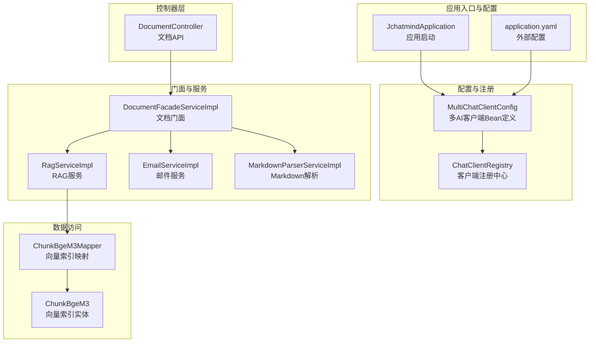
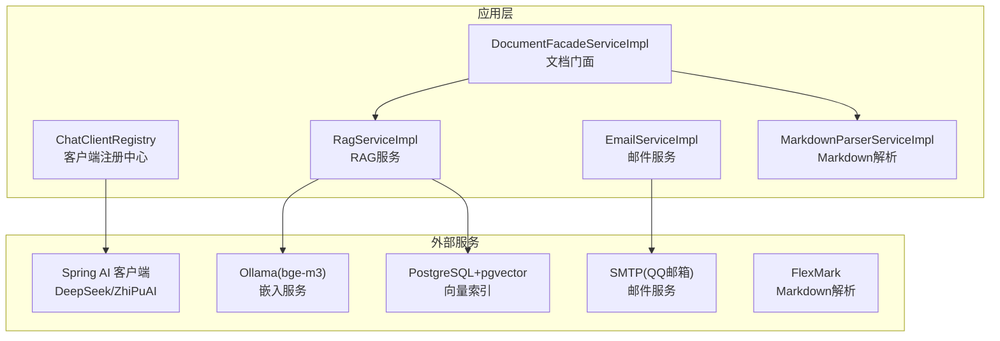
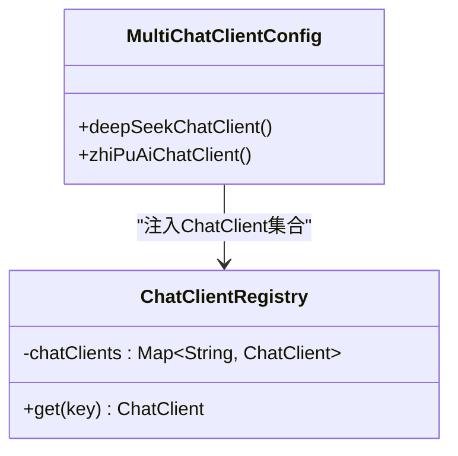
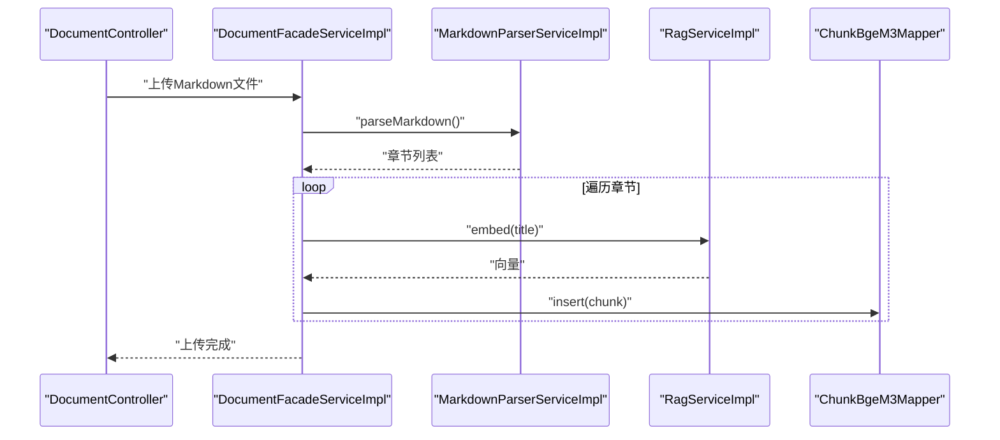
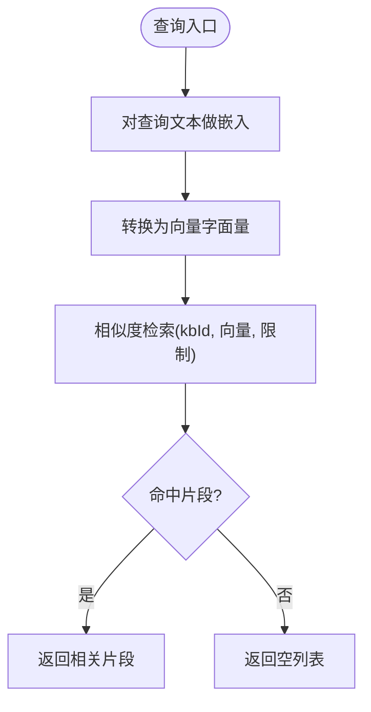
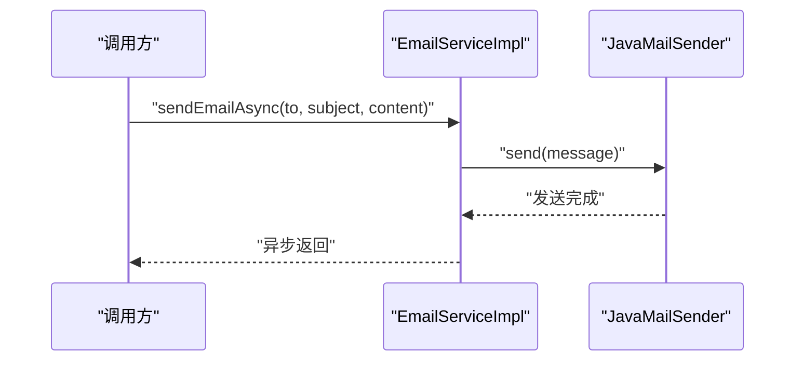
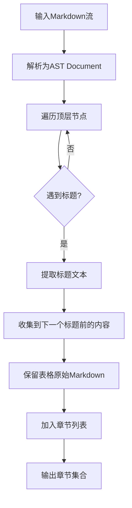
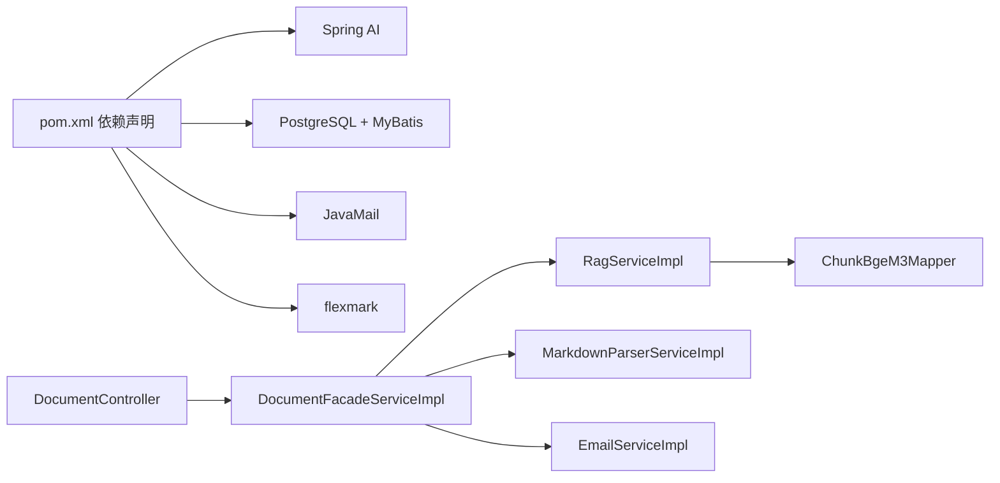

# 集成模式

<cite>
**本文引用的文件**
- [JchatmindApplication.java](file://jchatmind/src/main/java/com/kama/jchatmind/JchatmindApplication.java)
- [application.yaml](file://jchatmind/src/main/resources/application.yaml)
- [MultiChatClientConfig.java](file://jchatmind/src/main/java/com/kama/jchatmind/config/MultiChatClientConfig.java)
- [ChatClientRegistry.java](file://jchatmind/src/main/java/com/kama/jchatmind/config/ChatClientRegistry.java)
- [RagService.java](file://jchatmind/src/main/java/com/kama/jchatmind/service/RagService.java)
- [RagServiceImpl.java](file://jchatmind/src/main/java/com/kama/jchatmind/service/impl/RagServiceImpl.java)
- [ChunkBgeM3Mapper.java](file://jchatmind/src/main/java/com/kama/jchatmind/mapper/ChunkBgeM3Mapper.java)
- [ChunkBgeM3.java](file://jchatmind/src/main/java/com/kama/jchatmind/model/entity/ChunkBgeM3.java)
- [EmailService.java](file://jchatmind/src/main/java/com/kama/jchatmind/service/EmailService.java)
- [EmailServiceImpl.java](file://jchatmind/src/main/java/com/kama/jchatmind/service/impl/EmailServiceImpl.java)
- [MarkdownParserService.java](file://jchatmind/src/main/java/com/kama/jchatmind/service/MarkdownParserService.java)
- [MarkdownParserServiceImpl.java](file://jchatmind/src/main/java/com/kama/jchatmind/service/impl/MarkdownParserServiceImpl.java)
- [DocumentController.java](file://jchatmind/src/main/java/com/kama/jchatmind/controller/DocumentController.java)
- [DocumentFacadeServiceImpl.java](file://jchatmind/src/main/java/com/kama/jchatmind/service/impl/DocumentFacadeServiceImpl.java)
- [pom.xml](file://jchatmind/pom.xml)
</cite>

## 目录
1. [引言](#引言)
2. [项目结构](#项目结构)
3. [核心组件](#核心组件)
4. [架构总览](#架构总览)
5. [详细组件分析](#详细组件分析)
6. [依赖分析](#依赖分析)
7. [性能考虑](#性能考虑)
8. [故障排查指南](#故障排查指南)
9. [结论](#结论)
10. [附录](#附录)

## 引言
本文件面向JChatMind的“集成模式”目标，系统性梳理与外部服务的集成策略与设计模式，重点覆盖以下方面：
- 客户端注册中心：多AI模型客户端的统一管理与动态切换机制
- RAG服务：文档处理流程、向量嵌入集成与相似度检索实现
- 邮件服务与Markdown解析服务等第三方服务的集成模式
- 集成架构图、客户端注册流程图与第三方服务适配器模式说明

## 项目结构
JChatMind采用Spring Boot工程组织，核心模块按职责分层：
- 应用入口与配置：应用启动类、Spring配置与外部配置
- 控制器层：REST API入口，负责请求路由与响应封装
- 业务门面层：编排领域服务与数据转换
- 领域服务层：RAG、邮件、Markdown解析等能力实现
- 数据访问层：MyBatis Mapper与实体模型
- 第三方依赖：Spring AI、邮件、Markdown解析等

图表来源
- [JchatmindApplication.java:1-14](file://jchatmind/src/main/java/com/kama/jchatmind/JchatmindApplication.java#L1-L14)
- [application.yaml:1-43](file://jchatmind/src/main/resources/application.yaml#L1-L43)
- [MultiChatClientConfig.java:1-23](file://jchatmind/src/main/java/com/kama/jchatmind/config/MultiChatClientConfig.java#L1-L23)
- [ChatClientRegistry.java:1-21](file://jchatmind/src/main/java/com/kama/jchatmind/config/ChatClientRegistry.java#L1-L21)
- [DocumentController.java:1-60](file://jchatmind/src/main/java/com/kama/jchatmind/controller/DocumentController.java#L1-L60)
- [DocumentFacadeServiceImpl.java:1-312](file://jchatmind/src/main/java/com/kama/jchatmind/service/impl/DocumentFacadeServiceImpl.java#L1-L312)
- [RagServiceImpl.java:1-67](file://jchatmind/src/main/java/com/kama/jchatmind/service/impl/RagServiceImpl.java#L1-L67)
- [ChunkBgeM3Mapper.java:1-31](file://jchatmind/src/main/java/com/kama/jchatmind/mapper/ChunkBgeM3Mapper.java#L1-L31)
- [ChunkBgeM3.java:1-83](file://jchatmind/src/main/java/com/kama/jchatmind/model/entity/ChunkBgeM3.java#L1-L83)
- [EmailServiceImpl.java:1-45](file://jchatmind/src/main/java/com/kama/jchatmind/service/impl/EmailServiceImpl.java#L1-L45)
- [MarkdownParserServiceImpl.java:1-236](file://jchatmind/src/main/java/com/kama/jchatmind/service/impl/MarkdownParserServiceImpl.java#L1-L236)

章节来源
- [JchatmindApplication.java:1-14](file://jchatmind/src/main/java/com/kama/jchatmind/JchatmindApplication.java#L1-L14)
- [application.yaml:1-43](file://jchatmind/src/main/resources/application.yaml#L1-L43)

## 核心组件
- 客户端注册中心：集中持有多种ChatClient实例，提供按键获取能力，便于在运行时动态选择不同AI模型
- RAG服务：封装本地模型调用（Ollama bge-m3），负责文本嵌入与相似度检索
- 邮件服务：基于JavaMailSender的异步邮件发送
- Markdown解析服务：基于flexmark的Markdown AST解析，提取章节标题与内容
- 文档门面：编排文档上传、存储、解析与RAG索引构建流程

章节来源
- [ChatClientRegistry.java:1-21](file://jchatmind/src/main/java/com/kama/jchatmind/config/ChatClientRegistry.java#L1-L21)
- [RagService.java:1-10](file://jchatmind/src/main/java/com/kama/jchatmind/service/RagService.java#L1-L10)
- [RagServiceImpl.java:1-67](file://jchatmind/src/main/java/com/kama/jchatmind/service/impl/RagServiceImpl.java#L1-L67)
- [EmailService.java:1-16](file://jchatmind/src/main/java/com/kama/jchatmind/service/EmailService.java#L1-L16)
- [EmailServiceImpl.java:1-45](file://jchatmind/src/main/java/com/kama/jchatmind/service/impl/EmailServiceImpl.java#L1-L45)
- [MarkdownParserService.java:1-33](file://jchatmind/src/main/java/com/kama/jchatmind/service/MarkdownParserService.java#L1-L33)
- [MarkdownParserServiceImpl.java:1-236](file://jchatmind/src/main/java/com/kama/jchatmind/service/impl/MarkdownParserServiceImpl.java#L1-L236)
- [DocumentFacadeServiceImpl.java:1-312](file://jchatmind/src/main/java/com/kama/jchatmind/service/impl/DocumentFacadeServiceImpl.java#L1-L312)

## 架构总览
JChatMind通过“配置即注册”的方式，将多个AI模型客户端注入容器；通过门面层编排文档处理与RAG索引；通过外部服务（邮件、Markdown解析、向量数据库）实现完整的知识增强对话能力。

图表来源
- [MultiChatClientConfig.java:1-23](file://jchatmind/src/main/java/com/kama/jchatmind/config/MultiChatClientConfig.java#L1-L23)
- [ChatClientRegistry.java:1-21](file://jchatmind/src/main/java/com/kama/jchatmind/config/ChatClientRegistry.java#L1-L21)
- [DocumentFacadeServiceImpl.java:1-312](file://jchatmind/src/main/java/com/kama/jchatmind/service/impl/DocumentFacadeServiceImpl.java#L1-L312)
- [RagServiceImpl.java:1-67](file://jchatmind/src/main/java/com/kama/jchatmind/service/impl/RagServiceImpl.java#L1-L67)
- [EmailServiceImpl.java:1-45](file://jchatmind/src/main/java/com/kama/jchatmind/service/impl/EmailServiceImpl.java#L1-L45)
- [MarkdownParserServiceImpl.java:1-236](file://jchatmind/src/main/java/com/kama/jchatmind/service/impl/MarkdownParserServiceImpl.java#L1-L236)

## 详细组件分析

### 客户端注册中心与多AI模型管理
- 设计要点
  - 通过配置类定义多个ChatClient Bean，并以明确的Bean名称标识不同模型
  - 注册中心以Map形式接收所有ChatClient实例，提供按键获取方法
  - 运行时可依据上下文选择不同模型，实现动态切换
- 关键点
  - Bean命名规范：如“deepseek-chat”、“glm-4.6”
  - 注册中心仅提供只读访问，避免在运行期修改注册表
- 适用场景
  - A/B模型对比、灰度切换、按会话或用户偏好选择模型

图表来源
- [MultiChatClientConfig.java:1-23](file://jchatmind/src/main/java/com/kama/jchatmind/config/MultiChatClientConfig.java#L1-L23)
- [ChatClientRegistry.java:1-21](file://jchatmind/src/main/java/com/kama/jchatmind/config/ChatClientRegistry.java#L1-L21)

章节来源
- [MultiChatClientConfig.java:1-23](file://jchatmind/src/main/java/com/kama/jchatmind/config/MultiChatClientConfig.java#L1-L23)
- [ChatClientRegistry.java:1-21](file://jchatmind/src/main/java/com/kama/jchatmind/config/ChatClientRegistry.java#L1-L21)

### RAG服务：文档处理、嵌入与相似度检索
- 流程概述
  - 文档上传后，若为Markdown则解析章节
  - 对每个章节标题进行嵌入，生成向量
  - 将章节内容与向量写入向量索引表
  - 查询时对问题做相同嵌入，执行相似度检索返回相关片段
- 技术细节
  - 嵌入服务：通过WebClient调用本地Ollama的bge-m3模型
  - 向量存储：将float[]转换为PostgreSQL的向量字符串字面量
  - 相似度检索：通过Mapper参数传入kbId、向量字面量与限制条数
- 性能与扩展
  - 建议对嵌入结果做缓存
  - 可引入分段截断与重叠策略提升召回质量

图表来源
- [DocumentController.java:1-60](file://jchatmind/src/main/java/com/kama/jchatmind/controller/DocumentController.java#L1-L60)
- [DocumentFacadeServiceImpl.java:1-312](file://jchatmind/src/main/java/com/kama/jchatmind/service/impl/DocumentFacadeServiceImpl.java#L1-L312)
- [MarkdownParserServiceImpl.java:1-236](file://jchatmind/src/main/java/com/kama/jchatmind/service/impl/MarkdownParserServiceImpl.java#L1-L236)
- [RagServiceImpl.java:1-67](file://jchatmind/src/main/java/com/kama/jchatmind/service/impl/RagServiceImpl.java#L1-L67)
- [ChunkBgeM3Mapper.java:1-31](file://jchatmind/src/main/java/com/kama/jchatmind/mapper/ChunkBgeM3Mapper.java#L1-L31)

图表来源
- [RagServiceImpl.java:1-67](file://jchatmind/src/main/java/com/kama/jchatmind/service/impl/RagServiceImpl.java#L1-L67)
- [ChunkBgeM3Mapper.java:1-31](file://jchatmind/src/main/java/com/kama/jchatmind/mapper/ChunkBgeM3Mapper.java#L1-L31)

章节来源
- [RagService.java:1-10](file://jchatmind/src/main/java/com/kama/jchatmind/service/RagService.java#L1-L10)
- [RagServiceImpl.java:1-67](file://jchatmind/src/main/java/com/kama/jchatmind/service/impl/RagServiceImpl.java#L1-L67)
- [ChunkBgeM3Mapper.java:1-31](file://jchatmind/src/main/java/com/kama/jchatmind/mapper/ChunkBgeM3Mapper.java#L1-L31)
- [ChunkBgeM3.java:1-83](file://jchatmind/src/main/java/com/kama/jchatmind/model/entity/ChunkBgeM3.java#L1-L83)

### 邮件服务集成
- 设计要点
  - 基于JavaMailSender的异步发送，降低请求延迟
  - 通过配置文件设置发件人、SMTP参数
  - 异常捕获与日志记录，保证流程健壮性
- 适用场景
  - 通知类消息、报告发送、异步任务回调

图表来源
- [EmailServiceImpl.java:1-45](file://jchatmind/src/main/java/com/kama/jchatmind/service/impl/EmailServiceImpl.java#L1-L45)
- [application.yaml:9-22](file://jchatmind/src/main/resources/application.yaml#L9-L22)

章节来源
- [EmailService.java:1-16](file://jchatmind/src/main/java/com/kama/jchatmind/service/EmailService.java#L1-L16)
- [EmailServiceImpl.java:1-45](file://jchatmind/src/main/java/com/kama/jchatmind/service/impl/EmailServiceImpl.java#L1-L45)
- [application.yaml:9-22](file://jchatmind/src/main/resources/application.yaml#L9-L22)

### Markdown解析服务集成
- 设计要点
  - 基于flexmark解析AST，支持标题、表格等结构
  - 保留表格原始Markdown格式，确保后续RAG质量
  - 递归提取文本，控制分隔符与换行
- 适用场景
  - 文档结构化、知识库章节切分、RAG索引构建

图表来源
- [MarkdownParserServiceImpl.java:1-236](file://jchatmind/src/main/java/com/kama/jchatmind/service/impl/MarkdownParserServiceImpl.java#L1-L236)

章节来源
- [MarkdownParserService.java:1-33](file://jchatmind/src/main/java/com/kama/jchatmind/service/MarkdownParserService.java#L1-L33)
- [MarkdownParserServiceImpl.java:1-236](file://jchatmind/src/main/java/com/kama/jchatmind/service/impl/MarkdownParserServiceImpl.java#L1-L236)

### 第三方服务适配器模式说明
- 适配器模式在本项目中的体现
  - ChatClientRegistry作为统一适配器，屏蔽底层AI模型差异，向上提供一致的ChatClient访问接口
  - RagServiceImpl封装外部嵌入服务（Ollama），对外暴露embed/similaritySearch
  - EmailServiceImpl封装JavaMailSender，对外暴露sendEmailAsync
  - MarkdownParserServiceImpl封装flexmark，对外暴露parseMarkdown
- 优势
  - 降低耦合，便于替换与扩展
  - 统一异常处理与日志记录
  - 易于测试与Mock

章节来源
- [ChatClientRegistry.java:1-21](file://jchatmind/src/main/java/com/kama/jchatmind/config/ChatClientRegistry.java#L1-L21)
- [RagServiceImpl.java:1-67](file://jchatmind/src/main/java/com/kama/jchatmind/service/impl/RagServiceImpl.java#L1-L67)
- [EmailServiceImpl.java:1-45](file://jchatmind/src/main/java/com/kama/jchatmind/service/impl/EmailServiceImpl.java#L1-L45)
- [MarkdownParserServiceImpl.java:1-236](file://jchatmind/src/main/java/com/kama/jchatmind/service/impl/MarkdownParserServiceImpl.java#L1-L236)

## 依赖分析
- 外部依赖
  - Spring AI：DeepSeek与ZhiPuAI模型集成
  - PostgreSQL + pgvector：向量索引存储
  - JavaMail：邮件发送
  - flexmark：Markdown解析
- 内部依赖
  - 控制器依赖门面服务
  - 门面服务依赖RAG、邮件、Markdown解析与数据访问层
  - RAG服务依赖WebClient与Mapper

图表来源
- [pom.xml:1-132](file://jchatmind/pom.xml#L1-L132)
- [DocumentController.java:1-60](file://jchatmind/src/main/java/com/kama/jchatmind/controller/DocumentController.java#L1-L60)
- [DocumentFacadeServiceImpl.java:1-312](file://jchatmind/src/main/java/com/kama/jchatmind/service/impl/DocumentFacadeServiceImpl.java#L1-L312)
- [RagServiceImpl.java:1-67](file://jchatmind/src/main/java/com/kama/jchatmind/service/impl/RagServiceImpl.java#L1-L67)
- [ChunkBgeM3Mapper.java:1-31](file://jchatmind/src/main/java/com/kama/jchatmind/mapper/ChunkBgeM3Mapper.java#L1-L31)
- [EmailServiceImpl.java:1-45](file://jchatmind/src/main/java/com/kama/jchatmind/service/impl/EmailServiceImpl.java#L1-L45)
- [MarkdownParserServiceImpl.java:1-236](file://jchatmind/src/main/java/com/kama/jchatmind/service/impl/MarkdownParserServiceImpl.java#L1-L236)

章节来源
- [pom.xml:1-132](file://jchatmind/pom.xml#L1-L132)

## 性能考虑
- 嵌入与相似度检索
  - 建议对高频查询结果做缓存，减少重复嵌入与数据库查询
  - 分页与限制返回数量，避免大批次扫描
- 文档处理
  - Markdown解析与向量插入建议异步化，避免阻塞上传接口
  - 对超长文档采用分段策略，提升召回与检索效率
- 邮件发送
  - 异步发送已降低阻塞风险，建议结合队列进一步削峰

## 故障排查指南
- 嵌入服务不可达
  - 检查Ollama服务状态与bge-m3模型可用性
  - 校验RagServiceImpl中WebClient基础URL与URI
- 向量检索无结果
  - 确认kbId过滤正确、向量维度匹配
  - 检查toPgVector转换逻辑与数据库向量类型
- 邮件发送失败
  - 校验SMTP配置、发件人授权码
  - 查看异步线程异常日志
- Markdown解析异常
  - 检查输入流编码与文件完整性
  - 关注表格解析回退逻辑

章节来源
- [RagServiceImpl.java:1-67](file://jchatmind/src/main/java/com/kama/jchatmind/service/impl/RagServiceImpl.java#L1-L67)
- [application.yaml:9-22](file://jchatmind/src/main/resources/application.yaml#L9-L22)
- [EmailServiceImpl.java:1-45](file://jchatmind/src/main/java/com/kama/jchatmind/service/impl/EmailServiceImpl.java#L1-L45)
- [MarkdownParserServiceImpl.java:1-236](file://jchatmind/src/main/java/com/kama/jchatmind/service/impl/MarkdownParserServiceImpl.java#L1-L236)

## 结论
JChatMind通过“配置即注册”的客户端管理机制、统一的门面编排与清晰的适配器模式，实现了与多AI模型、嵌入服务、邮件与Markdown解析等外部服务的稳定集成。RAG流程围绕文档上传、解析、嵌入与相似度检索形成闭环，具备良好的扩展性与可维护性。建议在生产环境中引入缓存、异步与限流等机制，持续优化性能与稳定性。

## 附录
- 配置要点
  - 数据源与MyBatis：application.yaml中配置PostgreSQL连接与Mapper路径
  - AI模型：application.yaml中配置DeepSeek与ZhiPuAI的API Key与基础URL
  - 邮件：application.yaml中配置SMTP主机、端口、用户名与授权码
- 依赖版本
  - Spring Boot与Spring AI版本由pom.xml统一管理

章节来源
- [application.yaml:1-43](file://jchatmind/src/main/resources/application.yaml#L1-L43)
- [pom.xml:1-132](file://jchatmind/pom.xml#L1-L132)