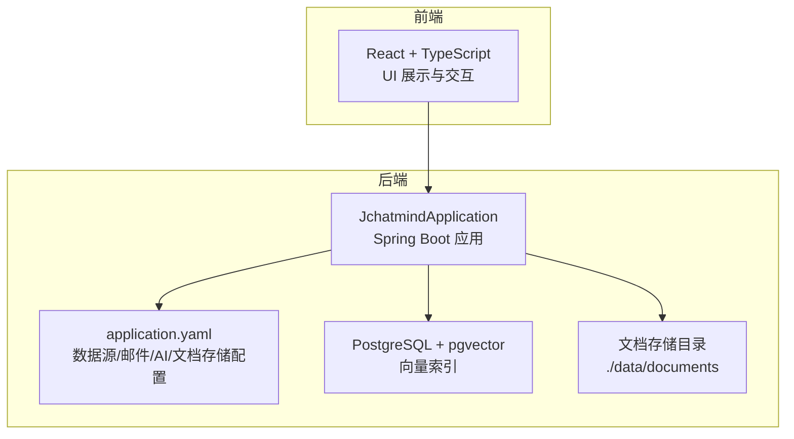
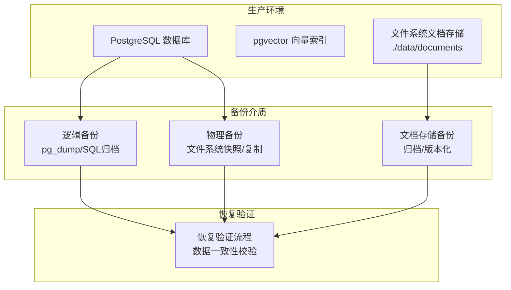
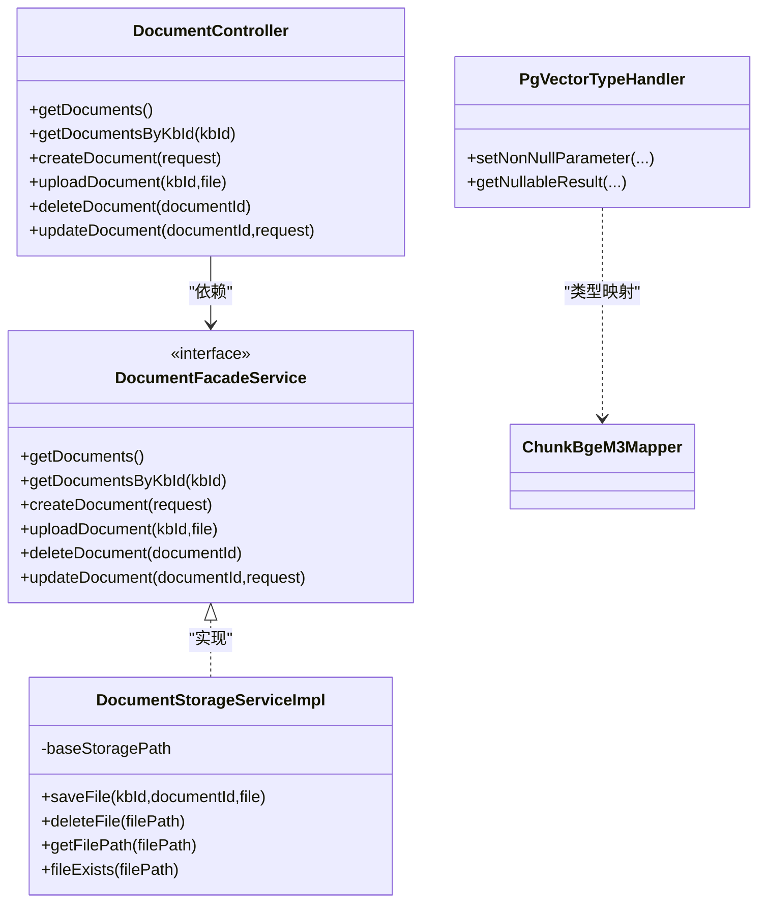

# 备份恢复

<cite>
**本文引用的文件**
- [application.yaml](file://jchatmind/src/main/resources/application.yaml)
- [jchatmind.sql](file://sql/jchatmind.sql)
- [README.md](file://README.md)
- [DocumentStorageServiceImpl.java](file://jchatmind/src/main/java/com/kama/jchatmind/service/impl/DocumentStorageServiceImpl.java)
- [DocumentController.java](file://jchatmind/src/main/java/com/kama/jchatmind/controller/DocumentController.java)
- [DocumentFacadeService.java](file://jchatmind/src/main/java/com/kama/jchatmind/service/DocumentFacadeService.java)
- [DataBaseTools.java](file://jchatmind/src/main/java/com/kama/jchatmind/agent/tools/DataBaseTools.java)
- [PgVectorTypeHandler.java](file://jchatmind/src/main/java/com/kama/jchatmind/typehandler/PgVectorTypeHandler.java)
- [ChunkBgeM3Mapper.xml](file://jchatmind/src/main/resources/mapper/ChunkBgeM3Mapper.xml)
- [pom.xml](file://jchatmind/pom.xml)
</cite>

## 目录
1. [简介](#简介)
2. [项目结构](#项目结构)
3. [核心组件](#核心组件)
4. [架构总览](#架构总览)
5. [详细组件分析](#详细组件分析)
6. [依赖分析](#依赖分析)
7. [性能考虑](#性能考虑)
8. [故障排查指南](#故障排查指南)
9. [结论](#结论)
10. [附录](#附录)

## 简介
本指南面向JChatMind系统的运维与开发团队，提供一套完整的备份与恢复策略，覆盖数据库（PostgreSQL + pgvector）与文档存储备份、灾难恢复计划（RTO/RPO）、自动化脚本与监控告警建议。文档以仓库现有配置与代码为依据，结合实际部署场景给出可落地的实践方案。

## 项目结构
JChatMind后端采用Spring Boot + MyBatis架构，数据库为PostgreSQL并启用pgvector扩展；前端为React+TypeScript。数据库连接、邮件、AI模型、文档存储路径等关键配置集中在应用配置文件中。

图表来源
- [application.yaml:1-43](file://jchatmind/src/main/resources/application.yaml#L1-L43)
- [README.md:31-45](file://README.md#L31-L45)

章节来源
- [application.yaml:1-43](file://jchatmind/src/main/resources/application.yaml#L1-L43)
- [README.md:31-45](file://README.md#L31-L45)

## 核心组件
- 数据库与向量索引
  - 使用PostgreSQL 14+，启用pgvector扩展，向量维度为1024，使用IVFFLAT索引。
  - 关键表：agent、chat_session、chat_message、knowledge_base、document、chunk_bge_m3。
- 文档存储
  - 基于文件系统，存储路径默认为“./data/documents”，按知识库ID与文档ID组织目录结构。
- 数据访问与工具
  - MyBatis映射器负责向量字段的SQL处理，自定义类型处理器将float[]与PostgreSQL向量类型互转。
  - 提供数据库查询工具，限制为只读查询，避免误写操作。

章节来源
- [jchatmind.sql:1-88](file://sql/jchatmind.sql#L1-L88)
- [application.yaml:40-43](file://jchatmind/src/main/resources/application.yaml#L40-L43)
- [PgVectorTypeHandler.java:1-53](file://jchatmind/src/main/java/com/kama/jchatmind/typehandler/PgVectorTypeHandler.java#L1-L53)
- [ChunkBgeM3Mapper.xml](file://jchatmind/src/main/resources/mapper/ChunkBgeM3Mapper.xml)
- [DataBaseTools.java:1-62](file://jchatmind/src/main/java/com/kama/jchatmind/agent/tools/DataBaseTools.java#L1-L62)

## 架构总览
下图展示备份与恢复涉及的关键组件及数据流向。

图表来源
- [jchatmind.sql:1-88](file://sql/jchatmind.sql#L1-L88)
- [application.yaml:40-43](file://jchatmind/src/main/resources/application.yaml#L40-L43)

## 详细组件分析

### 数据库备份策略
- 逻辑备份（推荐）
  - 使用pg_dump进行全库或按schema/表粒度导出，保留SQL结构与数据，便于跨平台迁移与版本对比。
  - 建议开启压缩与并行度优化，结合时间戳命名输出文件，便于版本管理。
  - 对向量表（chunk_bge_m3）建议单独导出，避免大对象影响整体备份效率。
- 物理备份（补充）
  - 使用文件系统级快照或复制（如LVM、ZFS、容器卷快照），适合快速恢复与最小停机时间场景。
  - 注意：物理备份需确保数据库处于一致状态（热备/冷备策略），并验证恢复后索引完整性。
- 增量备份（可选）
  - 基于WAL归档与时间点恢复（PITR），结合逻辑备份定期重置基线，满足RPO目标。
  - 需要完善的WAL归档与传输策略，以及恢复验证流程。

章节来源
- [jchatmind.sql:1-88](file://sql/jchatmind.sql#L1-L88)
- [README.md:50-51](file://README.md#L50-L51)

### 数据导出导入流程
- 导出
  - 全库导出：pg_dump -h <host> -p <port> -U <user> -d <db> -F c -b -v > jchatmind_$(date +%Y%m%d_%H%M%S).tar
  - 单表导出：pg_dump -h <host> -p <port> -U <user> -d <db> -t chunk_bge_m3 -F p > chunk_bge_m3_$(date +%Y%m%d).sql
  - 文档存储：对“./data/documents”进行归档（建议按知识库维度分卷）。
- 导入
  - 先恢复数据库：pg_restore -h <host> -p <port> -U <user> -d <db> -v <backup.tar>
  - 再恢复文档：解压到原路径，确保权限与所有权正确。
  - 验证：检查向量索引是否可用，运行基础查询与检索功能测试。

章节来源
- [application.yaml:4-8](file://jchatmind/src/main/resources/application.yaml#L4-L8)
- [jchatmind.sql:84-87](file://sql/jchatmind.sql#L84-L87)

### 文档存储备份方案
- 存储位置
  - 默认路径：./data/documents，按“kbId/documentId/原始文件名”组织。
- 备份策略
  - 增量归档：每日/每周对新增/变更文件进行差异归档。
  - 版本管理：对重要知识库文件建立版本标签，保留历史版本以便回滚。
  - 重复数据处理：识别并去重，减少存储占用。
- 恢复流程
  - 恢复到指定路径，重建目录结构，校验文件完整性与元数据一致性。

章节来源
- [application.yaml:40-43](file://jchatmind/src/main/resources/application.yaml#L40-L43)
- [DocumentStorageServiceImpl.java:24-54](file://jchatmind/src/main/java/com/kama/jchatmind/service/impl/DocumentStorageServiceImpl.java#L24-L54)

### 灾难恢复计划（DRP）
- RTO/RPO目标
  - RTO：根据业务SLA设定（如小时级/分钟级），优先保证核心功能可用。
  - RPO：结合增量备份与WAL归档，目标控制在可接受范围内（如数分钟至数小时）。
- 恢复流程演练
  - 定期进行“离线演练”：在隔离环境中恢复备份，验证数据与功能完整性。
  - 包含数据库与文档存储两部分，覆盖主从切换、索引重建、服务重启等环节。
- 业务连续性保障
  - 多地备份：至少异地一份副本，降低区域性风险。
  - 自动化：脚本化恢复流程，减少人工干预时间。
  - 监控与告警：对备份成功率、恢复时间、索引健康度进行监控。

章节来源
- [jchatmind.sql:84-87](file://sql/jchatmind.sql#L84-L87)

### 自动化备份脚本与监控告警
- 自动化脚本建议
  - 数据库逻辑备份：定时任务执行pg_dump，自动命名与清理旧备份。
  - 文档存储备份：rsync/卷快照+归档脚本，按知识库维度分卷。
  - 恢复验证：编写一键验证脚本，执行关键查询与检索测试。
- 监控与告警
  - 备份任务执行状态、日志大小、恢复耗时等指标纳入监控。
  - 告警阈值：备份失败、超时、恢复失败、索引异常等触发告警。
  - 建议使用Prometheus/Grafana或企业级监控平台。

章节来源
- [application.yaml:4-8](file://jchatmind/src/main/resources/application.yaml#L4-L8)
- [application.yaml:40-43](file://jchatmind/src/main/resources/application.yaml#L40-L43)

## 依赖分析
- 数据库与向量处理
  - MyBatis映射器与类型处理器配合，确保向量字段在Java与PostgreSQL之间正确转换。
  - pgvector扩展与索引定义，支撑高效相似度检索。
- 文档存储
  - 控制器与门面服务协调文件上传、删除与查询，存储服务负责文件系统操作。
- 数据库访问安全
  - 工具类限制为只读查询，防止误操作破坏数据。

图表来源
- [DocumentController.java:1-60](file://jchatmind/src/main/java/com/kama/jchatmind/controller/DocumentController.java#L1-L60)
- [DocumentFacadeService.java:1-22](file://jchatmind/src/main/java/com/kama/jchatmind/service/DocumentFacadeService.java#L1-L22)
- [DocumentStorageServiceImpl.java:1-90](file://jchatmind/src/main/java/com/kama/jchatmind/service/impl/DocumentStorageServiceImpl.java#L1-L90)
- [PgVectorTypeHandler.java:1-53](file://jchatmind/src/main/java/com/kama/jchatmind/typehandler/PgVectorTypeHandler.java#L1-L53)
- [ChunkBgeM3Mapper.xml](file://jchatmind/src/main/resources/mapper/ChunkBgeM3Mapper.xml)

章节来源
- [DocumentController.java:1-60](file://jchatmind/src/main/java/com/kama/jchatmind/controller/DocumentController.java#L1-L60)
- [DocumentFacadeService.java:1-22](file://jchatmind/src/main/java/com/kama/jchatmind/service/DocumentFacadeService.java#L1-L22)
- [DocumentStorageServiceImpl.java:1-90](file://jchatmind/src/main/java/com/kama/jchatmind/service/impl/DocumentStorageServiceImpl.java#L1-L90)
- [PgVectorTypeHandler.java:1-53](file://jchatmind/src/main/java/com/kama/jchatmind/typehandler/PgVectorTypeHandler.java#L1-L53)

## 性能考虑
- 备份性能
  - 逻辑备份：合理设置并行度与压缩级别，避免高峰期执行。
  - 物理备份：选择低负载时段，确保文件系统一致性。
- 恢复性能
  - 分层恢复：先恢复数据库再恢复文档，减少锁竞争。
  - 索引重建：必要时重建向量索引，确保检索性能。
- 存储与网络
  - 备份介质与网络带宽应满足吞吐需求，避免成为瓶颈。

## 故障排查指南
- 备份失败
  - 检查数据库连接参数与权限，确认pg_dump可用性与磁盘空间。
  - 查看备份日志，定位具体错误（认证、权限、IO等）。
- 恢复异常
  - 校验备份文件完整性，确认导入顺序与依赖关系。
  - 验证向量索引是否重建成功，运行基础查询与检索测试。
- 文档存储问题
  - 检查存储路径权限与磁盘配额，确认文件系统可用性。
  - 对比元数据与实际文件，修复缺失或损坏的文件。

章节来源
- [application.yaml:4-8](file://jchatmind/src/main/resources/application.yaml#L4-L8)
- [application.yaml:40-43](file://jchatmind/src/main/resources/application.yaml#L40-L43)
- [DocumentStorageServiceImpl.java:56-77](file://jchatmind/src/main/java/com/kama/jchatmind/service/impl/DocumentStorageServiceImpl.java#L56-L77)

## 结论
本指南基于JChatMind现有配置与代码，提出了数据库与文档存储的备份与恢复策略，明确了RTO/RPO目标、恢复流程演练与自动化脚本建议。建议结合实际业务SLA与资源情况，持续优化备份频率、恢复验证与监控告警体系，确保系统在发生故障时能快速恢复并保持业务连续性。

## 附录
- 参考技术栈与环境
  - 后端：Spring Boot 3.x、MyBatis、PostgreSQL + pgvector
  - 前端：React 18 + TypeScript
  - 环境要求：PostgreSQL 14+（需安装pgvector扩展）

章节来源
- [README.md:31-45](file://README.md#L31-L45)
- [pom.xml:92-122](file://jchatmind/pom.xml#L92-L122)