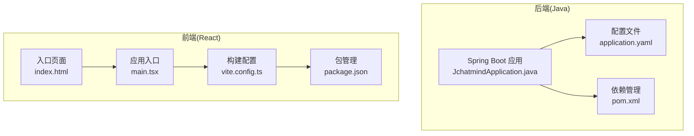
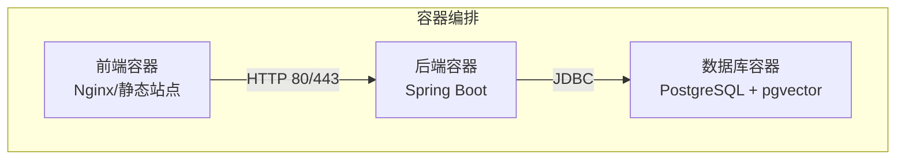
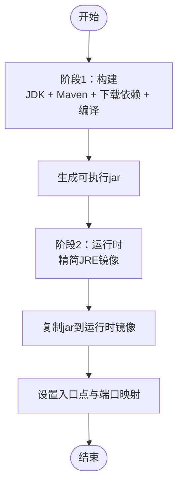
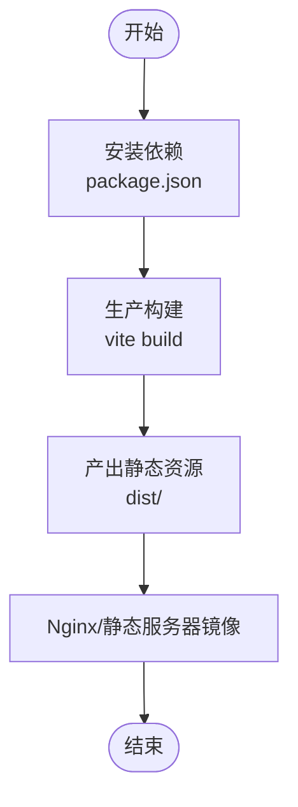
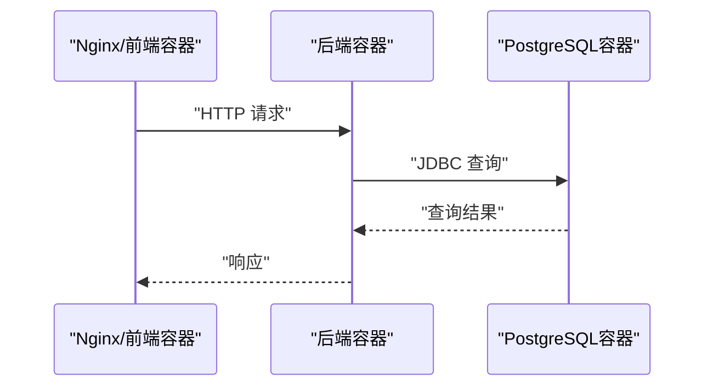
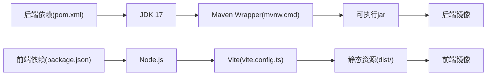

# 容器化部署

<cite>
**本文引用的文件**
- [README.md](file://README.md)
- [JchatmindApplication.java](file://jchatmind/src/main/java/com/kama/jchatmind/JchatmindApplication.java)
- [application.yaml](file://jchatmind/src/main/resources/application.yaml)
- [pom.xml](file://jchatmind/pom.xml)
- [mvnw.cmd](file://jchatmind/mvnw.cmd)
- [vite.config.ts](file://ui/vite.config.ts)
- [package.json](file://ui/package.json)
- [index.html](file://ui/index.html)
- [main.tsx](file://ui/src/main.tsx)
</cite>

## 目录
1. [简介](#简介)
2. [项目结构](#项目结构)
3. [核心组件](#核心组件)
4. [架构总览](#架构总览)
5. [详细组件分析](#详细组件分析)
6. [依赖关系分析](#依赖关系分析)
7. [性能与资源考虑](#性能与资源考虑)
8. [故障排查指南](#故障排查指南)
9. [结论](#结论)
10. [附录](#附录)

## 简介
本指南面向JChatMind项目的容器化部署，覆盖后端Java应用与前端React应用的镜像构建、多阶段构建策略、容器编排与网络配置、健康检查、资源限制与日志收集、以及安全加固与镜像优化建议。目标是帮助运维与开发团队在生产环境中稳定、高效地运行该系统。

## 项目结构
JChatMind由两部分组成：
- 后端：基于Spring Boot 3.x的Java应用，使用Spring AI、MyBatis、PostgreSQL(pgvector)等技术栈。
- 前端：基于React 19 + TypeScript + Vite的单页应用(SPA)，通过Ant Design提供UI组件。

图表来源
- [JchatmindApplication.java:1-14](file://jchatmind/src/main/java/com/kama/jchatmind/JchatmindApplication.java#L1-L14)
- [application.yaml:1-43](file://jchatmind/src/main/resources/application.yaml#L1-L43)
- [pom.xml:1-132](file://jchatmind/pom.xml#L1-L132)
- [index.html:1-13](file://ui/index.html#L1-L13)
- [main.tsx:1-11](file://ui/src/main.tsx#L1-L11)
- [vite.config.ts:1-9](file://ui/vite.config.ts#L1-L9)
- [package.json:1-44](file://ui/package.json#L1-L44)

章节来源
- [README.md:31-44](file://README.md#L31-L44)
- [pom.xml:1-132](file://pom.xml#L1-L132)
- [application.yaml:1-43](file://application.yaml#L1-L43)
- [index.html:1-13](file://index.html#L1-L13)
- [main.tsx:1-11](file://main.tsx#L1-L11)
- [vite.config.ts:1-9](file://vite.config.ts#L1-L9)
- [package.json:1-44](file://package.json#L1-L44)

## 核心组件
- 后端服务
  - 运行入口：Spring Boot应用启动类负责引导Web容器与业务模块。
  - 配置中心：application.yaml集中管理数据库连接、邮件、AI模型配置、文档存储路径等。
  - 构建工具：Maven Wrapper脚本提供跨平台构建一致性。
- 前端应用
  - SPA入口：index.html承载根节点，main.tsx挂载Ant Design国际化与应用组件。
  - 构建工具链：Vite提供快速开发与生产构建；TypeScript保障类型安全；Tailwind CSS提供样式基础。
  - 包管理：package.json定义依赖与脚本命令。

章节来源
- [JchatmindApplication.java:1-14](file://jchatmind/src/main/java/com/kama/jchatmind/JchatmindApplication.java#L1-L14)
- [application.yaml:1-43](file://jchatmind/src/main/resources/application.yaml#L1-L43)
- [mvnw.cmd:1-190](file://jchatmind/mvnw.cmd#L1-L190)
- [index.html:1-13](file://ui/index.html#L1-L13)
- [main.tsx:1-11](file://ui/src/main.tsx#L1-L11)
- [vite.config.ts:1-9](file://ui/vite.config.ts#L1-L9)
- [package.json:1-44](file://ui/package.json#L1-L44)

## 架构总览
下图展示了容器化部署的典型拓扑：前端静态资源由Nginx或反向代理提供，后端Java应用通过容器网络与数据库通信，容器间通过命名网络隔离，实现安全与可观察性。

图表来源
- [application.yaml:4-8](file://jchatmind/src/main/resources/application.yaml#L4-L8)
- [pom.xml:92-105](file://jchatmind/pom.xml#L92-L105)

## 详细组件分析

### 后端Java应用镜像构建
- 基础镜像选择
  - 推荐使用官方OpenJDK 17镜像作为基础，确保与项目Java版本一致。
- 多阶段构建策略
  - 第一阶段：使用完整JDK与Maven进行依赖下载与编译，输出可执行的Spring Boot可执行jar。
  - 第二阶段：仅复制第一阶段生成的jar到精简运行时镜像，减少攻击面与体积。
- 关键构建步骤
  - 使用Maven Wrapper脚本进行构建，保证CI/CD环境一致性。
  - 将构建产物复制至最终镜像的固定目录，设置容器内工作目录与入口点。
- 运行参数
  - 设置JAVA_OPTS或JVM参数，如堆大小、GC策略、时区与语言环境。
  - 映射端口（默认8080），挂载数据卷用于持久化文档存储路径。

图表来源
- [pom.xml:123-130](file://jchatmind/pom.xml#L123-L130)
- [mvnw.cmd:1-190](file://jchatmind/mvnw.cmd#L1-L190)

章节来源
- [pom.xml:1-132](file://jchatmind/pom.xml#L1-L132)
- [mvnw.cmd:1-190](file://jchatmind/mvnw.cmd#L1-L190)

### 前端React应用镜像构建
- 构建流程
  - 在CI中使用Node LTS镜像安装依赖并执行生产构建，输出静态资源目录。
  - 将构建产物放入Nginx或轻量HTTP服务器镜像，提供SPA服务。
- 入口与路由
  - index.html作为SPA入口，main.tsx挂载应用并配置Ant Design本地化。
  - Vite配置启用按需插件，Tailwind CSS用于样式体系。
- 镜像优化
  - 使用多阶段构建，仅保留dist目录产物。
  - 启用Gzip/Brotli压缩与缓存头，提升加载性能。

图表来源
- [package.json:6-11](file://ui/package.json#L6-L11)
- [vite.config.ts:1-9](file://ui/vite.config.ts#L1-L9)
- [index.html:1-13](file://ui/index.html#L1-L13)
- [main.tsx:1-11](file://ui/src/main.tsx#L1-L11)

章节来源
- [package.json:1-44](file://ui/package.json#L1-L44)
- [vite.config.ts:1-9](file://ui/vite.config.ts#L1-L9)
- [index.html:1-13](file://ui/index.html#L1-L13)
- [main.tsx:1-11](file://ui/src/main.tsx#L1-L11)

### 容器编排与网络配置
- 容器网络
  - 使用自定义桥接网络隔离后端与数据库，避免直接暴露端口。
  - 后端容器通过服务名解析数据库地址，降低硬编码风险。
- 服务暴露
  - 前端容器对外暴露HTTP/HTTPS端口，后端容器仅对内部网络开放。
- 环境变量与配置
  - 使用环境变量覆盖数据库连接、AI模型密钥与邮件配置，避免在镜像中硬编码敏感信息。
  - application.yaml中的数据库URL应指向容器网络内的数据库服务名。

图表来源
- [application.yaml:4-8](file://jchatmind/src/main/resources/application.yaml#L4-L8)
- [pom.xml:92-105](file://jchatmind/pom.xml#L92-L105)

章节来源
- [application.yaml:1-43](file://jchatmind/src/main/resources/application.yaml#L1-L43)
- [pom.xml:92-105](file://jchatmind/pom.xml#L92-L105)

### 健康检查与可观测性
- 健康检查
  - 后端：提供/actuator/health端点，容器健康探针轮询该端点判断存活与就绪。
  - 前端：若使用Nginx，可对静态资源路径进行简单探活。
- 日志收集
  - 后端：将日志输出到stdout/stderr，配合容器日志驱动采集。
  - 前端：Nginx访问与错误日志分别写入标准输出与错误输出。
- 资源限制
  - 为后端容器设置CPU与内存上限，避免资源争用。
  - 为前端容器设置较小的CPU/内存配额，满足静态资源服务需求。

章节来源
- [application.yaml:1-43](file://jchatmind/src/main/resources/application.yaml#L1-L43)

### 安全加固与镜像优化
- 安全加固
  - 使用非root用户运行容器，最小权限原则。
  - 移除构建期依赖与开发工具，仅保留运行时所需文件。
  - 对敏感配置使用Kubernetes Secret或环境变量注入，不写入镜像。
  - 启用只读根文件系统，必要时挂载临时卷。
- 镜像优化
  - 使用多阶段构建，减小最终镜像体积。
  - 合理利用镜像层缓存，将变化较少的层放在前面。
  - 前端静态资源启用压缩与缓存策略，缩短首屏加载时间。

## 依赖关系分析
后端与前端的构建与运行存在以下依赖关系：
- 后端依赖数据库连接与AI模型服务，容器编排时需确保网络连通与凭据正确。
- 前端通过反向代理或Nginx提供静态资源，需与后端容器在同一网络中以便转发请求。

图表来源
- [pom.xml:1-132](file://jchatmind/pom.xml#L1-L132)
- [mvnw.cmd:1-190](file://jchatmind/mvnw.cmd#L1-L190)
- [package.json:1-44](file://ui/package.json#L1-L44)
- [vite.config.ts:1-9](file://ui/vite.config.ts#L1-L9)

章节来源
- [pom.xml:1-132](file://jchatmind/pom.xml#L1-L132)
- [mvnw.cmd:1-190](file://jchatmind/mvnw.cmd#L1-L190)
- [package.json:1-44](file://ui/package.json#L1-L44)
- [vite.config.ts:1-9](file://ui/vite.config.ts#L1-L9)

## 性能与资源考虑
- JVM参数调优
  - 设置合适的堆大小与GC策略，结合容器内存限制避免频繁GC或OOM。
- 前端性能
  - 启用静态资源压缩与缓存，合理拆分代码块，减少初始加载体积。
- 网络与I/O
  - 数据库连接池参数与超时设置需与容器重启策略协调，避免长时间阻塞。
- 监控指标
  - 集成容器监控与APM，关注CPU、内存、GC、数据库连接数与请求延迟。

## 故障排查指南
- 启动失败
  - 检查数据库连接字符串与凭证是否正确，确认容器网络可达。
  - 查看后端容器日志，定位配置加载与依赖初始化问题。
- 健康检查失败
  - 确认/actuator/health端点可用，检查数据库连接池与外部服务可用性。
- 前端空白页
  - 检查Nginx配置与静态资源路径，确认构建产物已正确挂载。
- 性能问题
  - 分析JVM GC日志与容器资源使用情况，调整JVM参数与容器配额。

章节来源
- [application.yaml:1-43](file://jchatmind/src/main/resources/application.yaml#L1-L43)
- [index.html:1-13](file://ui/index.html#L1-L13)
- [main.tsx:1-11](file://ui/src/main.tsx#L1-L11)

## 结论
通过多阶段构建与容器编排，JChatMind可以在生产环境中实现高可用、可扩展与可维护的部署。建议在CI/CD流水线中自动化镜像构建与推送，并结合健康检查、资源限制与日志采集，形成完整的可观测性闭环。同时，遵循安全加固与镜像优化最佳实践，确保系统在安全性与性能之间取得平衡。

## 附录
- 快速开始参考
  - 后端启动：在后端目录使用Maven Wrapper脚本启动Spring Boot应用。
  - 前端启动：在前端目录安装依赖并运行开发服务器。
- 技术栈概览
  - 后端：Java 17+、Spring Boot 3.x、Spring AI、MyBatis、PostgreSQL + pgvector。
  - 前端：React 19、TypeScript、Tailwind CSS、Vite。

章节来源
- [README.md:46-66](file://README.md#L46-L66)
- [mvnw.cmd:53-71](file://jchatmind/mvnw.cmd#L53-L71)
- [package.json:6-11](file://ui/package.json#L6-L11)