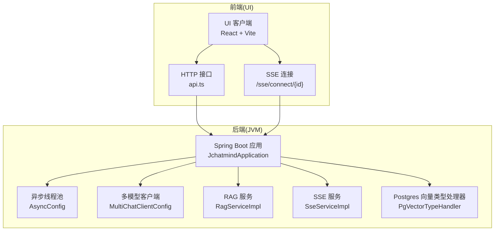
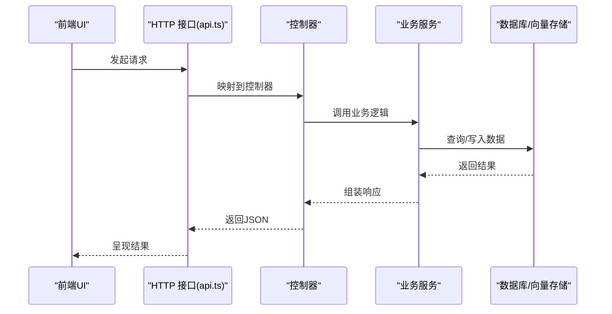
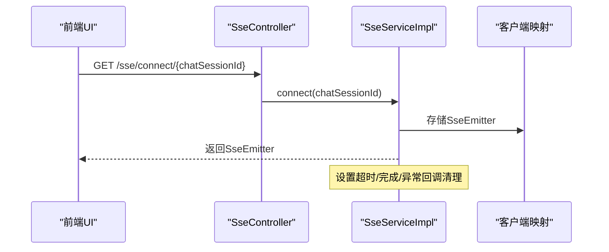
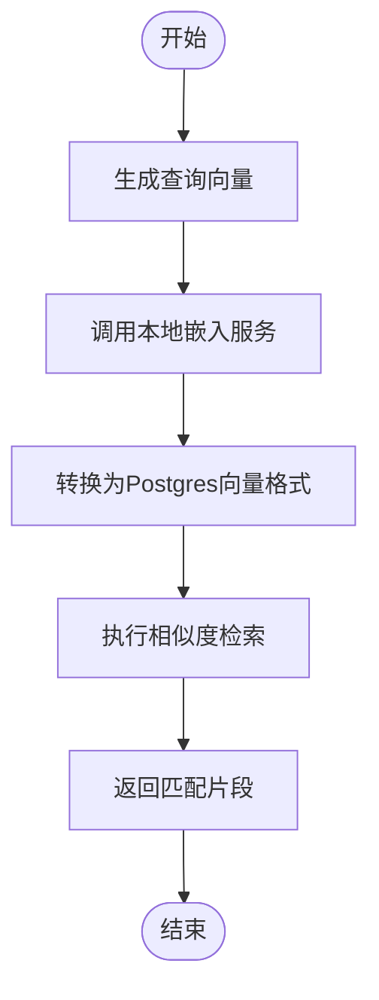
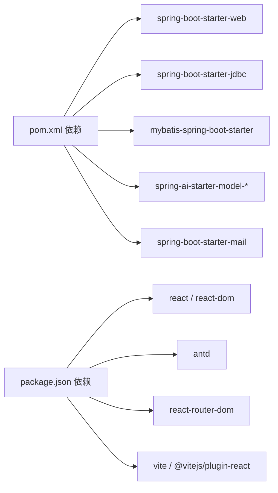

# 性能调优

<cite>
**本文引用的文件**
- [application.yaml](file://jchatmind/src/main/resources/application.yaml)
- [pom.xml](file://jchatmind/pom.xml)
- [JchatmindApplication.java](file://jchatmind/src/main/java/com/kama/jchatmind/JchatmindApplication.java)
- [AsyncConfig.java](file://jchatmind/src/main/java/com/kama/jchatmind/config/AsyncConfig.java)
- [MultiChatClientConfig.java](file://jchatmind/src/main/java/com/kama/jchatmind/config/MultiChatClientConfig.java)
- [RagServiceImpl.java](file://jchatmind/src/main/java/com/kama/jchatmind/service/impl/RagServiceImpl.java)
- [SseServiceImpl.java](file://jchatmind/src/main/java/com/kama/jchatmind/service/impl/SseServiceImpl.java)
- [SseController.java](file://jchatmind/src/main/java/com/kama/jchatmind/controller/SseController.java)
- [PgVectorTypeHandler.java](file://jchatmind/src/main/java/com/kama/jchatmind/typehandler/PgVectorTypeHandler.java)
- [vite.config.ts](file://ui/vite.config.ts)
- [package.json](file://ui/package.json)
- [api.ts](file://ui/src/api/api.ts)
</cite>

## 目录
1. [简介](#简介)
2. [项目结构](#项目结构)
3. [核心组件](#核心组件)
4. [架构总览](#架构总览)
5. [详细组件分析](#详细组件分析)
6. [依赖分析](#依赖分析)
7. [性能考虑与优化建议](#性能考虑与优化建议)
8. [故障排查指南](#故障排查指南)
9. [结论](#结论)
10. [附录](#附录)

## 简介
本指南面向JChatMind系统的性能调优需求，覆盖后端JVM参数与GC优化、数据库连接池与查询优化、AI模型调用并发与限流、以及前端构建与运行时性能优化，并提供性能测试与基准测试方法建议。内容基于仓库中现有配置与实现进行分析与扩展，帮助在不同规模与负载下获得稳定、低延迟与高吞吐的表现。

## 项目结构
JChatMind采用前后端分离架构：
- 后端：Spring Boot应用，负责REST API、异步事件、SSE实时推送、向量嵌入与RAG检索、邮件服务等。
- 前端：React + Vite应用，通过HTTP与SSE与后端交互，提供聊天与知识库管理界面。

图表来源
- [JchatmindApplication.java:1-14](file://jchatmind/src/main/java/com/kama/jchatmind/JchatmindApplication.java#L1-L14)
- [AsyncConfig.java:1-25](file://jchatmind/src/main/java/com/kama/jchatmind/config/AsyncConfig.java#L1-L25)
- [MultiChatClientConfig.java:1-23](file://jchatmind/src/main/java/com/kama/jchatmind/config/MultiChatClientConfig.java#L1-L23)
- [RagServiceImpl.java:1-67](file://jchatmind/src/main/java/com/kama/jchatmind/service/impl/RagServiceImpl.java#L1-L67)
- [SseServiceImpl.java:1-64](file://jchatmind/src/main/java/com/kama/jchatmind/service/impl/SseServiceImpl.java#L1-L64)
- [PgVectorTypeHandler.java:1-54](file://jchatmind/src/main/java/com/kama/jchatmind/typehandler/PgVectorTypeHandler.java#L1-L54)
- [api.ts:1-378](file://ui/src/api/api.ts#L1-L378)
- [SseController.java:1-24](file://jchatmind/src/main/java/com/kama/jchatmind/controller/SseController.java#L1-L24)

章节来源
- [JchatmindApplication.java:1-14](file://jchatmind/src/main/java/com/kama/jchatmind/JchatmindApplication.java#L1-L14)
- [vite.config.ts:1-9](file://ui/vite.config.ts#L1-L9)
- [package.json:1-44](file://ui/package.json#L1-L44)

## 核心组件
- 异步执行与线程池：用于事件驱动与后台任务，避免阻塞主线程。
- SSE 实时推送：长连接推送消息，需关注连接生命周期与内存占用。
- RAG 服务：本地嵌入模型WebClient调用，向量相似度检索，涉及网络与数据库I/O。
- 多模型客户端：支持DeepSeek与ZhipuAI，便于按场景切换与限流。
- Postgres 向量类型处理：自定义类型处理器，支撑向量字段序列化与解析。
- 前端HTTP与SSE封装：统一接口与错误处理，便于性能监控埋点。

章节来源
- [AsyncConfig.java:1-25](file://jchatmind/src/main/java/com/kama/jchatmind/config/AsyncConfig.java#L1-L25)
- [SseServiceImpl.java:1-64](file://jchatmind/src/main/java/com/kama/jchatmind/service/impl/SseServiceImpl.java#L1-L64)
- [RagServiceImpl.java:1-67](file://jchatmind/src/main/java/com/kama/jchatmind/service/impl/RagServiceImpl.java#L1-L67)
- [MultiChatClientConfig.java:1-23](file://jchatmind/src/main/java/com/kama/jchatmind/config/MultiChatClientConfig.java#L1-L23)
- [PgVectorTypeHandler.java:1-54](file://jchatmind/src/main/java/com/kama/jchatmind/typehandler/PgVectorTypeHandler.java#L1-L54)
- [api.ts:1-378](file://ui/src/api/api.ts#L1-L378)

## 架构总览
后端通过REST API与SSE提供聊天与知识库能力；RAG模块对接本地嵌入服务与PostgreSQL向量存储；前端通过HTTP与SSE与后端交互，具备良好的可扩展性与性能优化空间。

图表来源
- [api.ts:1-378](file://ui/src/api/api.ts#L1-L378)
- [SseController.java:1-24](file://jchatmind/src/main/java/com/kama/jchatmind/controller/SseController.java#L1-L24)
- [SseServiceImpl.java:1-64](file://jchatmind/src/main/java/com/kama/jchatmind/service/impl/SseServiceImpl.java#L1-L64)

## 详细组件分析

### 异步线程池与并发控制
- 当前配置：核心线程数、最大线程数、队列容量、线程名前缀已显式设置，适合事件驱动与IO密集型任务。
- 建议：
  - 根据CPU核数与任务特征调整核心/最大线程数。
  - 队列容量应结合任务到达率与平均耗时评估，避免内存压力过大。
  - 对长时间任务建议拆分或引入超时控制，防止线程池“饿死”。

章节来源
- [AsyncConfig.java:1-25](file://jchatmind/src/main/java/com/kama/jchatmind/config/AsyncConfig.java#L1-L25)

### SSE 实时推送
- 连接管理：使用ConcurrentHashMap维护会话ID到SseEmitter映射，设置超时时间与完成/异常回调清理。
- 性能要点：
  - 控制并发连接数量，避免内存与文件句柄耗尽。
  - 对消息体进行压缩或分片，减少带宽与延迟。
  - 在高并发场景下考虑连接池化与限速策略。

图表来源
- [SseController.java:1-24](file://jchatmind/src/main/java/com/kama/jchatmind/controller/SseController.java#L1-L24)
- [SseServiceImpl.java:1-64](file://jchatmind/src/main/java/com/kama/jchatmind/service/impl/SseServiceImpl.java#L1-L64)

章节来源
- [SseServiceImpl.java:1-64](file://jchatmind/src/main/java/com/kama/jchatmind/service/impl/SseServiceImpl.java#L1-L64)
- [SseController.java:1-24](file://jchatmind/src/main/java/com/kama/jchatmind/controller/SseController.java#L1-L24)

### RAG 服务与向量检索
- 本地嵌入：通过WebClient调用本地Ollama服务生成向量。
- 向量相似度：将查询文本转为向量，拼接为PostgreSQL向量格式，调用Mapper执行相似度检索。
- 性能要点：
  - 本地嵌入服务的并发与超时需合理配置，避免阻塞主流程。
  - 检索返回条数可调，平衡召回与性能。
  - 向量字段序列化/反序列化开销较小，但需确保类型处理器正确。

图表来源
- [RagServiceImpl.java:1-67](file://jchatmind/src/main/java/com/kama/jchatmind/service/impl/RagServiceImpl.java#L1-L67)
- [PgVectorTypeHandler.java:1-54](file://jchatmind/src/main/java/com/kama/jchatmind/typehandler/PgVectorTypeHandler.java#L1-L54)

章节来源
- [RagServiceImpl.java:1-67](file://jchatmind/src/main/java/com/kama/jchatmind/service/impl/RagServiceImpl.java#L1-L67)
- [PgVectorTypeHandler.java:1-54](file://jchatmind/src/main/java/com/kama/jchatmind/typehandler/PgVectorTypeHandler.java#L1-L54)

### 多模型客户端与AI调用
- 支持DeepSeek与ZhipuAI两种模型，便于按场景切换与限流。
- 建议：
  - 为不同模型配置独立的并发限制与超时策略。
  - 引入统一的限流器（令牌桶/滑动窗口）控制QPS。
  - 对长文本与复杂提示词进行预处理与截断，降低延迟与成本。

章节来源
- [MultiChatClientConfig.java:1-23](file://jchatmind/src/main/java/com/kama/jchatmind/config/MultiChatClientConfig.java#L1-L23)

### 数据库与MyBatis配置
- 数据源：PostgreSQL，驱动与URL在配置文件中声明。
- MyBatis：别名包、Mapper路径、类型处理器包均已配置。
- 建议：
  - 配置连接池（HikariCP）参数（连接数、空闲、超时、最大Lifetime）。
  - 对高频查询建立合适索引（如会话ID、知识库ID、时间戳等）。
  - 使用只读事务与批量写入优化提升吞吐。

章节来源
- [application.yaml:4-8](file://jchatmind/src/main/resources/application.yaml#L4-L8)
- [application.yaml:35-38](file://jchatmind/src/main/resources/application.yaml#L35-L38)
- [pom.xml:92-105](file://jchatmind/pom.xml#L92-L105)

### 前端性能优化
- 构建与打包：Vite默认启用生产模式优化，React插件与Tailwind集成良好。
- 建议：
  - 启用资源压缩与Tree Shaking（Vite已默认开启）。
  - 图片与静态资源CDN化，减少首屏加载时间。
  - 组件懒加载与路由级分割，降低初始包体积。
  - 缓存策略：HTTP缓存头、浏览器缓存、Service Worker离线缓存。

章节来源
- [vite.config.ts:1-9](file://ui/vite.config.ts#L1-L9)
- [package.json:1-44](file://ui/package.json#L1-L44)

## 依赖分析
- 后端依赖Spring Boot Starter、JDBC、MyBatis、Spring AI（DeepSeek/ZhipuAI）、邮件服务等。
- 前端依赖React、Ant Design、路由与Vite生态。

图表来源
- [pom.xml:46-122](file://jchatmind/pom.xml#L46-L122)
- [package.json:12-39](file://ui/package.json#L12-L39)

章节来源
- [pom.xml:46-122](file://jchatmind/pom.xml#L46-L122)
- [package.json:12-39](file://ui/package.json#L12-L39)

## 性能考虑与优化建议

### JVM参数优化
- 堆内存配置
  - 初始堆大小与最大堆大小：根据应用内存占用与GC行为设定，避免频繁Full GC。
  - 新生代/老年代比例：偏向短生命周期对象可适当增大新生代。
- 垃圾回收器选择
  - G1GC：适合大堆与低延迟目标，建议开启并行GC线程与并发阶段。
  - ZGC/Shenandoah：追求极低停顿的应用可考虑，需验证吞吐影响。
- 性能监控
  - 启用JFR、GC日志与堆Dump，结合Micrometer+Prometheus/Grafana观测指标。
  - 关键指标：GC暂停时间、晋升失败、堆使用率、线程数、SSE连接数。

### 数据库连接池与查询优化
- 连接池参数
  - 最小/最大连接数：结合并发请求数与数据库最大连接限制。
  - 空闲超时与连接生命周期：避免僵尸连接与资源泄漏。
  - 超时设置：获取连接超时、查询超时、事务超时。
- 查询性能优化
  - 为高频查询建立复合索引（如会话ID+时间戳）。
  - 分页查询与LIMIT，避免全表扫描。
  - 使用只读事务与批量插入/更新。
- 索引策略
  - 向量检索使用PostgreSQL向量扩展与Gin索引（视具体实现而定）。
  - 对JSON/元数据字段建立GIN索引以支持快速过滤。

### AI模型调用优化
- 并发控制
  - 为不同模型配置独立线程池或信号量，限制并发数。
  - 对外部模型调用增加超时与重试策略，避免雪崩。
- 缓存策略
  - 对热点问题与历史对话摘要进行缓存，减少重复调用。
  - 使用分布式缓存（Redis）支持多实例共享。
- 请求限流
  - 令牌桶/滑动窗口限流器，按模型与用户维度进行配额控制。
  - 对SSE推送通道也实施速率限制，避免过载。

### 前端性能优化
- 资源压缩
  - 生产构建自动启用压缩与最小化，确保上线前检查产物。
- 懒加载
  - 路由级懒加载与组件懒加载，降低首屏JS体积。
- 缓存策略
  - HTTP缓存头（ETag/Cache-Control），浏览器缓存静态资源。
  - 对API响应结果进行轻量缓存，减少重复请求。

### 性能测试与基准测试
- 单元与集成测试
  - 使用JUnit/Mockito对关键服务进行单元测试，覆盖边界条件。
  - 集成测试验证数据库与外部模型调用链路。
- 压力测试
  - 使用JMeter/Locust对REST API与SSE端点施压，观察延迟与错误率。
  - 关注线程池饱和、数据库连接池耗尽、外部模型限流等瓶颈。
- 基准测试
  - 对RAG嵌入与相似度检索进行基准测试，记录吞吐与延迟。
  - 对不同模型与参数组合进行对比实验，确定最优配置。

## 故障排查指南
- SSE连接异常
  - 检查连接超时与回调清理是否生效，确认客户端网络与代理设置。
  - 观察连接数峰值与内存占用，必要时限流或降级。
- RAG检索缓慢
  - 检查本地嵌入服务可用性与超时设置，确认向量维度与索引策略。
  - 对高频查询引入缓存与预计算。
- 数据库连接不足
  - 检查连接池参数与慢查询日志，优化SQL与索引。
- 前端白屏或卡顿
  - 检查打包体积与懒加载配置，确认缓存策略与CDN可用性。

章节来源
- [SseServiceImpl.java:1-64](file://jchatmind/src/main/java/com/kama/jchatmind/service/impl/SseServiceImpl.java#L1-L64)
- [RagServiceImpl.java:1-67](file://jchatmind/src/main/java/com/kama/jchatmind/service/impl/RagServiceImpl.java#L1-L67)
- [application.yaml:4-8](file://jchatmind/src/main/resources/application.yaml#L4-L8)

## 结论
通过对线程池、SSE、RAG、数据库与前端的系统性优化，JChatMind可在高并发与复杂AI工作负载下保持稳定性能。建议以监控为先导，以基准测试为依据，持续迭代参数与策略，逐步逼近最优性能与成本平衡点。

## 附录
- 关键配置参考路径
  - [application.yaml:1-43](file://jchatmind/src/main/resources/application.yaml#L1-L43)
  - [pom.xml:1-132](file://jchatmind/pom.xml#L1-L132)
  - [vite.config.ts:1-9](file://ui/vite.config.ts#L1-L9)
  - [package.json:1-44](file://ui/package.json#L1-L44)
- 关键实现参考路径
  - [AsyncConfig.java:1-25](file://jchatmind/src/main/java/com/kama/jchatmind/config/AsyncConfig.java#L1-L25)
  - [MultiChatClientConfig.java:1-23](file://jchatmind/src/main/java/com/kama/jchatmind/config/MultiChatClientConfig.java#L1-L23)
  - [RagServiceImpl.java:1-67](file://jchatmind/src/main/java/com/kama/jchatmind/service/impl/RagServiceImpl.java#L1-L67)
  - [SseServiceImpl.java:1-64](file://jchatmind/src/main/java/com/kama/jchatmind/service/impl/SseServiceImpl.java#L1-L64)
  - [PgVectorTypeHandler.java:1-54](file://jchatmind/src/main/java/com/kama/jchatmind/typehandler/PgVectorTypeHandler.java#L1-L54)
  - [api.ts:1-378](file://ui/src/api/api.ts#L1-L378)