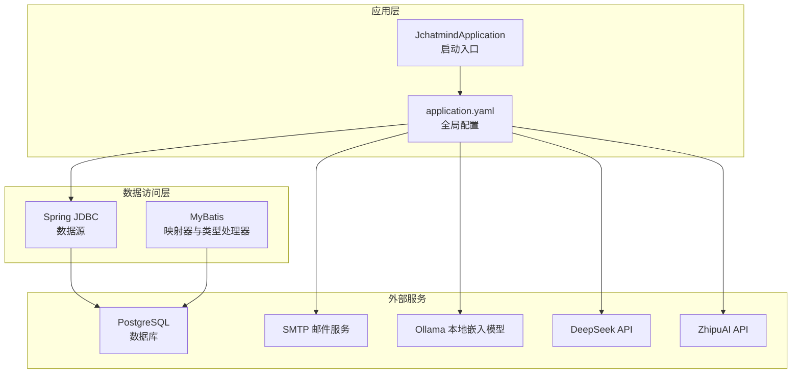
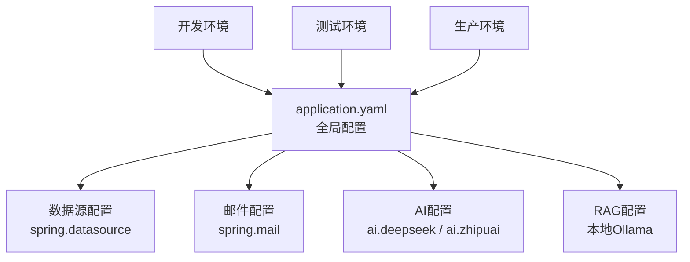
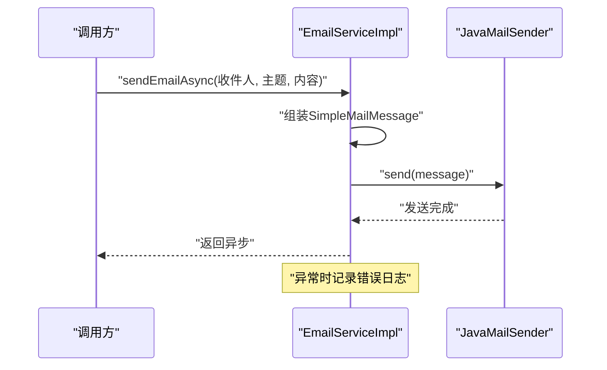
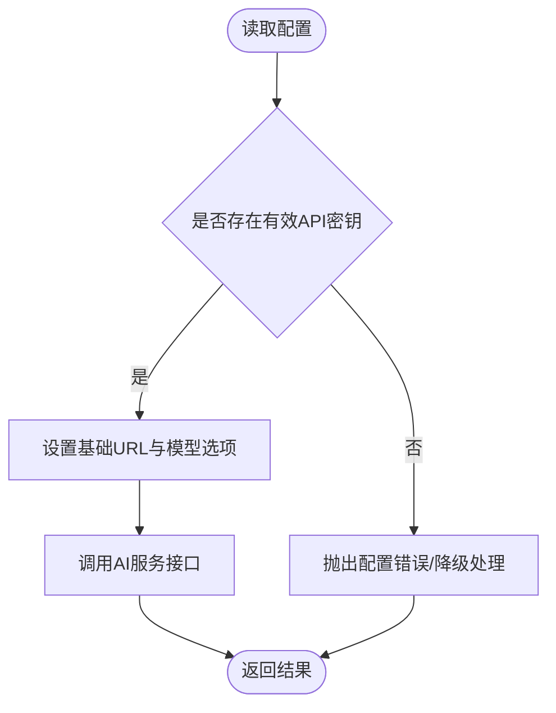
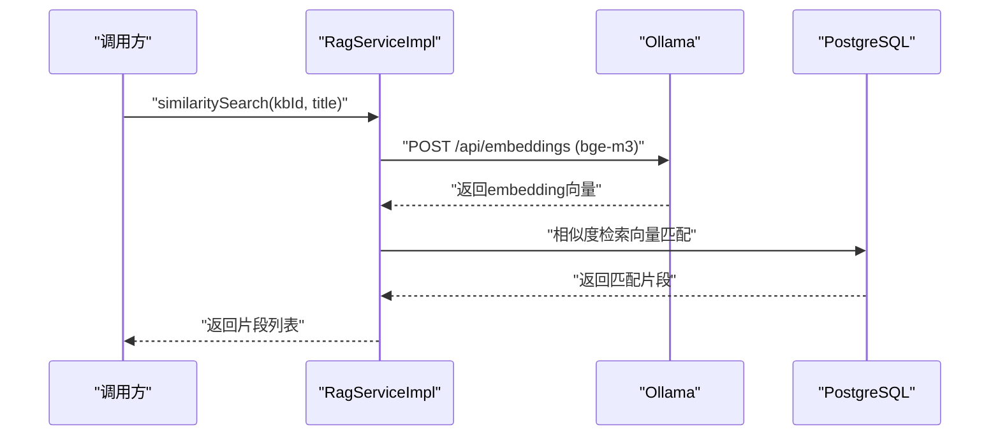
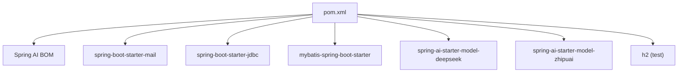

# 环境配置

<cite>
**本文引用的文件**
- [application.yaml](file://jchatmind/src/main/resources/application.yaml)
- [pom.xml](file://jchatmind/pom.xml)
- [EmailServiceImpl.java](file://jchatmind/src/main/java/com/kama/jchatmind/service/impl/EmailServiceImpl.java)
- [RagServiceImpl.java](file://jchatmind/src/main/java/com/kama/jchatmind/service/impl/RagServiceImpl.java)
- [JchatmindApplication.java](file://jchatmind/src/main/java/com/kama/jchatmind/JchatmindApplication.java)
</cite>

## 目录
1. [简介](#简介)
2. [项目结构](#项目结构)
3. [核心组件](#核心组件)
4. [架构总览](#架构总览)
5. [详细组件分析](#详细组件分析)
6. [依赖分析](#依赖分析)
7. [性能考虑](#性能考虑)
8. [故障排查指南](#故障排查指南)
9. [结论](#结论)
10. [附录](#附录)

## 简介
本指南面向JChatMind项目的运维与开发团队，系统性说明开发、测试与生产环境的配置差异，重点覆盖数据库连接、邮件服务、AI模型API密钥等关键配置项，并对application.yaml中的各项参数进行逐条解析。同时提供不同环境下的配置模板与最佳实践，以及环境变量管理与敏感信息保护策略，帮助在多环境中安全、稳定地部署与运行。

## 项目结构
JChatMind后端基于Spring Boot构建，核心配置集中在resources目录下的application.yaml；数据库访问使用MyBatis；邮件服务通过Spring Boot Starter Mail集成；AI能力通过Spring AI Starter对接DeepSeek与ZhipuAI；向量检索（RAG）依赖本地Ollama服务（默认端口11434）。

图表来源
- [application.yaml:1-43](file://jchatmind/src/main/resources/application.yaml#L1-L43)
- [pom.xml:46-122](file://jchatmind/pom.xml#L46-L122)
- [RagServiceImpl.java:21-24](file://jchatmind/src/main/java/com/kama/jchatmind/service/impl/RagServiceImpl.java#L21-L24)

章节来源
- [application.yaml:1-43](file://jchatmind/src/main/resources/application.yaml#L1-L43)
- [pom.xml:29-44](file://jchatmind/pom.xml#L29-L44)

## 核心组件
- 数据源与持久化：通过spring.datasource配置PostgreSQL连接参数；MyBatis负责实体映射与SQL执行。
- 邮件服务：通过spring.mail配置SMTP主机、端口、认证凭据与编码；EmailServiceImpl封装异步发送逻辑。
- AI服务：ai.deepseek与ai.zhipuai分别定义API密钥、基础URL与对话选项；Spring AI Starter在pom中统一管理版本。
- RAG嵌入：RagServiceImpl默认连接本地Ollama服务（/api/embeddings），生成向量并写入PostgreSQL的向量类型字段。

章节来源
- [application.yaml:4-43](file://jchatmind/src/main/resources/application.yaml#L4-L43)
- [EmailServiceImpl.java:17-22](file://jchatmind/src/main/java/com/kama/jchatmind/service/impl/EmailServiceImpl.java#L17-L22)
- [RagServiceImpl.java:21-24](file://jchatmind/src/main/java/com/kama/jchatmind/service/impl/RagServiceImpl.java#L21-L24)
- [pom.xml:34-44](file://jchatmind/pom.xml#L34-L44)

## 架构总览
下图展示JChatMind在不同环境下的配置分层与关键依赖关系，强调配置参数如何影响运行时行为。

图表来源
- [application.yaml:1-43](file://jchatmind/src/main/resources/application.yaml#L1-L43)
- [pom.xml:107-116](file://jchatmind/pom.xml#L107-L116)

## 详细组件分析

### 数据库连接配置（spring.datasource）
- 目标：为应用提供PostgreSQL连接，支持MyBatis读写。
- 关键参数与建议：
  - url：生产环境应指向高可用主从或读写分离实例地址。
  - username/password：使用最小权限账号；生产环境务必通过环境变量注入，避免硬编码。
  - driver-class-name：保持PostgreSQL驱动以兼容向量类型处理。
- 运行时行为：Spring Boot自动装配数据源；MyBatis根据mapper与类型处理器访问表与向量字段。

章节来源
- [application.yaml:4-8](file://jchatmind/src/main/resources/application.yaml#L4-L8)
- [pom.xml:97-105](file://jchatmind/pom.xml#L97-L105)

### 邮件服务配置（spring.mail）
- 目标：启用SMTP邮件发送，支持异步投递。
- 关键参数与建议：
  - host/port：根据所选邮箱服务商调整；生产环境优先使用企业邮箱或第三方邮件服务（如SendGrid）。
  - username/password：使用授权码而非登录密码；生产环境通过环境变量注入。
  - default-encoding：UTF-8确保多语言内容正确显示。
  - properties.mail.smtp.auth/starttls：开启认证与TLS增强安全性。
- 实现要点：EmailServiceImpl通过@Value注入发件人地址，使用JavaMailSender异步发送，异常记录日志。

图表来源
- [EmailServiceImpl.java:24-42](file://jchatmind/src/main/java/com/kama/jchatmind/service/impl/EmailServiceImpl.java#L24-L42)

章节来源
- [application.yaml:9-21](file://jchatmind/src/main/resources/application.yaml#L9-L21)
- [EmailServiceImpl.java:17-22](file://jchatmind/src/main/java/com/kama/jchatmind/service/impl/EmailServiceImpl.java#L17-L22)

### AI服务配置（ai.deepseek / ai.zhipuai）
- 目标：配置两大AI模型服务的API密钥与基础URL，以及对话选项。
- 关键参数与建议：
  - api-key：必须为有效密钥；生产环境通过环境变量注入，避免提交到版本控制。
  - base-url：按官方文档填写；若需代理或自建网关，可在此处统一修改。
  - chat.options.model：选择具体模型名称；生产环境建议固定版本以保证一致性。
- 运行时行为：Spring AI Starter在pom中统一管理版本，确保依赖兼容性。

图表来源
- [application.yaml:22-34](file://jchatmind/src/main/resources/application.yaml#L22-L34)
- [pom.xml:107-116](file://jchatmind/pom.xml#L107-L116)

章节来源
- [application.yaml:22-34](file://jchatmind/src/main/resources/application.yaml#L22-L34)
- [pom.xml:34-44](file://jchatmind/pom.xml#L34-L44)

### RAG嵌入与向量存储（本地Ollama + PostgreSQL）
- 目标：使用本地Ollama提供的bge-m3嵌入模型，将文本转为向量并存入PostgreSQL。
- 关键参数与建议：
  - Ollama基础URL：默认http://localhost:11434；生产环境需确保网络可达与安全策略允许。
  - 模型名：bge-m3；需提前拉取镜像并运行服务。
  - 向量写入：RagServiceImpl将float[]转换为PostgreSQL向量字符串格式，供相似度检索使用。
- 运行时行为：WebClient同步阻塞获取嵌入向量；MyBatis Mapper执行相似度查询。

图表来源
- [RagServiceImpl.java:31-55](file://jchatmind/src/main/java/com/kama/jchatmind/service/impl/RagServiceImpl.java#L31-L55)

章节来源
- [application.yaml:40-43](file://jchatmind/src/main/resources/application.yaml#L40-L43)
- [RagServiceImpl.java:21-24](file://jchatmind/src/main/java/com/kama/jchatmind/service/impl/RagServiceImpl.java#L21-L24)

### MyBatis配置（mybatis.*）
- 目标：统一实体包扫描、Mapper XML位置与类型处理器包。
- 关键参数与建议：
  - type-aliases-package：确保实体类被正确识别。
  - mapper-locations：classpath路径需与实际资源一致。
  - type-handlers-package：向量类型处理器位于该包内，确保PostgreSQL向量字段正确映射。

章节来源
- [application.yaml:35-38](file://jchatmind/src/main/resources/application.yaml#L35-L38)

## 依赖分析
- Spring AI依赖由Spring AI Bill of Materials统一管理，确保版本兼容。
- 邮件服务依赖Spring Boot Starter Mail。
- 数据访问依赖JDBC与MyBatis Starter。
- 测试阶段使用H2内存数据库，便于快速验证。

图表来源
- [pom.xml:34-44](file://jchatmind/pom.xml#L34-L44)
- [pom.xml:107-121](file://jchatmind/pom.xml#L107-L121)

章节来源
- [pom.xml:34-44](file://jchatmind/pom.xml#L34-L44)
- [pom.xml:107-121](file://jchatmind/pom.xml#L107-L121)

## 性能考虑
- 数据库连接池与超时：生产环境建议配置连接池大小、空闲超时与查询超时，避免长事务与慢查询。
- 异步邮件：EmailServiceImpl已标注@Async，避免阻塞请求线程；建议配合线程池与队列限流。
- AI调用：在高并发场景下，建议引入重试、熔断与限流策略，避免上游服务抖动影响整体稳定性。
- RAG检索：相似度检索可能涉及向量计算与数据库扫描，建议对常用知识库建立索引与缓存热点。

## 故障排查指南
- 邮件发送失败
  - 检查spring.mail配置是否正确，特别是host/port/username/password与TLS设置。
  - 查看EmailServiceImpl日志输出，定位异常原因。
- AI服务不可用
  - 确认ai.deepseek或ai.zhipuai的api-key有效且未过期。
  - 校验base-url连通性与网络策略。
- RAG检索异常
  - 确认本地Ollama服务已启动并可访问，默认端口11434。
  - 检查bge-m3模型是否已拉取并加载。
  - 核对PostgreSQL向量类型与类型处理器是否生效。
- 数据库连接问题
  - 校验spring.datasource.url/username/password与目标数据库权限。
  - 检查驱动类名与数据库版本兼容性。

章节来源
- [EmailServiceImpl.java:24-42](file://jchatmind/src/main/java/com/kama/jchatmind/service/impl/EmailServiceImpl.java#L24-L42)
- [RagServiceImpl.java:21-24](file://jchatmind/src/main/java/com/kama/jchatmind/service/impl/RagServiceImpl.java#L21-L24)
- [application.yaml:4-43](file://jchatmind/src/main/resources/application.yaml#L4-L43)

## 结论
JChatMind的环境配置围绕application.yaml集中管理，结合Spring Boot自动装配与显式依赖声明，形成清晰的开发、测试与生产三段式配置边界。通过环境变量注入敏感信息、在生产环境采用专用凭据与网络策略、以及对邮件、AI与RAG模块进行异步与限流优化，可显著提升系统的安全性与稳定性。

## 附录

### 不同环境配置模板与最佳实践
- 开发环境
  - 数据库：本地PostgreSQL，账号密码可使用默认值，便于快速启动。
  - 邮件：使用个人邮箱SMTP，开启TLS与授权码；仅用于功能验证。
  - AI：保留示例API密钥用于本地联调；建议尽快替换为自有密钥。
  - RAG：本地Ollama服务，确保bge-m3模型可用。
- 测试环境
  - 数据库：独立测试库，定期回滚快照；账号最小权限。
  - 邮件：使用测试邮箱或Mock服务，避免外发。
  - AI：使用测试密钥或Mock网关，隔离真实计费。
  - RAG：与开发一致，但限制并发与数据规模。
- 生产环境
  - 数据库：高可用主从/集群，只读副本用于查询；账号最小权限。
  - 邮件：企业邮箱或第三方邮件服务，启用严格TLS与IP白名单。
  - AI：自有密钥与网关，开启访问审计与限额；模型版本固化。
  - RAG：内网访问Ollama，限制模型与并发；向量索引与缓存优化。

### 环境变量管理与敏感信息保护
- 建议将以下敏感项通过环境变量注入，不在application.yaml中硬编码：
  - spring.datasource.password
  - spring.mail.username
  - spring.mail.password
  - ai.deepseek.api-key
  - ai.zhipuai.api-key
- 使用配置加密或密钥管理服务（如KMS）对密钥进行动态解密。
- 在CI/CD流水线中使用受控的密钥存储与注入机制，避免明文泄露。
- 定期轮换密钥与数据库账号，审计访问日志。