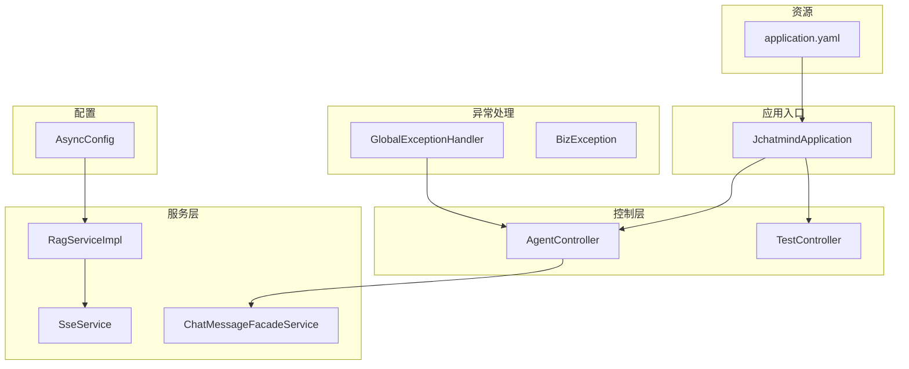
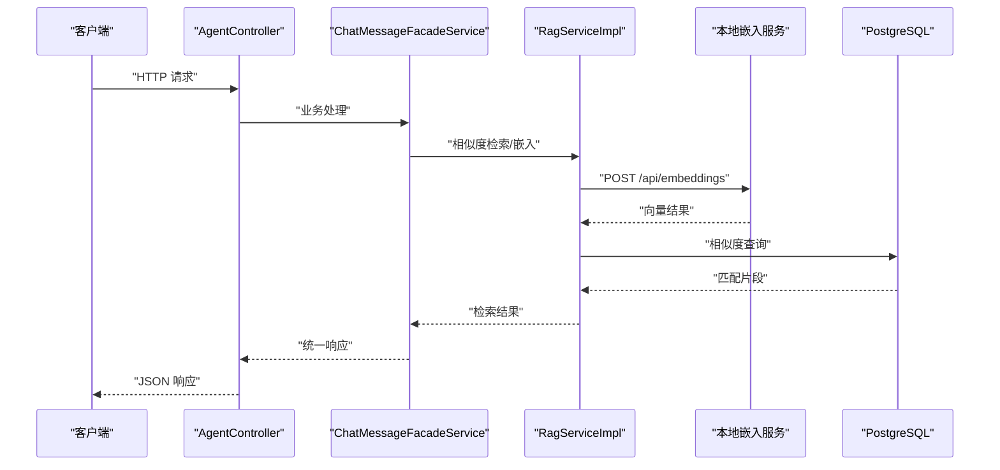
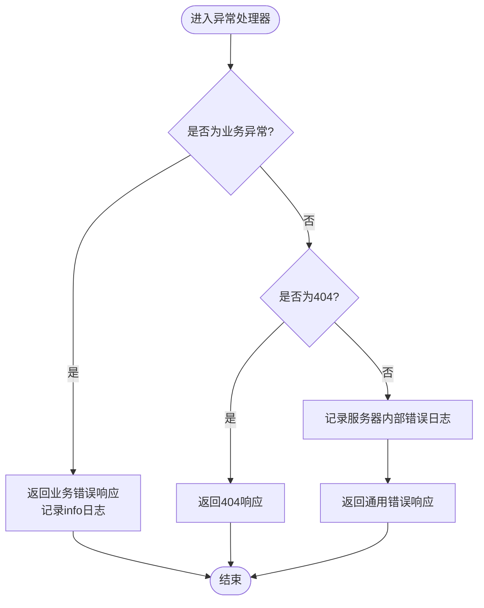
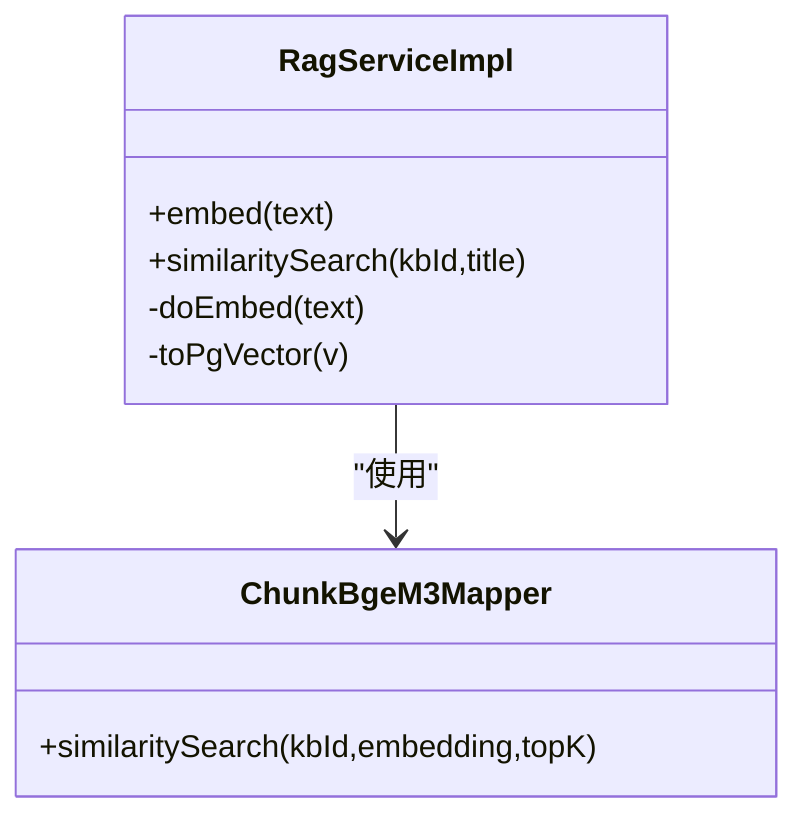
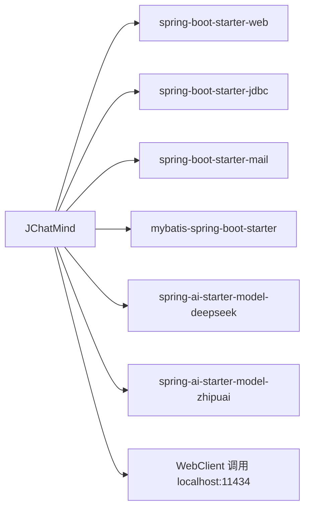

# 监控日志

<cite>
**本文引用的文件**
- [application.yaml](file://jchatmind/src/main/resources/application.yaml)
- [pom.xml](file://jchatmind/pom.xml)
- [JchatmindApplication.java](file://jchatmind/src/main/java/com/kama/jchatmind/JchatmindApplication.java)
- [GlobalExceptionHandler.java](file://jchatmind/src/main/java/com/kama/jchatmind/exception/GlobalExceptionHandler.java)
- [BizException.java](file://jchatmind/src/main/java/com/kama/jchatmind/exception/BizException.java)
- [AsyncConfig.java](file://jchatmind/src/main/java/com/kama/jchatmind/config/AsyncConfig.java)
- [RagServiceImpl.java](file://jchatmind/src/main/java/com/kama/jchatmind/service/impl/RagServiceImpl.java)
- [AgentController.java](file://jchatmind/src/main/java/com/kama/jchatmind/controller/AgentController.java)
- [TestController.java](file://jchatmind/src/main/java/com/kama/jchatmind/controller/TestController.java)
- [ApiResponse.java](file://jchatmind/src/main/java/com/kama/jchatmind/model/common/ApiResponse.java)
- [JChatMind.java](file://jchatmind/src/main/java/com/kama/jchatmind/agent/JChatMind.java)
</cite>

## 目录
1. [简介](#简介)
2. [项目结构](#项目结构)
3. [核心组件](#核心组件)
4. [架构总览](#架构总览)
5. [详细组件分析](#详细组件分析)
6. [依赖分析](#依赖分析)
7. [性能考虑](#性能考虑)
8. [故障排查指南](#故障排查指南)
9. [结论](#结论)
10. [附录](#附录)

## 简介
本指南面向JChatMind的运维与开发团队，聚焦于Spring Boot应用的监控与日志管理。内容涵盖：
- 应用性能监控：线程池、异步任务、请求处理等
- 数据库连接池监控：当前未启用连接池监控，建议引入相关指标
- AI服务调用监控：本地嵌入模型服务与外部AI模型调用的可观测性
- 日志配置与级别管理：统一错误日志收集与异常处理机制
- Prometheus与Grafana集成：关键指标定义与告警规则建议
- 分布式追踪与链路监控：基于HTTP请求链路的端到端观测

## 项目结构
JChatMind采用标准Spring Boot工程结构，核心模块包括：
- 控制层：REST接口，统一响应包装
- 异常处理：全局异常捕获与错误响应
- 服务层：RAG嵌入、SSE推送、邮件等
- 配置层：异步任务线程池配置
- 资源：应用配置与MyBatis映射

图表来源
- [JchatmindApplication.java:1-14](file://jchatmind/src/main/java/com/kama/jchatmind/JchatmindApplication.java#L1-L14)
- [AgentController.java:1-45](file://jchatmind/src/main/java/com/kama/jchatmind/controller/AgentController.java#L1-L45)
- [TestController.java:1-25](file://jchatmind/src/main/java/com/kama/jchatmind/controller/TestController.java#L1-L25)
- [RagServiceImpl.java:1-67](file://jchatmind/src/main/java/com/kama/jchatmind/service/impl/RagServiceImpl.java#L1-L67)
- [AsyncConfig.java:1-25](file://jchatmind/src/main/java/com/kama/jchatmind/config/AsyncConfig.java#L1-L25)
- [GlobalExceptionHandler.java:1-38](file://jchatmind/src/main/java/com/kama/jchatmind/exception/GlobalExceptionHandler.java#L1-L38)
- [BizException.java:1-15](file://jchatmind/src/main/java/com/kama/jchatmind/exception/BizException.java#L1-L15)
- [application.yaml:1-43](file://jchatmind/src/main/resources/application.yaml#L1-L43)

章节来源
- [JchatmindApplication.java:1-14](file://jchatmind/src/main/java/com/kama/jchatmind/JchatmindApplication.java#L1-L14)
- [application.yaml:1-43](file://jchatmind/src/main/resources/application.yaml#L1-L43)

## 核心组件
- 全局异常处理器：统一捕获业务异常与未处理异常，输出结构化错误响应，并记录错误日志
- 统一响应封装：所有接口返回统一格式，便于前端与监控系统解析
- 异步任务配置：线程池参数可调，支持事件驱动的异步处理
- AI服务调用：通过WebClient调用本地嵌入模型服务，支持向量相似检索
- 健康检查：提供基础健康探针接口

章节来源
- [GlobalExceptionHandler.java:1-38](file://jchatmind/src/main/java/com/kama/jchatmind/exception/GlobalExceptionHandler.java#L1-L38)
- [ApiResponse.java:1-59](file://jchatmind/src/main/java/com/kama/jchatmind/model/common/ApiResponse.java#L1-L59)
- [AsyncConfig.java:1-25](file://jchatmind/src/main/java/com/kama/jchatmind/config/AsyncConfig.java#L1-L25)
- [RagServiceImpl.java:1-67](file://jchatmind/src/main/java/com/kama/jchatmind/service/impl/RagServiceImpl.java#L1-L67)
- [TestController.java:1-25](file://jchatmind/src/main/java/com/kama/jchatmind/controller/TestController.java#L1-L25)

## 架构总览
下图展示从客户端到AI服务的关键调用路径与监控关注点。

图表来源
- [AgentController.java:1-45](file://jchatmind/src/main/java/com/kama/jchatmind/controller/AgentController.java#L1-L45)
- [RagServiceImpl.java:1-67](file://jchatmind/src/main/java/com/kama/jchatmind/service/impl/RagServiceImpl.java#L1-L67)
- [application.yaml:1-43](file://jchatmind/src/main/resources/application.yaml#L1-L43)

## 详细组件分析

### 全局异常处理与日志
- 业务异常捕获：将业务异常转换为统一错误响应，避免泄露内部细节
- 未处理异常：记录服务器内部错误日志，返回通用错误提示
- 404处理：对资源不存在进行明确响应
- 日志级别：使用info/warn/error等分层记录，便于集中采集与告警

图表来源
- [GlobalExceptionHandler.java:1-38](file://jchatmind/src/main/java/com/kama/jchatmind/exception/GlobalExceptionHandler.java#L1-L38)
- [BizException.java:1-15](file://jchatmind/src/main/java/com/kama/jchatmind/exception/BizException.java#L1-L15)

章节来源
- [GlobalExceptionHandler.java:1-38](file://jchatmind/src/main/java/com/kama/jchatmind/exception/GlobalExceptionHandler.java#L1-L38)
- [BizException.java:1-15](file://jchatmind/src/main/java/com/kama/jchatmind/exception/BizException.java#L1-L15)

### 统一响应与接口设计
- 统一响应体包含状态码、消息与数据字段，便于监控系统解析
- 控制器方法直接返回统一响应，减少重复逻辑

章节来源
- [ApiResponse.java:1-59](file://jchatmind/src/main/java/com/kama/jchatmind/model/common/ApiResponse.java#L1-L59)
- [AgentController.java:1-45](file://jchatmind/src/main/java/com/kama/jchatmind/controller/AgentController.java#L1-L45)

### 异步任务与线程池
- 线程池参数：核心线程数、最大线程数、队列容量、线程前缀
- 适用于事件监听、SSE推送等异步场景

章节来源
- [AsyncConfig.java:1-25](file://jchatmind/src/main/java/com/kama/jchatmind/config/AsyncConfig.java#L1-L25)

### AI服务调用与RAG流程
- 本地嵌入服务：通过WebClient调用本地模型服务生成向量
- 向量相似检索：将查询向量与知识库向量进行相似度匹配
- 数据库：使用PostgreSQL与pgvector类型进行向量存储与检索

图表来源
- [RagServiceImpl.java:1-67](file://jchatmind/src/main/java/com/kama/jchatmind/service/impl/RagServiceImpl.java#L1-L67)

章节来源
- [RagServiceImpl.java:1-67](file://jchatmind/src/main/java/com/kama/jchatmind/service/impl/RagServiceImpl.java#L1-L67)
- [application.yaml:1-43](file://jchatmind/src/main/resources/application.yaml#L1-L43)

### 健康检查与SSE测试
- 健康探针：提供基础健康检查接口
- SSE测试：验证服务端推送能力

章节来源
- [TestController.java:1-25](file://jchatmind/src/main/java/com/kama/jchatmind/controller/TestController.java#L1-L25)

### 智能体日志与工具调用
- 工具调用日志：在智能体执行过程中打印工具调用明细，便于审计与排障
- 错误与警告：对异常与达到最大步数等边界条件进行日志记录

章节来源
- [JChatMind.java:142-160](file://jchatmind/src/main/java/com/kama/jchatmind/agent/JChatMind.java#L142-L160)
- [JChatMind.java:327-333](file://jchatmind/src/main/java/com/kama/jchatmind/agent/JChatMind.java#L327-L333)

## 依赖分析
- Spring Boot Starter：web、jdbc、mail、devtools、test
- MyBatis：数据访问层
- Spring AI：DeepSeek与ZhipuAI模型集成
- 本地嵌入服务：Ollama（通过WebClient调用）

图表来源
- [pom.xml:46-122](file://jchatmind/pom.xml#L46-L122)
- [RagServiceImpl.java:21-24](file://jchatmind/src/main/java/com/kama/jchatmind/service/impl/RagServiceImpl.java#L21-L24)

章节来源
- [pom.xml:46-122](file://jchatmind/pom.xml#L46-L122)

## 性能考虑
- 线程池调优：根据并发请求与I/O密集程度调整核心线程数、最大线程数与队列容量
- 数据库连接池：当前未引入连接池监控，建议增加连接池指标（活跃连接、空闲连接、等待时间、超时次数）
- AI服务延迟：本地嵌入服务与外部模型调用均可能成为瓶颈，建议增加调用耗时与失败率指标
- GC与内存：结合JVM指标观察Full GC频率与停顿时间，优化对象生命周期
- 网络与超时：合理设置WebClient超时与重试策略，避免阻塞

## 故障排查指南
- 统一错误响应：优先查看接口返回的统一响应体，定位业务错误或系统错误
- 日志定位：根据全局异常处理器的日志级别，快速定位异常根因
- 健康检查：确认应用健康探针可用，排除启动失败或端口占用问题
- AI服务连通性：检查本地嵌入服务是否正常，确认WebClient调用可达
- 数据库连通性：核对数据源配置与凭据，确保连接成功

章节来源
- [GlobalExceptionHandler.java:1-38](file://jchatmind/src/main/java/com/kama/jchatmind/exception/GlobalExceptionHandler.java#L1-L38)
- [TestController.java:1-25](file://jchatmind/src/main/java/com/kama/jchatmind/controller/TestController.java#L1-L25)
- [RagServiceImpl.java:32-43](file://jchatmind/src/main/java/com/kama/jchatmind/service/impl/RagServiceImpl.java#L32-L43)
- [application.yaml:4-8](file://jchatmind/src/main/resources/application.yaml#L4-L8)

## 结论
JChatMind已具备统一异常处理与日志记录的基础能力，建议在此基础上补充：
- 连接池与数据库指标采集
- AI服务调用耗时与成功率统计
- 健康检查与SSE推送的端到端链路观测
- Prometheus与Grafana的指标与告警配置
- 分布式追踪（如基于HTTP链路）以实现跨服务链路监控

## 附录

### 监控指标建议（Prometheus）
- 应用层
  - 请求总量与成功率：counter
  - 请求耗时分位：histogram
  - 异常计数：counter
  - 健康检查状态：gauge
- 数据库层
  - 连接池活跃/空闲连接数：gauge
  - 连接获取等待时间：histogram
  - SQL执行耗时：histogram
  - 连接超时/拒绝次数：counter
- AI服务层
  - 嵌入调用耗时：histogram
  - 嵌入调用失败率：counter
  - 相似度检索耗时：histogram
- 系统层
  - CPU使用率、内存使用率、GC时间
  - 线程池活跃线程数、队列长度

### 告警规则示例（Prometheus Alerting）
- 请求错误率超过阈值
- 健康检查连续失败
- 数据库连接池等待时间持续升高
- AI服务调用失败率上升
- 线程池队列积压严重

### Prometheus与Grafana集成步骤
- 配置Prometheus抓取目标（应用端点）
- 在Grafana中添加Prometheus数据源
- 导入或自定义仪表盘模板，展示关键指标
- 设置告警通道（邮件/IM），绑定告警规则

### 分布式追踪与链路监控
- 使用HTTP请求作为链路起点，记录请求ID与上下文
- 在控制器、服务层、WebClient调用处标注span
- 将span上报至集中式追踪系统（如Jaeger/Zipkin）
- 在Grafana中通过追踪面板查看端到端时序