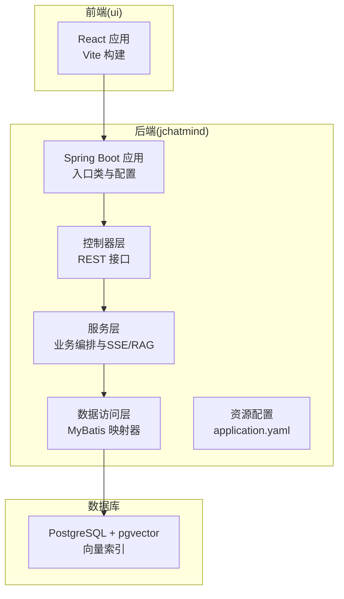
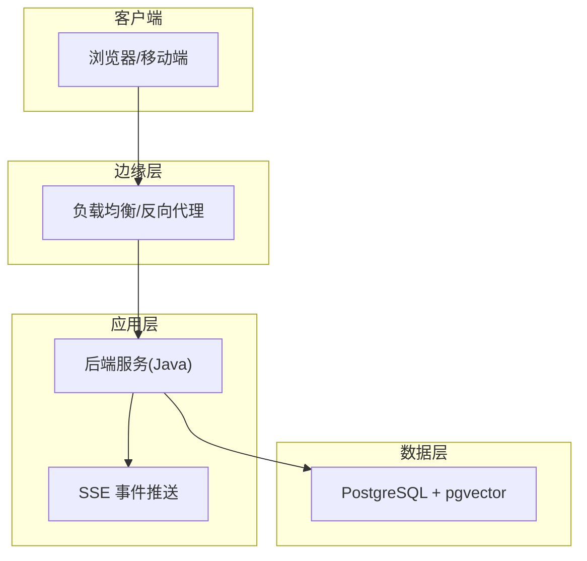
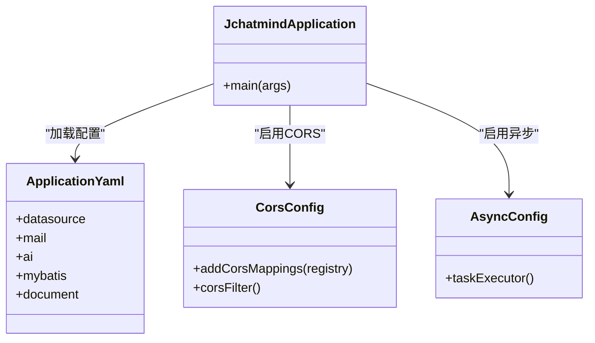
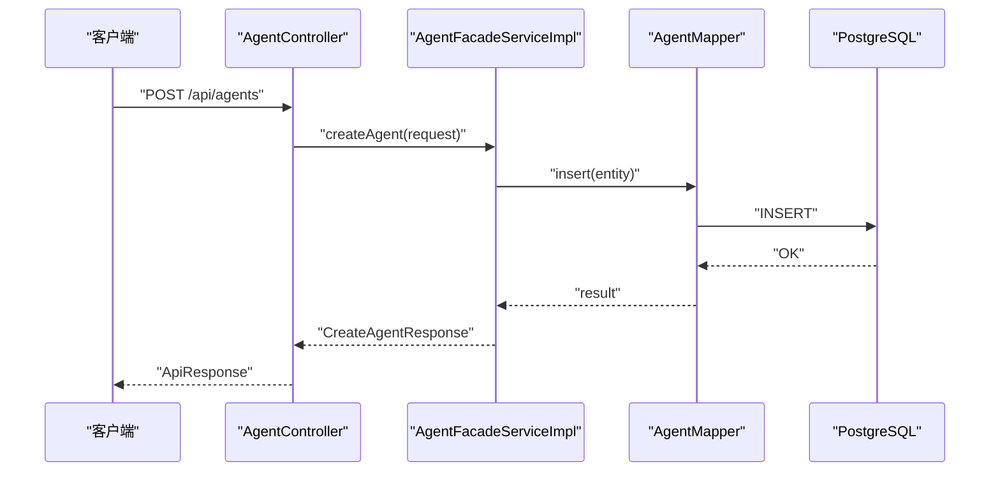
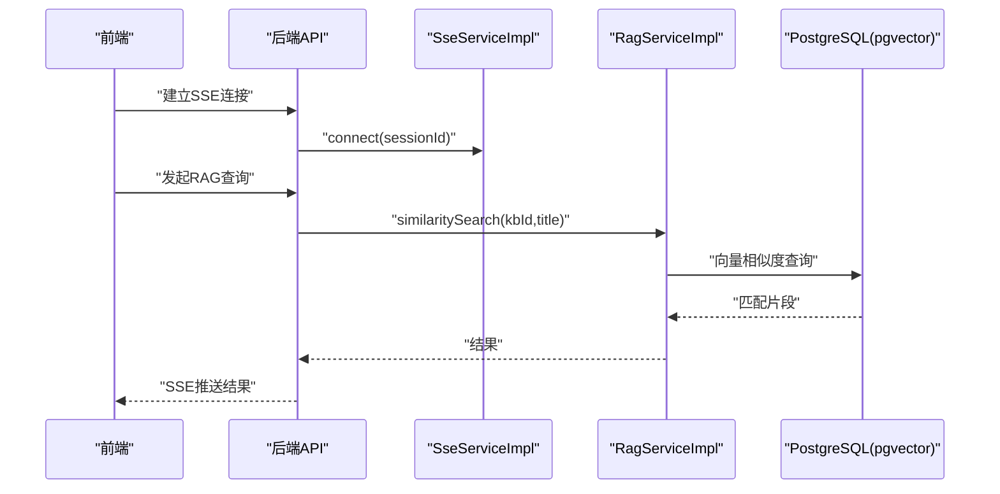
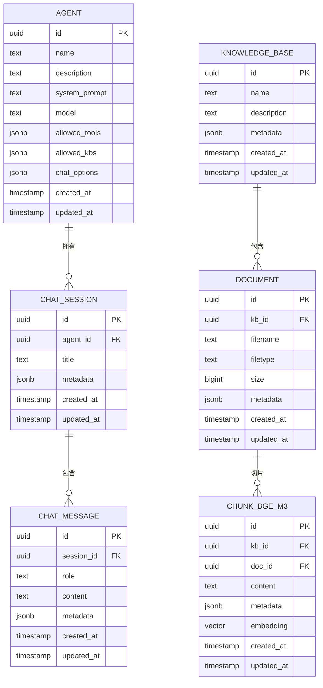
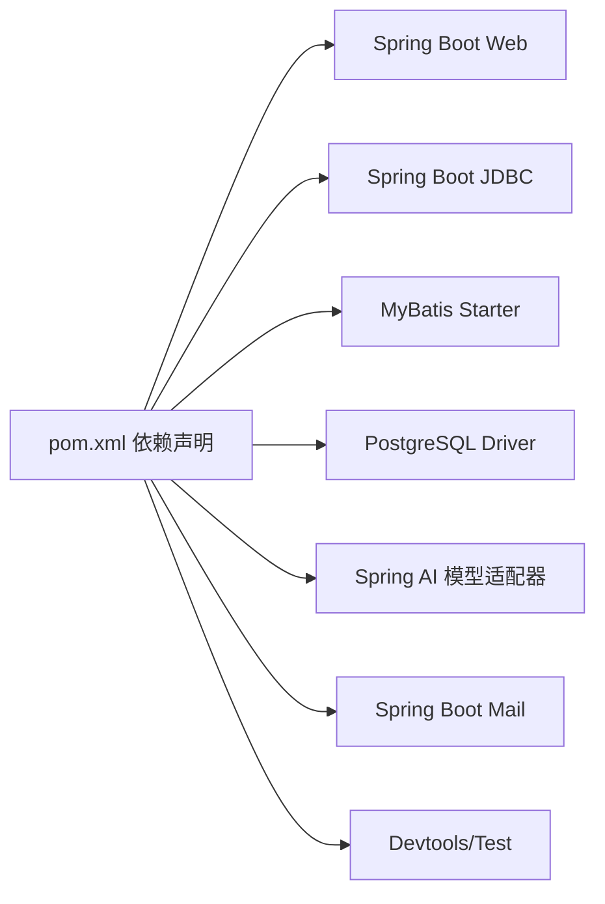

# 部署运维

<cite>
**本文引用的文件**
- [README.md](file://README.md)
- [pom.xml](file://jchatmind/pom.xml)
- [application.yaml](file://jchatmind/src/main/resources/application.yaml)
- [jchatmind.sql](file://sql/jchatmind.sql)
- [package.json](file://ui/package.json)
- [JchatmindApplication.java](file://jchatmind/src/main/java/com/kama/jchatmind/JchatmindApplication.java)
- [CorsConfig.java](file://jchatmind/src/main/java/com/kama/jchatmind/config/CorsConfig.java)
- [AsyncConfig.java](file://jchatmind/src/main/java/com/kama/jchatmind/config/AsyncConfig.java)
- [AgentController.java](file://jchatmind/src/main/java/com/kama/jchatmind/controller/AgentController.java)
- [AgentFacadeServiceImpl.java](file://jchatmind/src/main/java/com/kama/jchatmind/service/impl/AgentFacadeServiceImpl.java)
- [RagServiceImpl.java](file://jchatmind/src/main/java/com/kama/jchatmind/service/impl/RagServiceImpl.java)
- [SseServiceImpl.java](file://jchatmind/src/main/java/com/kama/jchatmind/service/impl/SseServiceImpl.java)
</cite>

## 目录
1. [简介](#简介)
2. [项目结构](#项目结构)
3. [核心组件](#核心组件)
4. [架构总览](#架构总览)
5. [详细组件分析](#详细组件分析)
6. [依赖关系分析](#依赖关系分析)
7. [性能考虑](#性能考虑)
8. [故障排除指南](#故障排除指南)
9. [结论](#结论)
10. [附录](#附录)

## 简介
本指南面向JChatMind在生产环境的部署与运维，覆盖以下主题：
- 生产环境部署流程与容器化方案
- 云平台部署策略与负载均衡设置
- 数据库配置优化与向量索引
- 性能监控指标与日志管理策略
- CI/CD流水线配置、自动化测试与发布流程
- 故障排除、性能调优与安全加固
- 备份恢复与灾难恢复计划

JChatMind基于Spring Boot 3.x与Spring AI构建，后端采用PostgreSQL + pgvector实现RAG检索，前端使用React 18 + Vite，提供SSE实时推送能力。

**章节来源**
- [README.md:1-71](file://README.md#L1-L71)

## 项目结构
后端工程位于jchatmind目录，前端工程位于ui目录；数据库初始化脚本位于sql目录。整体结构清晰，前后端分离，便于容器化与云平台部署。

**图表来源**
- [JchatmindApplication.java:1-14](file://jchatmind/src/main/java/com/kama/jchatmind/JchatmindApplication.java#L1-L14)
- [application.yaml:1-43](file://jchatmind/src/main/resources/application.yaml#L1-L43)
- [jchatmind.sql:1-88](file://sql/jchatmind.sql#L1-L88)

**章节来源**
- [README.md:25-45](file://README.md#L25-L45)
- [pom.xml:1-132](file://jchatmind/pom.xml#L1-L132)
- [application.yaml:1-43](file://jchatmind/src/main/resources/application.yaml#L1-L43)
- [jchatmind.sql:1-88](file://sql/jchatmind.sql#L1-L88)
- [package.json:1-44](file://ui/package.json#L1-L44)

## 核心组件
- 应用入口与启动：Spring Boot应用入口负责加载配置与启动Web容器。
- 控制器层：提供REST接口，如Agent管理、聊天会话、文档与知识库等。
- 服务层：封装业务逻辑，包括SSE事件推送、RAG相似度检索、异步任务执行等。
- 数据访问层：基于MyBatis，映射器访问PostgreSQL，使用pgvector进行向量检索。
- 配置中心：application.yaml集中管理数据源、邮件、AI模型、文档存储路径等。

**章节来源**
- [JchatmindApplication.java:1-14](file://jchatmind/src/main/java/com/kama/jchatmind/JchatmindApplication.java#L1-L14)
- [AgentController.java:1-45](file://jchatmind/src/main/java/com/kama/jchatmind/controller/AgentController.java#L1-L45)
- [AgentFacadeServiceImpl.java:1-122](file://jchatmind/src/main/java/com/kama/jchatmind/service/impl/AgentFacadeServiceImpl.java#L1-L122)
- [SseServiceImpl.java:1-64](file://jchatmind/src/main/java/com/kama/jchatmind/service/impl/SseServiceImpl.java#L1-L64)
- [RagServiceImpl.java:1-67](file://jchatmind/src/main/java/com/kama/jchatmind/service/impl/RagServiceImpl.java#L1-L67)
- [application.yaml:1-43](file://jchatmind/src/main/resources/application.yaml#L1-L43)

## 架构总览
下图展示JChatMind在生产环境中的典型部署形态：前端通过反向代理或负载均衡接入后端服务，后端连接PostgreSQL并利用pgvector进行RAG检索；SSE用于实时事件推送。

**图表来源**
- [README.md:25-45](file://README.md#L25-L45)
- [application.yaml:1-43](file://jchatmind/src/main/resources/application.yaml#L1-L43)
- [jchatmind.sql:1-88](file://sql/jchatmind.sql#L1-L88)

## 详细组件分析

### 后端应用与配置
- 应用入口：负责启动Spring Boot应用，加载自动配置与组件扫描。
- 配置文件：集中管理数据源、邮件、AI模型（DeepSeek/ZhipuAI）、MyBatis、文档存储路径等。
- 跨域配置：开发环境允许本地主机跨域，生产环境应按域名白名单严格配置。
- 异步配置：线程池用于异步事件处理，避免阻塞主线程。

**图表来源**
- [JchatmindApplication.java:1-14](file://jchatmind/src/main/java/com/kama/jchatmind/JchatmindApplication.java#L1-L14)
- [CorsConfig.java:1-61](file://jchatmind/src/main/java/com/kama/jchatmind/config/CorsConfig.java#L1-L61)
- [AsyncConfig.java:1-25](file://jchatmind/src/main/java/com/kama/jchatmind/config/AsyncConfig.java#L1-L25)
- [application.yaml:1-43](file://jchatmind/src/main/resources/application.yaml#L1-L43)

**章节来源**
- [JchatmindApplication.java:1-14](file://jchatmind/src/main/java/com/kama/jchatmind/JchatmindApplication.java#L1-L14)
- [CorsConfig.java:1-61](file://jchatmind/src/main/java/com/kama/jchatmind/config/CorsConfig.java#L1-L61)
- [AsyncConfig.java:1-25](file://jchatmind/src/main/java/com/kama/jchatmind/config/AsyncConfig.java#L1-L25)
- [application.yaml:1-43](file://jchatmind/src/main/resources/application.yaml#L1-L43)

### 控制器与服务编排
- 控制器：提供Agent管理等REST接口，返回统一响应包装。
- 服务实现：封装Agent增删改查、SSE事件推送、RAG相似度检索等业务逻辑。
- SSE服务：维护客户端连接，发送事件流，支持超时与异常清理。
- RAG服务：调用本地嵌入服务生成向量，查询pgvector相似片段。

**图表来源**
- [AgentController.java:1-45](file://jchatmind/src/main/java/com/kama/jchatmind/controller/AgentController.java#L1-L45)
- [AgentFacadeServiceImpl.java:1-122](file://jchatmind/src/main/java/com/kama/jchatmind/service/impl/AgentFacadeServiceImpl.java#L1-L122)

**图表来源**
- [SseServiceImpl.java:1-64](file://jchatmind/src/main/java/com/kama/jchatmind/service/impl/SseServiceImpl.java#L1-L64)
- [RagServiceImpl.java:1-67](file://jchatmind/src/main/java/com/kama/jchatmind/service/impl/RagServiceImpl.java#L1-L67)
- [jchatmind.sql:68-88](file://sql/jchatmind.sql#L68-L88)

**章节来源**
- [AgentController.java:1-45](file://jchatmind/src/main/java/com/kama/jchatmind/controller/AgentController.java#L1-L45)
- [AgentFacadeServiceImpl.java:1-122](file://jchatmind/src/main/java/com/kama/jchatmind/service/impl/AgentFacadeServiceImpl.java#L1-L122)
- [SseServiceImpl.java:1-64](file://jchatmind/src/main/java/com/kama/jchatmind/service/impl/SseServiceImpl.java#L1-L64)
- [RagServiceImpl.java:1-67](file://jchatmind/src/main/java/com/kama/jchatmind/service/impl/RagServiceImpl.java#L1-L67)

### 数据模型与向量索引
数据库采用PostgreSQL + pgvector，核心表包括agent、chat_session、chat_message、knowledge_base、document、chunk_bge_m3。向量字段使用1024维，创建IVFFLAT索引以提升相似度检索性能。

**图表来源**
- [jchatmind.sql:1-88](file://sql/jchatmind.sql#L1-L88)

**章节来源**
- [jchatmind.sql:1-88](file://sql/jchatmind.sql#L1-L88)

## 依赖关系分析
- 技术栈：Java 17+、Spring Boot 3.x、Spring AI、MyBatis、PostgreSQL + pgvector、React 18 + Vite。
- 关键依赖：Spring Web、JDBC、MyBatis Starter、PostgreSQL驱动、Spring AI模型适配器、邮件、开发工具与测试框架。
- 运行时依赖：后端服务依赖数据库与本地嵌入服务（Ollama），SSE用于实时推送。

**图表来源**
- [pom.xml:1-132](file://jchatmind/pom.xml#L1-L132)

**章节来源**
- [pom.xml:1-132](file://jchatmind/pom.xml#L1-L132)
- [README.md:31-45](file://README.md#L31-L45)

## 性能考虑
- 数据库性能
  - 向量索引：使用IVFFLAT索引与合适的lists参数，平衡召回率与查询延迟。
  - 连接池：合理配置最大连接数与超时，避免高并发下的连接争用。
  - 查询优化：对常用过滤字段建立索引，减少全表扫描。
- 应用性能
  - 异步处理：利用线程池处理非CPU密集型任务，降低请求延迟。
  - SSE长连接：控制超时时间与内存占用，及时清理断开连接。
  - 缓存策略：对热点配置与只读数据进行缓存，减少数据库压力。
- 前端性能
  - 构建优化：使用Vite生产构建，启用代码分割与懒加载。
  - 资源压缩：开启Gzip/Brotli压缩，合理设置缓存头。
- 监控指标
  - 应用指标：请求QPS、P95/P99延迟、错误率、线程池队列长度、数据库连接数。
  - 数据库指标：慢查询、锁等待、索引命中率、向量查询耗时。
  - 容器指标：CPU/内存使用率、网络I/O、磁盘IO与容量。
- 日志管理
  - 结构化日志：统一格式输出，便于采集与检索。
  - 分层日志：区分访问日志、业务日志、错误日志，设置不同级别与滚动策略。
  - 隐私保护：脱敏敏感信息，遵守数据合规要求。

[本节为通用性能指导，不直接分析特定文件]

## 故障排除指南
- 启动失败
  - 检查JDK版本与依赖是否正确，确认数据库连接参数与网络可达性。
  - 查看应用日志定位异常堆栈，优先排查配置文件与依赖冲突。
- 数据库问题
  - pgvector扩展缺失：确保PostgreSQL版本满足要求并已安装扩展。
  - 向量索引异常：检查索引创建语句与权限，必要时重建索引。
- SSE连接异常
  - 客户端未收到消息：确认SSE连接建立成功，检查事件名称与数据格式。
  - 连接频繁断开：调整超时时间与心跳策略，排查网络波动。
- RAG检索缓慢
  - 向量维度与索引参数：评估lists与ef参数，结合业务召回率调整。
  - 数据量增长：定期维护索引，拆分知识库或增加分片。
- 邮件发送失败
  - SMTP配置：核对主机、端口、认证与加密设置，检查授权码有效性。
- 跨域问题
  - 生产环境CORS：严格限制域名与方法，避免使用通配符导致安全风险。

**章节来源**
- [application.yaml:1-43](file://jchatmind/src/main/resources/application.yaml#L1-L43)
- [jchatmind.sql:1-88](file://sql/jchatmind.sql#L1-L88)
- [SseServiceImpl.java:1-64](file://jchatmind/src/main/java/com/kama/jchatmind/service/impl/SseServiceImpl.java#L1-L64)
- [CorsConfig.java:1-61](file://jchatmind/src/main/java/com/kama/jchatmind/config/CorsConfig.java#L1-L61)

## 结论
JChatMind具备清晰的分层架构与可扩展的服务能力，适合在生产环境中通过容器化与云平台进行部署。建议结合本文提供的部署流程、性能优化与安全加固策略，构建稳定可靠的AI Agent服务平台。

[本节为总结性内容，不直接分析特定文件]

## 附录

### 生产环境部署流程
- 环境准备
  - 操作系统：Linux发行版（推荐Ubuntu/CentOS）。
  - 运行时：JDK 17+、Node.js 18+、PostgreSQL 14+（含pgvector扩展）。
  - 容器运行时：Docker与Kubernetes集群。
- 步骤概要
  - 构建后端镜像：打包Spring Boot应用，生成最小化容器镜像。
  - 构建前端镜像：使用Vite生产构建，静态资源托管于Nginx或CDN。
  - 部署数据库：初始化schema与索引，配置备份策略。
  - 部署应用：通过Kubernetes部署后端服务，配置Service与Ingress。
  - 负载均衡：配置Nginx或云厂商LB，启用健康检查与会话亲和。
  - 监控与日志：集成Prometheus/Grafana与日志收集系统。

[本节为通用流程说明，不直接分析特定文件]

### 容器化部署方案
- Docker镜像构建
  - 后端：多阶段构建，使用Alpine或Debian基础镜像，复制JAR与配置文件。
  - 前端：使用Nginx官方镜像，挂载构建产物，启用gzip与缓存。
  - 镜像签名与仓库：使用私有仓库或云镜像服务，启用镜像签名与漏洞扫描。
- Kubernetes部署
  - Deployment：定义副本数、探针、资源限制与环境变量。
  - Service：ClusterIP或LoadBalancer暴露服务，配置会话亲和。
  - ConfigMap/Secret：分离配置与密钥，支持热更新。
  - Ingress：配置TLS、路径路由与限流策略。
  - 存储：持久卷挂载文档存储目录与数据库卷。

[本节为通用容器化指导，不直接分析特定文件]

### 云平台部署策略
- 云厂商选择：AWS、Azure、GCP或国内云平台，关注网络、存储与数据库服务。
- 网络与安全：VPC隔离、子网划分、安全组与WAF防护。
- 数据库托管：使用托管PostgreSQL与pgvector，开启自动备份与跨可用区部署。
- 负载均衡：云LB或Ingress控制器，配置健康检查与自动扩缩容。
- CI/CD：流水线自动构建镜像、推送仓库、触发Kubernetes部署。

[本节为通用云平台策略，不直接分析特定文件]

### CI/CD流水线配置
- 触发条件：主分支合并、标签推送、手动触发。
- 构建阶段：后端Maven构建、前端Vite构建、单元测试与静态分析。
- 安全扫描：镜像漏洞扫描、依赖许可证检查、配置文件敏感信息检测。
- 发布阶段：推送镜像到仓库、更新Kubernetes部署、灰度发布与回滚策略。
- 回归测试：集成测试、端到端测试与性能回归测试。

[本节为通用CI/CD指导，不直接分析特定文件]

### 数据库配置优化
- 参数调优：共享内存、工作进程、WAL与checkpoint相关参数。
- 索引策略：为高频查询字段建立索引，定期分析统计信息。
- 向量检索：根据业务规模调整IVFFLAT索引参数，定期重排lists。
- 备份策略：全量+增量备份，定期校验与异地容灾。

**章节来源**
- [jchatmind.sql:83-88](file://sql/jchatmind.sql#L83-L88)

### 备份恢复与灾难恢复
- 备份策略：数据库定时全备与增量备份，文档存储定期快照。
- 恢复流程：验证备份完整性，按步骤恢复至新实例，校验数据一致性。
- DR计划：同城双活与异地灾备，演练切换与回切流程，确保RTO/RPO达标。

[本节为通用备份与DR指导，不直接分析特定文件]

### 安全加固措施
- 网络安全：仅开放必要端口，启用WAF与DDoS防护，内网隔离。
- 访问控制：最小权限原则，RBAC与API鉴权，CORS严格白名单。
- 数据安全：传输加密（TLS）、静态加密、敏感数据脱敏与加密存储。
- 镜像与依赖：定期扫描漏洞，禁用不必要的包与root权限容器。

[本节为通用安全指导，不直接分析特定文件]