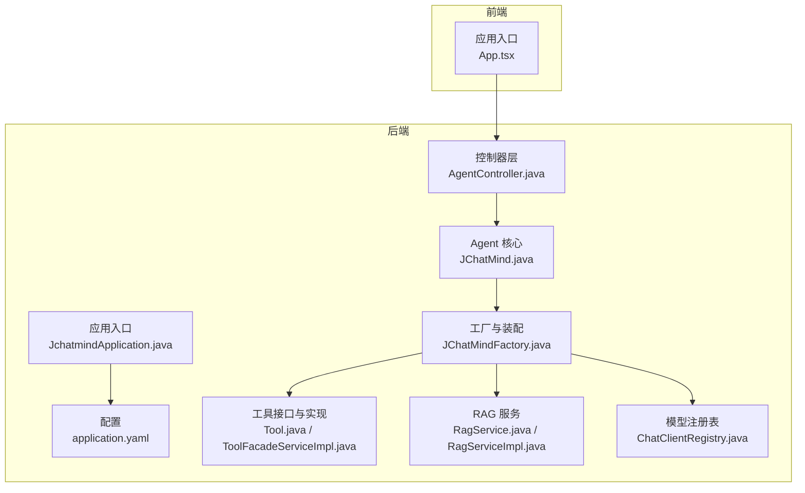
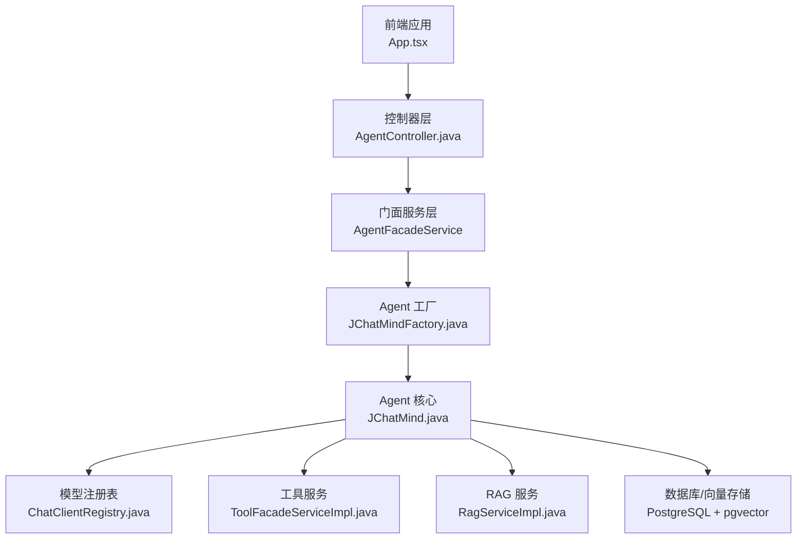
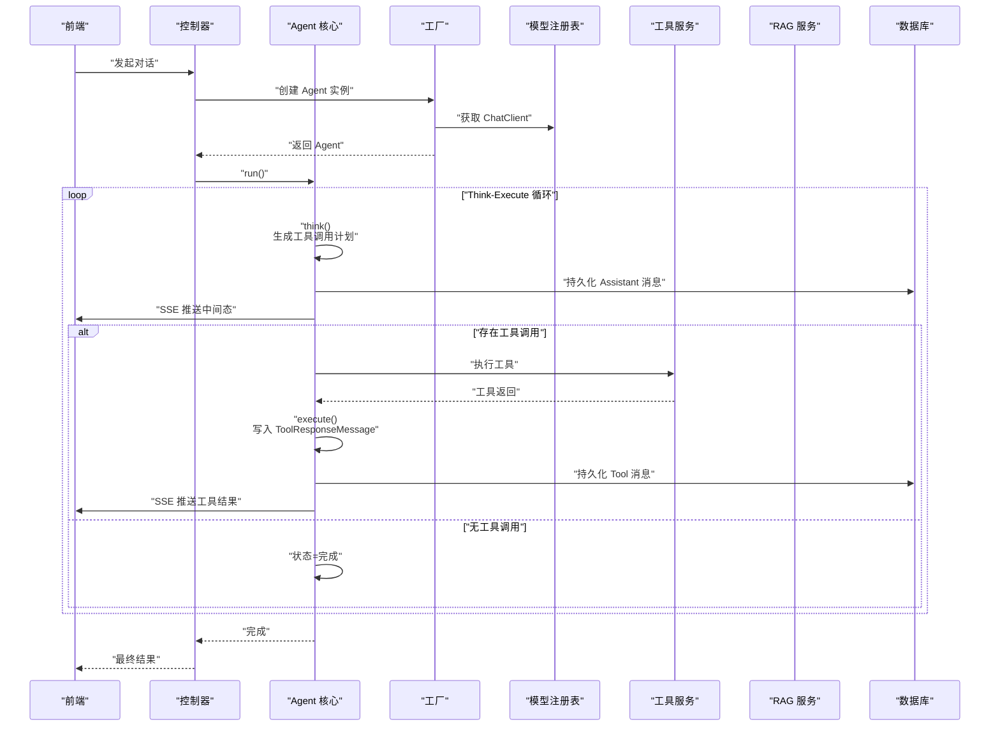
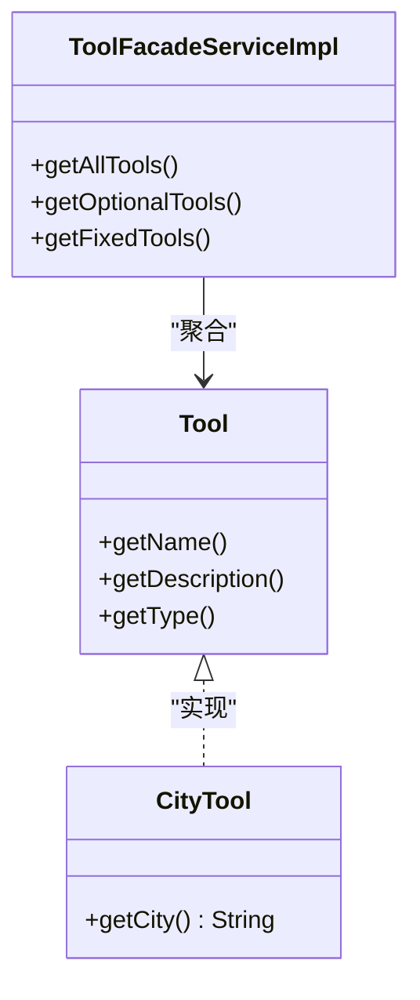
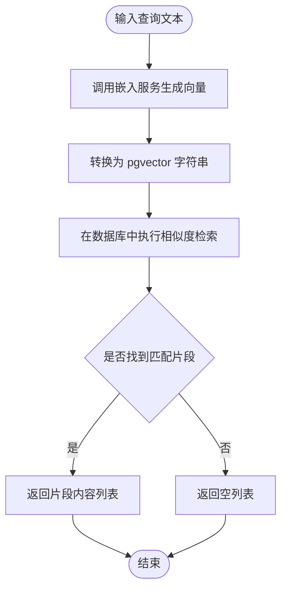
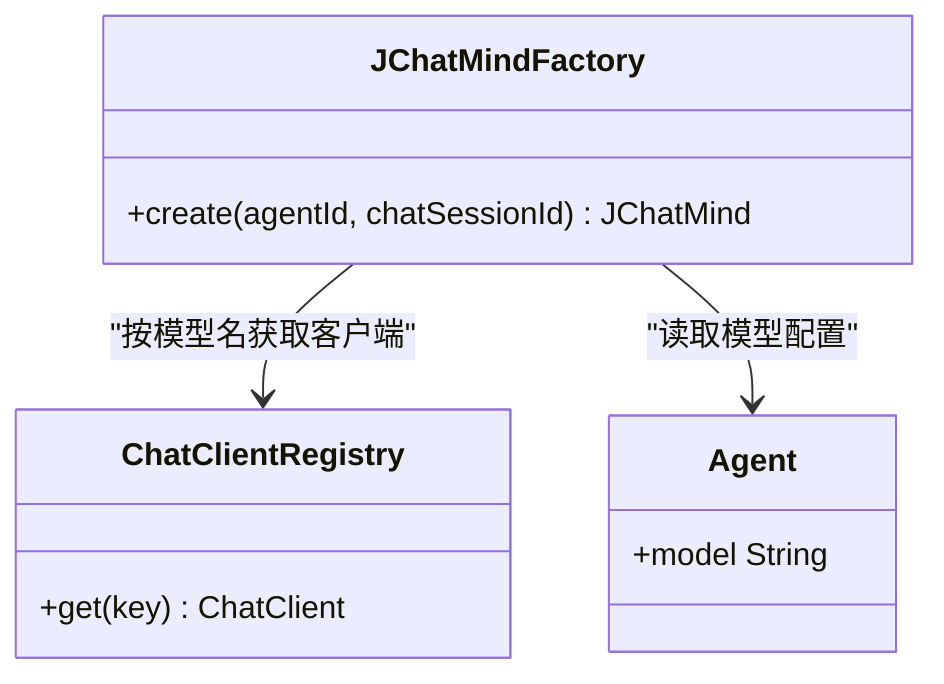
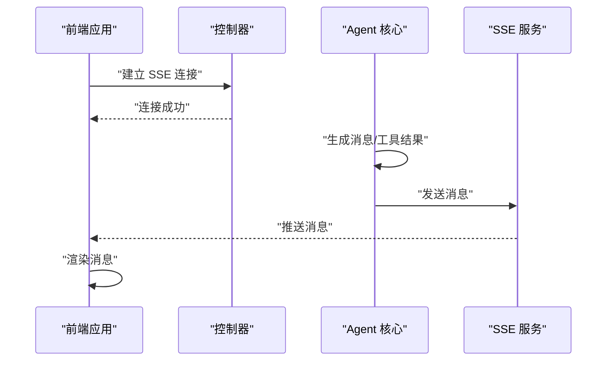
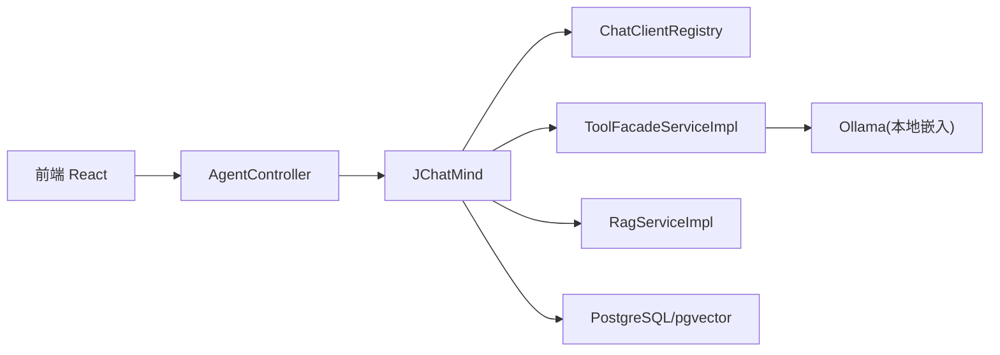

# 项目概述

<cite>
**本文引用的文件**
- [README.md](file://README.md)
- [JchatmindApplication.java](file://jchatmind/src/main/java/com/kama/jchatmind/JchatmindApplication.java)
- [application.yaml](file://jchatmind/src/main/resources/application.yaml)
- [JChatMind.java](file://jchatmind/src/main/java/com/kama/jchatmind/agent/JChatMind.java)
- [JChatMindFactory.java](file://jchatmind/src/main/java/com/kama/jchatmind/agent/JChatMindFactory.java)
- [ChatClientRegistry.java](file://jchatmind/src/main/java/com/kama/jchatmind/config/ChatClientRegistry.java)
- [Tool.java](file://jchatmind/src/main/java/com/kama/jchatmind/agent/tools/Tool.java)
- [ToolFacadeServiceImpl.java](file://jchatmind/src/main/java/com/kama/jchatmind/service/impl/ToolFacadeServiceImpl.java)
- [RagService.java](file://jchatmind/src/main/java/com/kama/jchatmind/service/RagService.java)
- [RagServiceImpl.java](file://jchatmind/src/main/java/com/kama/jchatmind/service/impl/RagServiceImpl.java)
- [AgentController.java](file://jchatmind/src/main/java/com/kama/jchatmind/controller/AgentController.java)
- [Agent.java](file://jchatmind/src/main/java/com/kama/jchatmind/model/entity/Agent.java)
- [App.tsx](file://ui/src/App.tsx)
</cite>

## 目录
1. [引言](#引言)
2. [项目结构](#项目结构)
3. [核心组件](#核心组件)
4. [架构总览](#架构总览)
5. [详细组件分析](#详细组件分析)
6. [依赖分析](#依赖分析)
7. [性能考虑](#性能考虑)
8. [故障排查指南](#故障排查指南)
9. [结论](#结论)
10. [附录](#附录)

## 引言
JChatMind 是一个基于 Spring AI 框架构建的智能体（Agent）系统，具备“思考-执行”循环、工具调用与 RAG 知识库检索能力，支持多模型切换与实时 SSE 推送。其核心价值在于将大模型、向量检索与可插拔工具以分层架构与“Agent 核心服务”理念进行解耦与组合，形成可扩展、可配置、可观测的智能体平台。

- 核心特性
  - Think-Execute 循环：在每一步中由模型生成工具调用计划，再执行工具并回写上下文，直至任务完成或达到最大步数。
  - 工具调用框架：支持固定工具与可选工具的分类管理，通过方法注解自动暴露为工具回调。
  - RAG 知识库：基于 PostgreSQL + pgvector 的向量检索，结合本地嵌入服务实现相似度搜索。
  - 多模型支持：通过注册表模式管理不同模型客户端，支持 DeepSeek、智谱等模型切换。
  - SSE 实时推送：将中间态与最终结果通过服务器推送事件实时反馈到前端。

- 项目背景与应用场景
  - 背景：面向企业与个人用户的智能问答与自动化任务编排需求，强调“可解释、可扩展、可运维”的 Agent 能力。
  - 场景：知识问答、跨系统查询、自动化流程编排、多轮对话与工具联动等。

- 技术选型理由
  - 后端：Spring Boot + Spring AI 提供统一的模型接入与工具调用能力；MyBatis 负责数据持久化；PostgreSQL + pgvector 提供向量检索能力。
  - 前端：React + TypeScript + Tailwind CSS + Vite 构建现代化交互界面，配合上下文与路由管理。

- 与其他 AI 系统的差异化优势
  - 分层架构与“Agent 核心服务”：将模型、工具、知识库与会话管理解耦，便于独立演进与替换。
  - 注册表模式的多模型支持：统一对外接口，内部按模型动态选择 ChatClient。
  - 可观测性：SSE 实时推送中间态，便于调试与用户体验优化。
  - 工具与知识库的可配置化：通过 Agent 实体中的 JSON 字段控制允许使用的工具与知识库集合。

**章节来源**
- [README.md:1-71](file://README.md#L1-L71)

## 项目结构
项目采用前后端分离的多模块结构：
- 后端（Java/Spring Boot）：包含控制器、服务、持久层、配置、Agent 核心与工具集等。
- 前端（React/TypeScript）：提供智能体聊天、知识库与 Agent 管理界面。
- 数据与脚本：SQL 初始化脚本与示例资源。

**图表来源**
- [JchatmindApplication.java:1-14](file://jchatmind/src/main/java/com/kama/jchatmind/JchatmindApplication.java#L1-L14)
- [application.yaml:1-43](file://jchatmind/src/main/resources/application.yaml#L1-L43)
- [AgentController.java:1-45](file://jchatmind/src/main/java/com/kama/jchatmind/controller/AgentController.java#L1-L45)
- [JChatMind.java:1-348](file://jchatmind/src/main/java/com/kama/jchatmind/agent/JChatMind.java#L1-L348)
- [JChatMindFactory.java:1-248](file://jchatmind/src/main/java/com/kama/jchatmind/agent/JChatMindFactory.java#L1-L248)
- [Tool.java:1-10](file://jchatmind/src/main/java/com/kama/jchatmind/agent/tools/Tool.java#L1-L10)
- [ToolFacadeServiceImpl.java:1-38](file://jchatmind/src/main/java/com/kama/jchatmind/service/impl/ToolFacadeServiceImpl.java#L1-L38)
- [RagService.java:1-10](file://jchatmind/src/main/java/com/kama/jchatmind/service/RagService.java#L1-L10)
- [RagServiceImpl.java:1-67](file://jchatmind/src/main/java/com/kama/jchatmind/service/impl/RagServiceImpl.java#L1-L67)
- [ChatClientRegistry.java:1-21](file://jchatmind/src/main/java/com/kama/jchatmind/config/ChatClientRegistry.java#L1-L21)
- [App.tsx:1-16](file://ui/src/App.tsx#L1-L16)

**章节来源**
- [README.md:25-45](file://README.md#L25-L45)
- [JchatmindApplication.java:1-14](file://jchatmind/src/main/java/com/kama/jchatmind/JchatmindApplication.java#L1-L14)
- [application.yaml:1-43](file://jchatmind/src/main/resources/application.yaml#L1-L43)
- [App.tsx:1-16](file://ui/src/App.tsx#L1-L16)

## 核心组件
- Agent 核心（JChatMind）
  - 负责“思考-执行”循环：在每步中生成工具调用计划（think），执行工具（execute），并将结果写入会话记忆与持久化。
  - 使用 Spring AI 的 ChatClient 与 ToolCallingManager，结合内存窗口（MessageWindowChatMemory）维护上下文。
  - 通过 SSE 实时推送中间态消息到前端。

- Agent 工厂（JChatMindFactory）
  - 负责装配运行时 Agent：加载 Agent 配置、恢复会话记忆、解析允许的工具与知识库、构建 ToolCallback 列表、选择 ChatClient 并创建 JChatMind 实例。

- 工具体系
  - Tool 接口定义工具元信息；ToolFacadeServiceImpl 提供固定/可选工具的分类与聚合。
  - 工具通过方法注解暴露为回调，由 Spring AI 自动绑定。

- RAG 服务
  - RagService 定义嵌入与相似度检索接口；RagServiceImpl 通过本地 Ollama 模型服务生成向量，并使用 pgvector 在 PostgreSQL 中检索相似片段。

- 模型注册表（ChatClientRegistry）
  - 统一管理多种模型客户端，按名称选择对应 ChatClient，支持多模型切换。

- 控制器与实体
  - AgentController 提供 Agent 的增删改查接口；Agent 实体以 JSON 字段存储允许工具、知识库与聊天选项，便于灵活配置。

**章节来源**
- [JChatMind.java:32-140](file://jchatmind/src/main/java/com/kama/jchatmind/agent/JChatMind.java#L32-L140)
- [JChatMindFactory.java:72-246](file://jchatmind/src/main/java/com/kama/jchatmind/agent/JChatMindFactory.java#L72-L246)
- [Tool.java:1-10](file://jchatmind/src/main/java/com/kama/jchatmind/agent/tools/Tool.java#L1-L10)
- [ToolFacadeServiceImpl.java:14-37](file://jchatmind/src/main/java/com/kama/jchatmind/service/impl/ToolFacadeServiceImpl.java#L14-L37)
- [RagService.java:1-10](file://jchatmind/src/main/java/com/kama/jchatmind/service/RagService.java#L1-L10)
- [RagServiceImpl.java:14-66](file://jchatmind/src/main/java/com/kama/jchatmind/service/impl/RagServiceImpl.java#L14-L66)
- [ChatClientRegistry.java:8-20](file://jchatmind/src/main/java/com/kama/jchatmind/config/ChatClientRegistry.java#L8-L20)
- [AgentController.java:15-44](file://jchatmind/src/main/java/com/kama/jchatmind/controller/AgentController.java#L15-L44)
- [Agent.java:13-36](file://jchatmind/src/main/java/com/kama/jchatmind/model/entity/Agent.java#L13-L36)

## 架构总览
JChatMind 采用“分层架构 + Agent 核心服务”的设计理念：
- 表现层：前端 React 应用负责交互与 SSE 订阅。
- 控制层：后端 REST 控制器接收请求，委派到门面服务。
- 领域层：Agent 工厂装配运行时 Agent，JChatMind 执行 Think-Execute 循环。
- 基础设施层：工具与 RAG 服务、模型注册表、数据库与向量存储。

**图表来源**
- [App.tsx:1-16](file://ui/src/App.tsx#L1-L16)
- [AgentController.java:15-44](file://jchatmind/src/main/java/com/kama/jchatmind/controller/AgentController.java#L15-L44)
- [JChatMindFactory.java:227-246](file://jchatmind/src/main/java/com/kama/jchatmind/agent/JChatMindFactory.java#L227-L246)
- [JChatMind.java:316-337](file://jchatmind/src/main/java/com/kama/jchatmind/agent/JChatMind.java#L316-L337)
- [ChatClientRegistry.java:17-19](file://jchatmind/src/main/java/com/kama/jchatmind/config/ChatClientRegistry.java#L17-L19)
- [ToolFacadeServiceImpl.java:14-37](file://jchatmind/src/main/java/com/kama/jchatmind/service/impl/ToolFacadeServiceImpl.java#L14-L37)
- [RagServiceImpl.java:14-66](file://jchatmind/src/main/java/com/kama/jchatmind/service/impl/RagServiceImpl.java#L14-L66)

## 详细组件分析

### Think-Execute 循环机制
- 思考（Think）：将当前会话记忆与系统提示词组合，调用模型生成工具调用计划；同时保存 Assistant 消息到数据库并通过 SSE 推送。
- 执行（Execute）：使用 ToolCallingManager 执行工具调用，将工具返回结果封装为 ToolResponseMessage 写入会话记忆与数据库，并通过 SSE 推送。
- 终止条件：若工具返回终止信号或达到最大步数，Agent 状态变为完成。

**图表来源**
- [JChatMind.java:220-337](file://jchatmind/src/main/java/com/kama/jchatmind/agent/JChatMind.java#L220-L337)
- [JChatMindFactory.java:227-246](file://jchatmind/src/main/java/com/kama/jchatmind/agent/JChatMindFactory.java#L227-L246)
- [ChatClientRegistry.java:17-19](file://jchatmind/src/main/java/com/kama/jchatmind/config/ChatClientRegistry.java#L17-L19)
- [ToolFacadeServiceImpl.java:14-37](file://jchatmind/src/main/java/com/kama/jchatmind/service/impl/ToolFacadeServiceImpl.java#L14-L37)
- [RagServiceImpl.java:50-55](file://jchatmind/src/main/java/com/kama/jchatmind/service/impl/RagServiceImpl.java#L50-L55)

**章节来源**
- [JChatMind.java:220-337](file://jchatmind/src/main/java/com/kama/jchatmind/agent/JChatMind.java#L220-L337)

### 工具调用框架
- 工具接口与分类：Tool 接口定义工具元信息；ToolFacadeServiceImpl 提供固定与可选工具的分类聚合。
- 工具回调：通过 MethodToolCallbackProvider 将工具方法自动包装为 ToolCallback，注入到 ChatClient 的工具调用链路。
- 工具类型：示例工具（如城市查询）展示固定工具的实现方式。

**图表来源**
- [Tool.java:1-10](file://jchatmind/src/main/java/com/kama/jchatmind/agent/tools/Tool.java#L1-L10)
- [ToolFacadeServiceImpl.java:14-37](file://jchatmind/src/main/java/com/kama/jchatmind/service/impl/ToolFacadeServiceImpl.java#L14-L37)
- [CityTool.java:1-29](file://jchatmind/src/main/java/com/kama/jchatmind/agent/tools/test/CityTool.java#L1-L29)

**章节来源**
- [Tool.java:1-10](file://jchatmind/src/main/java/com/kama/jchatmind/agent/tools/Tool.java#L1-L10)
- [ToolFacadeServiceImpl.java:14-37](file://jchatmind/src/main/java/com/kama/jchatmind/service/impl/ToolFacadeServiceImpl.java#L14-L37)
- [CityTool.java:1-29](file://jchatmind/src/main/java/com/kama/jchatmind/agent/tools/test/CityTool.java#L1-L29)

### RAG 知识库与向量检索
- 嵌入与检索：RagService 定义 embed 与 similaritySearch；RagServiceImpl 调用本地 Ollama 服务生成 bge-m3 向量，并将向量格式化为 pgvector 字符串，查询数据库相似片段。
- 数据模型：ChunkBgeM3 作为向量存储的实体，与知识库 ID 组合进行检索。

**图表来源**
- [RagService.java:6-9](file://jchatmind/src/main/java/com/kama/jchatmind/service/RagService.java#L6-L9)
- [RagServiceImpl.java:31-55](file://jchatmind/src/main/java/com/kama/jchatmind/service/impl/RagServiceImpl.java#L31-L55)

**章节来源**
- [RagService.java:1-10](file://jchatmind/src/main/java/com/kama/jchatmind/service/RagService.java#L1-L10)
- [RagServiceImpl.java:14-66](file://jchatmind/src/main/java/com/kama/jchatmind/service/impl/RagServiceImpl.java#L14-L66)

### 多模型支持与注册表
- 注册表模式：ChatClientRegistry 以名称映射多个 ChatClient 实例，Agent 工厂按 Agent 配置选择对应模型。
- 配置来源：application.yaml 中定义多个模型的 API Key、基础地址与模型名，便于切换与扩展。

**图表来源**
- [ChatClientRegistry.java:8-20](file://jchatmind/src/main/java/com/kama/jchatmind/config/ChatClientRegistry.java#L8-L20)
- [JChatMindFactory.java:203-222](file://jchatmind/src/main/java/com/kama/jchatmind/agent/JChatMindFactory.java#L203-L222)
- [Agent.java:22-22](file://jchatmind/src/main/java/com/kama/jchatmind/model/entity/Agent.java#L22-L22)
- [application.yaml:22-34](file://jchatmind/src/main/resources/application.yaml#L22-L34)

**章节来源**
- [ChatClientRegistry.java:1-21](file://jchatmind/src/main/java/com/kama/jchatmind/config/ChatClientRegistry.java#L1-L21)
- [JChatMindFactory.java:203-222](file://jchatmind/src/main/java/com/kama/jchatmind/agent/JChatMindFactory.java#L203-L222)
- [application.yaml:22-34](file://jchatmind/src/main/resources/application.yaml#L22-L34)

### 前后端集成与 SSE
- 前端入口：App.tsx 使用路由与上下文提供器组织页面。
- SSE 推送：Agent 核心在保存消息后通过 SSE 服务向指定会话推送消息，前端订阅并渲染。

**图表来源**
- [App.tsx:1-16](file://ui/src/App.tsx#L1-L16)
- [JChatMind.java:202-217](file://jchatmind/src/main/java/com/kama/jchatmind/agent/JChatMind.java#L202-L217)

**章节来源**
- [App.tsx:1-16](file://ui/src/App.tsx#L1-L16)
- [JChatMind.java:202-217](file://jchatmind/src/main/java/com/kama/jchatmind/agent/JChatMind.java#L202-L217)

## 依赖分析
- 组件内聚与耦合
  - JChatMind 与 JChatMindFactory 高内聚：前者专注执行循环，后者专注装配与运行时配置。
  - 工具与 RAG 服务通过接口与工厂注入，降低对具体实现的耦合。
  - ChatClientRegistry 作为外部依赖的统一入口，便于替换与扩展。

- 外部依赖与集成点
  - Spring AI：模型调用、工具调用与回调管理。
  - PostgreSQL + pgvector：向量检索与持久化。
  - Ollama：本地嵌入服务，提供 bge-m3 向量生成。
  - 前端：React 生态与路由、上下文管理。

**图表来源**
- [JChatMind.java:133-139](file://jchatmind/src/main/java/com/kama/jchatmind/agent/JChatMind.java#L133-L139)
- [JChatMindFactory.java:203-222](file://jchatmind/src/main/java/com/kama/jchatmind/agent/JChatMindFactory.java#L203-L222)
- [ToolFacadeServiceImpl.java:14-37](file://jchatmind/src/main/java/com/kama/jchatmind/service/impl/ToolFacadeServiceImpl.java#L14-L37)
- [RagServiceImpl.java:21-24](file://jchatmind/src/main/java/com/kama/jchatmind/service/impl/RagServiceImpl.java#L21-L24)
- [AgentController.java:15-44](file://jchatmind/src/main/java/com/kama/jchatmind/controller/AgentController.java#L15-L44)

**章节来源**
- [JChatMind.java:133-139](file://jchatmind/src/main/java/com/kama/jchatmind/agent/JChatMind.java#L133-L139)
- [JChatMindFactory.java:203-222](file://jchatmind/src/main/java/com/kama/jchatmind/agent/JChatMindFactory.java#L203-L222)
- [ToolFacadeServiceImpl.java:14-37](file://jchatmind/src/main/java/com/kama/jchatmind/service/impl/ToolFacadeServiceImpl.java#L14-L37)
- [RagServiceImpl.java:21-24](file://jchatmind/src/main/java/com/kama/jchatmind/service/impl/RagServiceImpl.java#L21-L24)
- [AgentController.java:15-44](file://jchatmind/src/main/java/com/kama/jchatmind/controller/AgentController.java#L15-L44)

## 性能考虑
- 循环步数限制：默认最大步数防止无限循环，建议根据任务复杂度调整。
- 上下文长度：通过 ChatOptions 控制记忆窗口大小，平衡上下文质量与性能。
- 向量检索：相似度检索的向量维度与数据库索引策略影响查询性能，建议在生产环境启用合适的索引与缓存。
- 工具调用：工具执行可能涉及网络或磁盘 IO，建议异步化与超时控制。
- SSE 推送：高频中间态推送可能带来带宽压力，建议前端节流与按需订阅。

## 故障排查指南
- 模型客户端缺失
  - 现象：创建 Agent 时找不到对应 ChatClient。
  - 排查：检查 application.yaml 中模型配置与名称是否一致；确认 ChatClientRegistry 是否正确注册。
  - 参考
    - [JChatMindFactory.java:203-206](file://jchatmind/src/main/java/com/kama/jchatmind/agent/JChatMindFactory.java#L203-L206)
    - [application.yaml:22-34](file://jchatmind/src/main/resources/application.yaml#L22-L34)

- 工具调用异常
  - 现象：工具执行失败或未生效。
  - 排查：确认工具类型（固定/可选）与 Agent 允许工具列表；检查工具方法注解与参数；查看工具回调是否正确注入。
  - 参考
    - [ToolFacadeServiceImpl.java:14-37](file://jchatmind/src/main/java/com/kama/jchatmind/service/impl/ToolFacadeServiceImpl.java#L14-L37)
    - [JChatMind.java:278-304](file://jchatmind/src/main/java/com/kama/jchatmind/agent/JChatMind.java#L278-L304)

- RAG 检索异常
  - 现象：相似度检索无结果或报错。
  - 排查：确认 Ollama 服务可用；检查嵌入模型名称与向量格式；验证数据库中是否存在对应知识库的向量数据。
  - 参考
    - [RagServiceImpl.java:31-43](file://jchatmind/src/main/java/com/kama/jchatmind/service/impl/RagServiceImpl.java#L31-L43)
    - [RagServiceImpl.java:50-55](file://jchatmind/src/main/java/com/kama/jchatmind/service/impl/RagServiceImpl.java#L50-L55)

- SSE 推送失败
  - 现象：前端无法收到中间态消息。
  - 排查：确认会话 ID 正确；检查 SSE 服务实现与连接状态；查看 Agent 核心中消息保存与推送逻辑。
  - 参考
    - [JChatMind.java:202-217](file://jchatmind/src/main/java/com/kama/jchatmind/agent/JChatMind.java#L202-L217)

**章节来源**
- [JChatMindFactory.java:203-206](file://jchatmind/src/main/java/com/kama/jchatmind/agent/JChatMindFactory.java#L203-L206)
- [application.yaml:22-34](file://jchatmind/src/main/resources/application.yaml#L22-L34)
- [ToolFacadeServiceImpl.java:14-37](file://jchatmind/src/main/java/com/kama/jchatmind/service/impl/ToolFacadeServiceImpl.java#L14-L37)
- [JChatMind.java:202-217](file://jchatmind/src/main/java/com/kama/jchatmind/agent/JChatMind.java#L202-L217)
- [RagServiceImpl.java:31-43](file://jchatmind/src/main/java/com/kama/jchatmind/service/impl/RagServiceImpl.java#L31-L43)
- [RagServiceImpl.java:50-55](file://jchatmind/src/main/java/com/kama/jchatmind/service/impl/RagServiceImpl.java#L50-L55)

## 结论
JChatMind 通过“Think-Execute 循环 + 工具调用 + RAG 知识库”的组合，提供了可解释、可扩展、可运维的智能体能力。其分层架构与注册表模式使系统具备良好的可演进性，适合在企业级场景中进行定制化部署与二次开发。建议在生产环境中关注上下文长度、向量检索性能与工具调用的稳定性，并结合 SSE 实时推送优化用户体验。

## 附录
- 快速开始
  - 后端：在 jchatmind 目录下使用 Maven 启动 Spring Boot 应用。
  - 前端：在 ui 目录下安装依赖并启动开发服务器。
  - 数据库：准备 PostgreSQL 14+ 并安装 pgvector 扩展，初始化数据库与表结构。
- 配置参考
  - application.yaml 中包含数据库、邮件、AI 模型与文档存储的基础配置项。

**章节来源**
- [README.md:46-66](file://README.md#L46-L66)
- [application.yaml:1-43](file://jchatmind/src/main/resources/application.yaml#L1-L43)