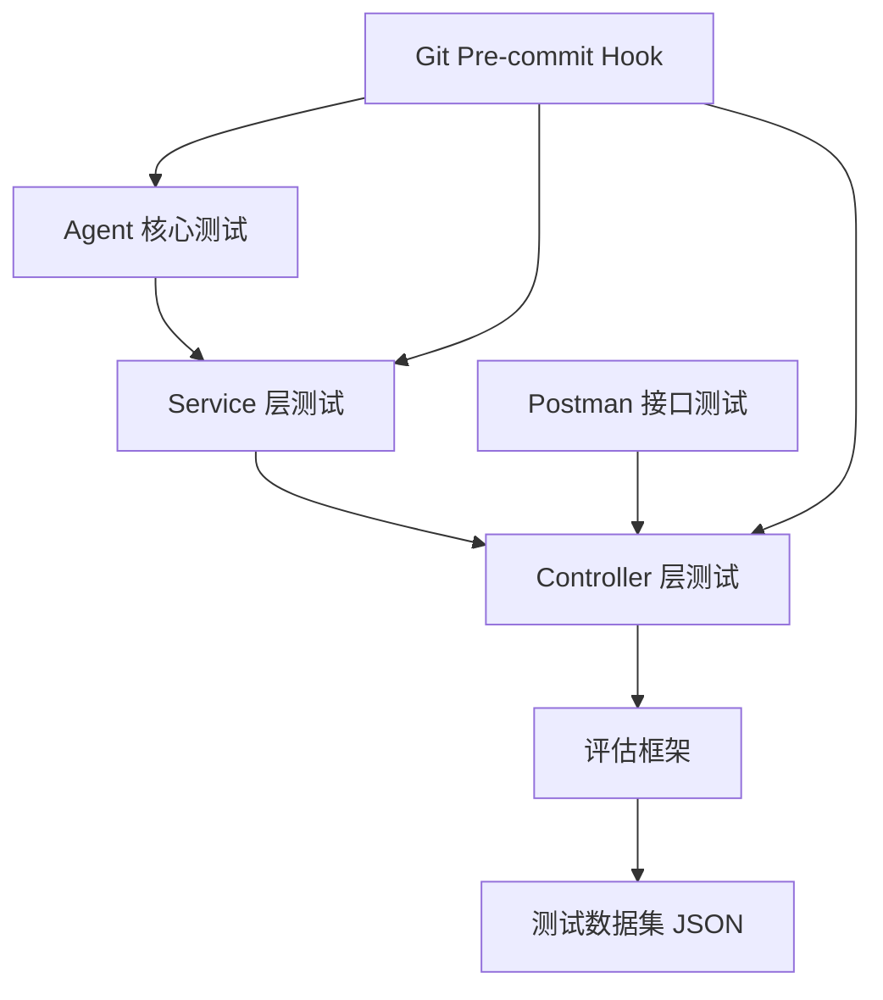
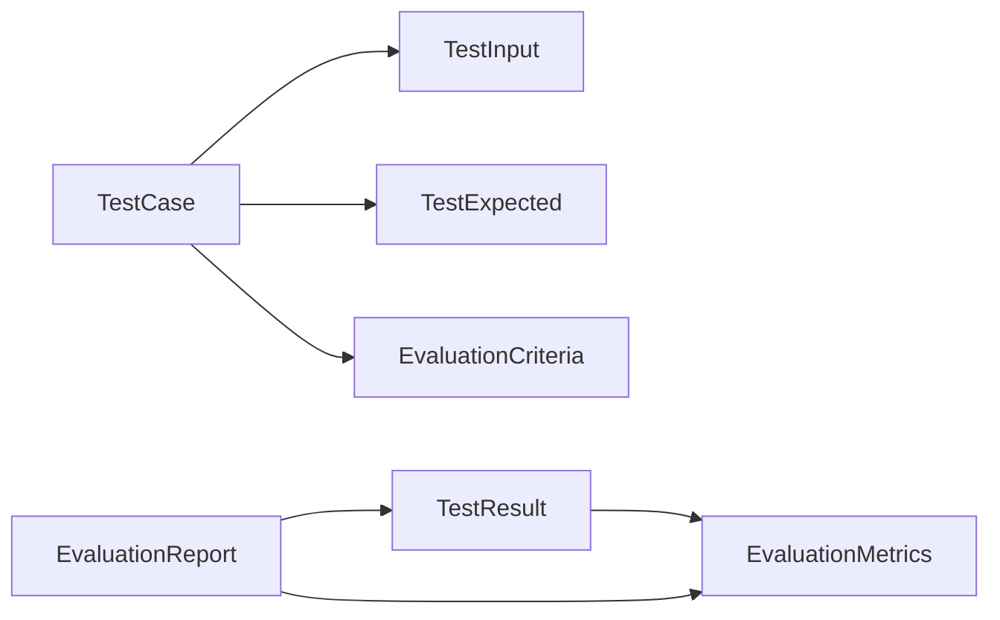
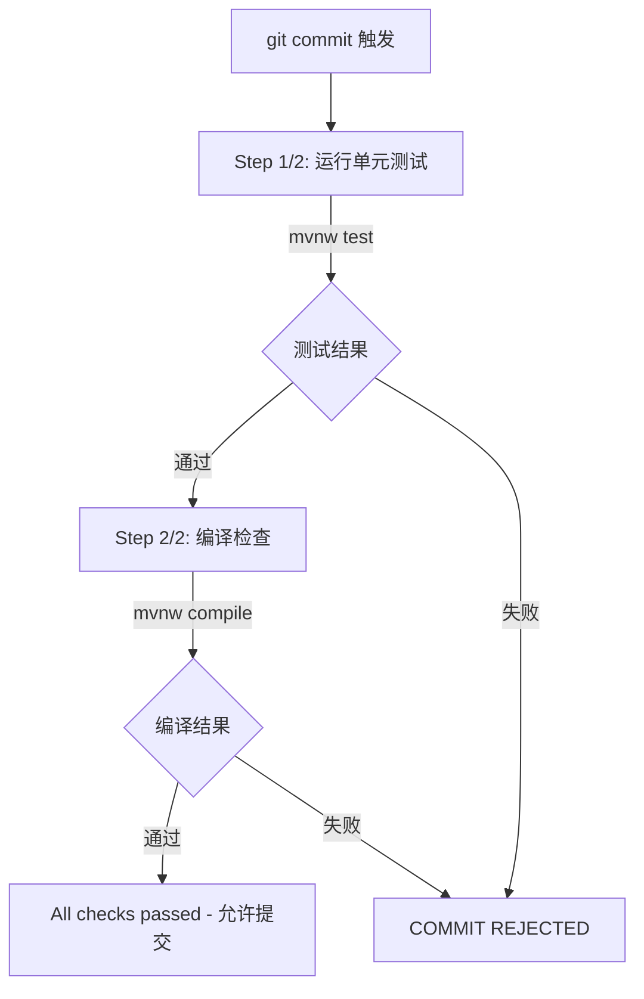

# JChatMind 测试代码详细解析

## 1. 测试体系总览

### 1.1 测试架构层次图



### 1.2 技术栈说明

| 技术组件 | 版本/说明 | 用途 |
|---------|----------|------|
| JUnit 5 | Spring Boot Starter Test 内置 | 测试框架核心 |
| Mockito | 5.2.0 (mockito-inline) | Mock 对象与行为验证 |
| MockMvc | Spring Test 内置 | Controller 层 HTTP 模拟测试 |
| Spring Boot Test | `@WebMvcTest` | 轻量级 Web 层集成测试 |
| H2 Database | test scope | 内存数据库（测试环境） |
| Jackson | Spring Boot 内置 | JSON 序列化/反序列化 |
| Lombok | 编译期注解 | 简化测试数据构建 |

### 1.3 文件统计表

| 测试文件 | 路径 | 行数 | 测试用例数 | 覆盖模块 |
|---------|------|------|-----------|---------|
| JChatMindTest.java | agent/ | 667 | 20 | Agent 核心运行逻辑 |
| JChatMindFactoryTest.java | agent/ | 443 | 12 | Agent 工厂创建 |
| AgentFacadeServiceTest.java | service/ | 229 | 8 | Agent CRUD |
| ChatMessageFacadeServiceTest.java | service/ | 229 | 8 | 聊天消息 CRUD |
| ChatSessionFacadeServiceTest.java | service/ | 218 | 9 | 聊天会话 CRUD |
| DocumentFacadeServiceTest.java | service/ | 215 | 7 | 文档管理 |
| KnowledgeBaseFacadeServiceTest.java | service/ | 164 | 6 | 知识库管理 |
| RagServiceTest.java | service/ | 155 | 7 | RAG 检索服务 |
| SseServiceTest.java | service/ | 181 | 8 | SSE 推送服务 |
| AgentControllerTest.java | controller/ | 191 | 9 | Agent API |
| ChatMessageControllerTest.java | controller/ | 193 | 9 | 消息 API |
| ChatSessionControllerTest.java | controller/ | 199 | 11 | 会话 API |
| DocumentControllerTest.java | controller/ | 201 | 10 | 文档 API |
| KnowledgeBaseControllerTest.java | controller/ | 175 | 9 | 知识库 API |
| SseControllerTest.java | controller/ | 74 | 5 | SSE 连接 API |
| ToolControllerTest.java | controller/ | 89 | 3 | 工具列表 API |
| AgentEvaluationTest.java | evaluation/ | 387 | 9 | 评估框架集成 |
| **合计** | — | **~4000** | **~150** | — |

---

## 2. Agent 核心测试解析

### 2.1 JChatMindTest.java

#### 类结构与注解说明

```java
@ExtendWith(MockitoExtension.class)    // 启用 Mockito 扩展
@MockitoSettings(strictness = Strictness.LENIENT)  // 宽松模式，允许未使用的 stub
class JChatMindTest {
```

- `@ExtendWith(MockitoExtension.class)`：JUnit 5 与 Mockito 集成
- `@MockitoSettings(strictness = Strictness.LENIENT)`：避免"unnecessary stubbing"异常，适用于多测试方法共享 setUp 的场景

#### Mock 对象清单及用途

| Mock 对象 | 类型 | 特殊配置 | 用途 |
|----------|------|---------|------|
| chatClient | ChatClient | `RETURNS_DEEP_STUBS` | 模拟 AI 模型调用链 |
| sseService | SseService | — | 模拟 SSE 推送 |
| chatMessageFacadeService | ChatMessageFacadeService | — | 模拟消息持久化 |
| chatMessageConverter | ChatMessageConverter | — | 模拟 DTO→VO 转换 |
| toolCallingManager | ToolCallingManager | — | 模拟工具执行 |

> `RETURNS_DEEP_STUBS` 使得 `chatClient.prompt().system().toolCallbacks().call().chatClientResponse().chatResponse()` 整条链式调用可以被一次性 mock。

#### setUp() 方法解析

```java
@BeforeEach
void setUp() {
    agent = new JChatMind(
            AGENT_ID, "TestAgent", "Test Description", SYSTEM_PROMPT,
            chatClient, 20, new ArrayList<>(), new ArrayList<>(),
            new ArrayList<>(), SESSION_ID, sseService,
            chatMessageFacadeService, chatMessageConverter
    );
    // 通过反射替换内部创建的 toolCallingManager
    ReflectionTestUtils.setField(agent, "toolCallingManager", toolCallingManager);
}
```

关键点：
1. 直接构造 `JChatMind` 实例，最大迭代次数设为 20
2. 使用 `ReflectionTestUtils.setField` 将内部的 `toolCallingManager` 替换为 mock，实现对工具执行的完全控制

#### 测试方法详细列表

| # | 方法名 | 测试目标 | 关键断言 |
|---|--------|---------|---------|
| 1 | testRunBasicChat_NoToolCalls | 无工具调用的基本聊天 | 状态=FINISHED；toolCallingManager 从未调用 |
| 2 | testRunWithSingleToolCall | 单次工具调用 | 状态=FINISHED；executeToolCalls 调用 1 次 |
| 3 | testRunWithMultipleToolCalls | 多个工具调用（一次响应包含多个） | createChatMessage 至少调用 3 次 |
| 4 | testRunWithChainedToolCalls | 链式工具调用（多轮 think-execute） | executeToolCalls 调用 2 次 |
| 5 | testRunMaxIterationsReached | 达到最大迭代次数后停止 | executeToolCalls 调用恰好 20 次 |
| 6 | testRunStateTransition_IdleToFinished | 状态转换 IDLE→FINISHED | 初始=IDLE，结束=FINISHED |
| 7 | testRunStateTransition_IdleToError | 异常时状态转为 ERROR | 抛出 RuntimeException；状态=ERROR |
| 8 | testThinkReturnsNoToolCalls | think 无工具调用→循环立即结束 | toolCallingManager 从未调用 |
| 9 | testThinkReturnsToolCalls | think 有工具调用→进入 execute | executeToolCalls 调用 1 次 |
| 10 | testExecuteToolSuccess | 工具执行成功 | 状态=FINISHED |
| 11 | testExecuteToolException | 工具执行抛异常 | 状态=ERROR |
| 12 | testExecuteToolTimeout | 工具执行超时 | 状态=ERROR；异常包含"timed out" |
| 13 | testSaveMessageSuccess | 消息成功保存 | createChatMessage 至少调用 1 次 |
| 14 | testSaveMessageFailure | 消息保存失败导致 ERROR | 状态=ERROR |
| 15 | testRefreshPendingMessages | SSE 推送被正确调用 | sseService.send 至少调用 1 次 |
| 16 | testTerminateToolStopsLoop | Terminate 工具终止循环 | executeToolCalls 仅调用 1 次 |
| 17 | testEmptyUserInput | 空用户输入处理 | 状态=FINISHED |
| 18 | testVeryLongUserInput | 超长用户输入（10000字符） | 状态=FINISHED |
| 19 | testChatClientReturnsNull | AI 模型返回 null | 状态=ERROR |
| 20 | testChatClientThrowsException | AI 模型调用抛异常 | 异常包含"Error running agent" |

#### 重点解析：think-execute 循环测试

**测试 #4 链式工具调用** 验证 Agent 的核心 think-execute 循环：

```java
// 模拟 3 轮调用：工具调用→工具调用→最终回复
when(chatClient.prompt(...).call()...chatResponse())
    .thenReturn(toolCallResponse)   // 第1轮: think返回工具调用
    .thenReturn(toolCallResponse)   // 第2轮: think返回工具调用
    .thenReturn(finalResponse);     // 第3轮: think返回最终回复

// 验证 execute 被调用了 2 次（前两轮有工具调用）
verify(toolCallingManager, times(2)).executeToolCalls(any(), any());
```

**测试 #5 最大迭代限制** 验证安全阈值：

```java
// think 总是返回工具调用（无限循环场景）
when(...).thenReturn(toolCallResponse);
agent.run();
// 验证恰好在 20 次（MAX_STEPS）后停止
verify(toolCallingManager, times(20)).executeToolCalls(any(), any());
```

### 2.2 JChatMindFactoryTest.java

#### 类结构与 Mock 对象

```java
@ExtendWith(MockitoExtension.class)
@MockitoSettings(strictness = Strictness.LENIENT)
class JChatMindFactoryTest {
```

Mock 对象共 10 个：`chatClientRegistry`、`sseService`、`agentMapper`、`agentConverter`、`knowledgeBaseMapper`、`knowledgeBaseConverter`、`toolFacadeService`、`chatMessageFacadeService`、`chatMessageConverter`、`chatClient`。

#### 测试方法详细列表

| # | 方法名 | 测试目标 | 关键断言 |
|---|--------|---------|---------|
| 1 | testCreateAgent_Success | 正常创建 Agent 运行时 | result 不为 null；各 mapper 被调用 |
| 2 | testCreateAgent_AgentNotFound | Agent ID 不存在 | 抛出 Exception |
| 3 | testLoadMemory_WithHistory | 有历史消息时加载到 ChatMemory | getChatMessagesBySessionIdRecently 被调用 |
| 4 | testLoadMemory_Empty | 无历史消息时 ChatMemory 为空 | result 不为 null |
| 5 | testResolveTools_FixedOnly | 无可选工具时只有固定工具 | getOptionalTools 从未调用 |
| 6 | testResolveTools_WithOptionalTools | 配置了可选工具 | getOptionalTools 被调用 |
| 7 | testResolveTools_WithKnowledgeTools | 配置了知识库 | knowledgeBaseMapper.selectByIdBatch 被调用 |
| 8 | testBuildToolCallbacks | ToolCallback 列表正确构建 | chatClientRegistry.get 被调用 |
| 9 | testResolveKnowledgeBases_NoneConfigured | 无知识库配置 | selectByIdBatch 从未调用 |
| 10 | testInvalidModel | 无效模型名 | 抛出 IllegalStateException |
| 11 | testNullSystemPrompt | 空系统提示词 | 正常创建不报错 |
| 12 | testChatOptionsDefault | 默认聊天选项 | temperature=0.7, topP=1.0, messageLength=10 |

---

## 3. Service 层测试解析

### 3.1 通用测试模式

所有 Service 层测试使用 `@InjectMocks + @Mock` 模式：

```java
@ExtendWith(MockitoExtension.class)
class XxxFacadeServiceTest {
    @Mock private XxxMapper mapper;
    @Mock private XxxConverter converter;
    @InjectMocks private XxxFacadeServiceImpl service;
}
```

### 3.2 AgentFacadeServiceTest (8 个测试)

| 方法名 | 测试目标 | 关键断言 |
|--------|---------|---------|
| testGetAgents_Success | 查询 Agent 列表 | 返回 2 个 Agent |
| testGetAgents_Empty | 空列表 | 返回 0 个 |
| testCreateAgent_Success | 创建 Agent | agentId = "generated-id" |
| testCreateAgent_InsertFails | 插入失败 | 抛出 BizException("创建 agent 失败") |
| testDeleteAgent_Success | 删除 Agent | mapper.deleteById 被调用 |
| testDeleteAgent_NotFound | 删除不存在 | 抛出 BizException("Agent 不存在") |
| testUpdateAgent_Success | 更新 Agent | mapper.updateById 被调用 |
| testUpdateAgent_NotFound | 更新不存在 | 抛出 BizException("Agent 不存在") |

### 3.3 ChatMessageFacadeServiceTest (8 个测试)

| 方法名 | 测试目标 | 关键断言 |
|--------|---------|---------|
| testGetChatMessagesBySessionId_Success | 按会话查消息 | 返回 2 条消息 |
| testGetChatMessagesBySessionId_Empty | 空消息列表 | 返回 0 条 |
| testGetChatMessagesBySessionIdRecently | 查近期消息 | selectBySessionIdRecently 被调用 |
| testCreateChatMessage_Success | 创建消息 | publisher.publishEvent 被调用 |
| testCreateChatMessage_InsertFails | 插入失败 | 抛出 BizException("创建聊天消息失败") |
| testDeleteChatMessage_Success | 删除消息 | mapper.deleteById 被调用 |
| testUpdateChatMessage_Success | 更新消息 | mapper.updateById 被调用 |
| testUpdateChatMessage_NotFound | 更新不存在 | 抛出 BizException("聊天消息不存在") |

### 3.4 ChatSessionFacadeServiceTest (9 个测试)

| 方法名 | 测试目标 | 关键断言 |
|--------|---------|---------|
| testGetChatSessions_Success | 查询会话列表 | 返回 2 个会话 |
| testGetChatSessions_Empty | 空列表 | 返回 0 个 |
| testGetChatSessionById_Success | 按 ID 查会话 | title = "Test Session" |
| testGetChatSessionById_NotFound | 查不存在 | 抛出 BizException("聊天会话不存在") |
| testGetChatSessionsByAgentId_Success | 按 Agent 查会话 | agentId 匹配 |
| testCreateChatSession_Success | 创建会话 | chatSessionId = "gen-session-id" |
| testDeleteChatSession_Success | 删除会话 | mapper.deleteById 被调用 |
| testUpdateChatSession_Success | 更新会话 | mapper.updateById 被调用 |
| testUpdateChatSession_NotFound | 更新不存在 | 抛出 BizException("聊天会话不存在") |

### 3.5 DocumentFacadeServiceTest (7 个测试)

特点：包含文件上传测试，使用 `MultipartFile` mock。

| 方法名 | 测试目标 | 关键断言 |
|--------|---------|---------|
| testGetDocuments_Success | 查询文档列表 | 返回 2 个文档 |
| testGetDocumentsByKbId_Success | 按知识库查文档 | filename 匹配 |
| testCreateDocument_Success | 创建文档记录 | documentId = "gen-doc-id" |
| testUploadDocument_Success | 上传文件 | documentStorageService.saveFile 被调用 |
| testDeleteDocument_Success | 删除文档 | mapper.deleteById 被调用 |
| testUpdateDocument_Success | 更新文档 | mapper.updateById 被调用 |

### 3.6 KnowledgeBaseFacadeServiceTest (6 个测试)

| 方法名 | 测试目标 | 关键断言 |
|--------|---------|---------|
| testGetKnowledgeBases_Success | 查询知识库列表 | 返回 2 个 |
| testGetKnowledgeBases_Empty | 空列表 | 返回 0 个 |
| testCreateKnowledgeBase_Success | 创建知识库 | knowledgeBaseId = "gen-kb-id" |
| testDeleteKnowledgeBase_Success | 删除知识库 | mapper.deleteById 被调用 |
| testUpdateKnowledgeBase_Success | 更新知识库 | mapper.updateById 被调用 |
| testUpdateKnowledgeBase_NotFound | 更新不存在 | 抛出 BizException("知识库不存在") |

### 3.7 SseServiceTest (8 个测试) — 并发测试重点

```java
@Test
void testConcurrentConnections() throws Exception {
    int threadCount = 10;
    CountDownLatch latch = new CountDownLatch(threadCount);
    ExecutorService executor = Executors.newFixedThreadPool(threadCount);
    for (int i = 0; i < threadCount; i++) {
        final int idx = i;
        executor.submit(() -> {
            try { sseService.connect("session-" + idx); }
            finally { latch.countDown(); }
        });
    }
    latch.await();
    // 验证 10 个并发连接全部成功
    assertEquals(threadCount, clients.size());
}
```

| 方法名 | 测试目标 | 关键断言 |
|--------|---------|---------|
| testConnect_Success | 连接成功 | clients 包含 session |
| testConnect_DuplicateSession | 重复连接替换旧 emitter | clients.size() = 1 |
| testSend_Success | 发送消息成功 | 不抛异常 |
| testSend_ClientNotFound | 客户端不存在 | 抛出 RuntimeException |
| testSend_EmitterCompleted | emitter 已完成 | 优雅处理 |
| testDisconnect_ViaCompletion | 完成后断开 | emitter 不为 null |
| testConcurrentConnections | **10 线程并发连接** | 全部成功注册 |
| testMultipleSessionsSendIndependently | 多会话独立发送 | 各自不抛异常 |

### 3.8 RagServiceTest (7 个测试) — 反射测试重点

```java
@Test
void testToPgVector_ViaReflection() throws Exception {
    Method toPgVector = RagServiceImpl.class.getDeclaredMethod("toPgVector", float[].class);
    toPgVector.setAccessible(true);
    float[] vector = {0.1f, 0.2f, 0.3f};
    String result = (String) toPgVector.invoke(ragService, vector);
    assertTrue(result.startsWith("["));
    assertTrue(result.contains("0.1"));
}
```

| 方法名 | 测试目标 | 关键断言 |
|--------|---------|---------|
| testServiceInitialization | 服务初始化 | ragService 不为 null |
| testSimilaritySearch_MapperWithResults | 相似度搜索有结果 | 返回 2 条 |
| testSimilaritySearch_NoResults | 无结果 | 返回空列表 |
| testSimilaritySearch_EmptyQuery | 空查询 | 返回空列表 |
| testSimilaritySearch_MultipleDocuments | 跨文档搜索 | docId 分别匹配 |
| testSimilaritySearch_LargeResultSet | 大结果集 | 返回 3 条 |
| testToPgVector_ViaReflection | **反射测试私有方法** | 格式正确 "[0.1,0.2,0.3]" |

---

## 4. Controller 层测试解析

### 4.1 @WebMvcTest 模式说明

所有 Controller 测试使用 `@WebMvcTest` 注解，仅加载指定 Controller 和相关配置：

```java
@WebMvcTest(AgentController.class)
class AgentControllerTest {
    @Autowired private MockMvc mockMvc;
    @Autowired private ObjectMapper objectMapper;
    @MockitoBean private AgentFacadeService agentFacadeService;
}
```

- `@MockitoBean`：Spring Boot 3.x 替代 `@MockBean` 的新注解
- MockMvc 使用 `perform + andExpect` 链式断言

### 4.2 AgentControllerTest (9 个测试)

| 方法名 | HTTP 方法 | 测试目标 | 关键断言 |
|--------|----------|---------|---------|
| testGetAgents_Success | GET /api/agents | 获取列表成功 | code=200, agents 数组 |
| testGetAgents_Empty | GET /api/agents | 空列表 | agents 为空数组 |
| testCreateAgent_Success | POST /api/agents | 创建成功 | agentId="agent-new" |
| testCreateAgent_InvalidRequest | POST /api/agents | 无效请求 | code=500 |
| testCreateAgent_MissingName | POST /api/agents | 缺少名称 | "Agent name is required" |
| testDeleteAgent_Success | DELETE /api/agents/{id} | 删除成功 | code=200 |
| testDeleteAgent_NotFound | DELETE /api/agents/{id} | 不存在 | code=500 |
| testUpdateAgent_Success | PATCH /api/agents/{id} | 更新成功 | code=200 |
| testUpdateAgent_NotFound | PATCH /api/agents/{id} | 不存在 | code=500 |

### 4.3 ChatMessageControllerTest (9 个测试)

| 方法名 | HTTP 方法 | 测试目标 | 关键断言 |
|--------|----------|---------|---------|
| testGetChatMessages_Success | GET /api/chat-messages/session/{id} | 查询消息 | content="Hello" |
| testGetChatMessages_Empty | GET | 空列表 | chatMessages 为空 |
| testCreateChatMessage_Success | POST /api/chat-messages | 创建消息 | chatMessageId="msg-new" |
| testCreateChatMessage_InvalidRequest | POST | 无效请求 | code=500 |
| testCreateChatMessage_MissingSessionId | POST | 缺少 sessionId | code=500 |
| testDeleteChatMessage_Success | DELETE | 删除成功 | code=200 |
| testDeleteChatMessage_NotFound | DELETE | 不存在 | code=500 |
| testUpdateChatMessage_Success | PATCH | 更新成功 | code=200 |
| testUpdateChatMessage_EmptyContent | PATCH | 空内容 | code=500 |

### 4.4 ChatSessionControllerTest (11 个测试)

覆盖全部 CRUD + 按 AgentId 查询，包含 11 个测试用例，是 Controller 层测试最多的文件。

### 4.5 DocumentControllerTest — 文件上传测试重点

```java
@Test
void testUploadDocument_Success() throws Exception {
    MockMultipartFile file = new MockMultipartFile(
            "file", "upload.pdf", "application/pdf", "file content".getBytes());
    mockMvc.perform(multipart("/api/documents/upload")
                    .file(file)
                    .param("kbId", "kb-1"))
            .andExpect(status().isOk())
            .andExpect(jsonPath("$.data.documentId").value("doc-uploaded"));
}
```

### 4.6 SseControllerTest (5 个测试)

| 方法名 | 测试目标 | 关键断言 |
|--------|---------|---------|
| testConnect_Success | SSE 连接成功 | status=200 |
| testConnect_InvalidSessionId | 无效 sessionId | code=500 |
| testConnect_ReturnsMediaTypeEventStream | 返回 SSE 媒体类型 | status=200 |
| testConnect_ServiceException | 服务异常 | "服务器内部错误" |
| testConnect_EmptySessionId | 空 sessionId | status=404 |

### 4.7 ToolControllerTest (3 个测试)

使用匿名内部类实现 `Tool` 接口进行 mock。

### 4.8 异常处理验证

Controller 测试统一验证 `BizException → GlobalExceptionHandler` 的处理链：

```java
// Service 抛出 BizException
doThrow(new BizException("Agent not found")).when(service).deleteAgent("non-existent");
// Controller 返回统一格式
mockMvc.perform(delete("/api/agents/{agentId}", "non-existent"))
    .andExpect(jsonPath("$.code").value(500))
    .andExpect(jsonPath("$.message").value("Agent not found"));
```

---

## 5. 评估框架解析

### 5.1 数据模型



**TestCase** 结构：

| 字段 | 类型 | 说明 |
|------|------|------|
| id | String | 用例 ID（如 TC-ST-001） |
| name | String | 用例名称 |
| category | String | 分类（single_turn, multi_turn 等） |
| input | TestInput | 输入（userMessage, conversationHistory, availableTools, knowledgeBase） |
| expected | TestExpected | 期望（shouldCallTool, expectedKeywords, shouldContain, shouldNotContain） |
| evaluationCriteria | EvaluationCriteria | 评估标准（accuracyWeight, hallucinationCheck） |

**TestResult** 结构：`testCaseId`, `category`, `passed`, `accuracyScore`, `hallucinationDetected`, `actualResponse`, `responseTimeMs`, `notes`

**EvaluationMetrics** 结构：`accuracyRate`, `hallucinationRate`, `toolCallingSuccessRate`, `relevanceScore`, `avgResponseTimeMs`, `totalCases`, `passedCases`, `failedCases`

### 5.2 TestCaseLoader 的 JSON 加载机制

```java
public class TestCaseLoader {
    private static final String TESTCASES_DIR = "testcases/";
    private static final String[] TEST_FILES = {
        "single_turn_cases.json", "multi_turn_cases.json",
        "tool_calling_normal_cases.json", "tool_calling_exception_cases.json",
        "rag_retrieval_cases.json", "rag_quality_cases.json", "edge_cases.json"
    };

    public List<TestCase> loadAll() {
        // 从 classpath 加载 7 个 JSON 文件，解析 testCases 数组
        // 自动设置 category 字段
    }
    public List<TestCase> loadByCategory(String category) { ... }
}
```

加载流程：`classpath:testcases/*.json` → `JsonNode` → `List<TestCase>` → 设置 category

### 5.3 评估算法

#### AccuracyEvaluator — 综合评估（权重 40%/40%/20%）

```java
public double evaluate(TestCase testCase, String actualResponse, boolean toolCalled, String toolName) {
    double keywordScore = evaluateByKeywords(actualResponse, expected.getExpectedKeywords());   // 40%
    double containScore = evaluateByContainRules(actualResponse, shouldContain, shouldNotContain); // 40%
    boolean toolCorrect = evaluateToolCalling(toolCalled, expected.isShouldCallTool(), ...);      // 20%
    double score = (keywordScore * 0.4 + containScore * 0.4 + (toolCorrect ? 1.0 : 0.0) * 0.2) * weight;
    return Math.min(1.0, Math.max(0.0, score));
}
```

| 评估维度 | 权重 | 算法 |
|---------|------|------|
| 关键词匹配 | 40% | expectedKeywords 中匹配数 / 总数 |
| 内容规则 | 40% | shouldContain + shouldNotContain 通过率 |
| 工具调用 | 20% | 是否调用 + 工具名称是否正确 |

#### HallucinationDetector — 幻觉检测

三种检测策略：

1. **禁止内容检测** `detectByForbiddenContent`：检查回复是否包含 shouldNotContain 中的内容
2. **知识库范围检测** `detectByKnowledgeScope`：将回复分句，检查每句的关键词是否在知识库中有对应；超过 50% 无支持则判定为幻觉
3. **事实核查** `detectFactualError`：基于 factMap 检查事实性错误

```java
// 幻觉率计算
public double calculateHallucinationRate(List<TestResult> results) {
    long hallucinationCount = results.stream()
        .filter(TestResult::isHallucinationDetected).count();
    return (double) hallucinationCount / results.size();
}
```

### 5.4 EvaluationReport — 报告生成

**评估基线定义：**

| 指标 | 基线阈值 |
|------|---------|
| 单轮对话准确率 | ≥ 90% |
| 多轮对话准确率 | ≥ 85% |
| RAG 问答准确率 | ≥ 80% |
| 工具调用成功率 | ≥ 95% |
| 无知识库幻觉率 | < 15% |
| 有知识库幻觉率 | < 5% |

**报告格式：**
```
============================================================
         JChatMind Agent 评估报告
============================================================
【总体指标】
  总用例数: 110
  通过数: 105
  失败数: 5
  准确率: 95.45%
  幻觉率: 1.82%
  工具调用成功率: 100.00%
  平均响应时间: 5ms
【分类别指标】
  [single_turn] 通过 20/20, 准确率 100.00%, 幻觉率 0.00%
  ...
【基线检查】
  总体达标: 是 ✓
【失败用例】
  - [TC-XX-001] category | 得分: 0.50 | 幻觉: 否 | 备注: ...
============================================================
```

### 5.5 AgentEvaluationTest

#### Mock 响应映射策略

`AgentEvaluationTest` 在 `@BeforeAll` 中初始化 200+ 条预定义 mock 响应，覆盖全部 110 个测试用例：

```java
private final Map<String, String> mockResponses = new HashMap<>();
private final Map<String, MockToolResult> mockToolResults = new HashMap<>();

void initMockResponses() {
    // 单轮对话 20 条
    mockResponses.put("TC-ST-001", "你好！很高兴见到你...");
    // 多轮对话 20 条
    mockResponses.put("TC-MT-001", "日本的首都是东京...");
    // 工具调用正常 15 条 + 工具调用异常 15 条
    mockResponses.put("TC-TN-001", "深圳今天天气：晴转多云...");
    mockToolResults.put("TC-TN-001", new MockToolResult(true, "weather"));
    // RAG 检索 15 条 + RAG 质量 15 条
    // 边界场景 10 条
}
```

#### 测试方法详解

| 方法名 | 测试目标 | 关键断言 |
|--------|---------|---------|
| testTotalTestCaseCount | 用例总数校验 | ≥ 110 |
| testSingleTurnAccuracy | 单轮对话准确率 | ≥ 90% |
| testMultiTurnAccuracy | 多轮对话准确率 | ≥ 85% |
| testToolCallingSuccess | 工具调用成功率 | ≥ 95% |
| testToolCallingExceptionHandling | 工具异常处理 | 每个用例有响应 |
| testRagRetrievalAccuracy | RAG 检索准确率 | ≥ 80% |
| testRagHallucinationRate | RAG 幻觉率 | < 5% |
| testEdgeCases | 边界用例 | 不抛异常 |
| testOverallEvaluationBaseline | 整体基线达标 | meetsBaseline() = true |
| testEvaluationReportGeneration | 报告生成 | 包含"评估报告"、"总用例数"、"准确率" |

---

## 6. 测试数据集解析

### 6.1 JSON 文件结构

每个 JSON 文件统一结构：

```json
{
  "category": "single_turn",
  "description": "...",
  "testCases": [
    {
      "id": "TC-ST-001",
      "name": "简单问候-你好",
      "description": "...",
      "input": { "userMessage": "...", "conversationHistory": [], "availableTools": [], "knowledgeBase": null },
      "expected": { "shouldCallTool": false, "expectedKeywords": [...], "shouldContain": [...], "shouldNotContain": [...] },
      "evaluationCriteria": { "accuracyWeight": 1.0, "hallucinationCheck": false, "relevanceCheck": true }
    }
  ]
}
```

### 6.2 各文件内容分析

| 文件 | 分类 | 用例数 | ID 范围 | 覆盖场景 |
|------|------|--------|---------|---------|
| single_turn_cases.json | single_turn | 20 | TC-ST-001~020 | 问候、知识问答、指令理解、拒绝不当请求、模糊问题、长文本理解 |
| multi_turn_cases.json | multi_turn | 20 | TC-MT-001~020 | 上下文保持、指代消解、话题切换、多轮修正、记忆衰减、信息积累 |
| tool_calling_normal_cases.json | tool_calling_normal | 15 | TC-TN-001~015 | 单工具调用、多工具调用、链式调用、参数推理、关键词误触 |
| tool_calling_exception_cases.json | tool_calling_exception | 15 | TC-TE-001~015 | 不存在的工具、工具超时、工具返回异常、网络错误、重试机制 |
| rag_retrieval_cases.json | rag_retrieval | 15 | TC-RR-001~015 | 精确匹配、模糊匹配、无结果、跨文档检索、多知识库、内容冲突 |
| rag_quality_cases.json | rag_quality | 15 | TC-RQ-001~015 | 精确引用、信息不存在、部分信息缺失、复杂问题、技术问题 |
| edge_cases.json | edge_cases | 10 | TC-EC-001~010 | 空输入、超长输入、SQL注入、XSS攻击、并发、超时、多语言混合 |

**代表性用例示例：**

- **TC-ST-004** "秦始皇统一六国是哪一年？" — 知识问答，期望关键词：["公元前221年", "秦始皇", "六国"]
- **TC-MT-003** 多轮追问后指代消解 — 需理解"第二本"指上文推荐的书
- **TC-TN-010** "我这里的天气怎么样？" — 链式调用 getCity → weather
- **TC-TE-007** 工具超时场景 — 期望优雅处理超时错误
- **TC-RR-015** 知识库内容冲突 — 期望提示信息不一致

### 6.3 用例统计总表

| 类别 | 用例数 | 占比 |
|------|--------|------|
| 单轮对话 | 20 | 18.2% |
| 多轮对话 | 20 | 18.2% |
| 工具调用正常 | 15 | 13.6% |
| 工具调用异常 | 15 | 13.6% |
| RAG 检索 | 15 | 13.6% |
| RAG 质量 | 15 | 13.6% |
| 边界场景 | 10 | 9.1% |
| **总计** | **110** | **100%** |

---

## 7. Postman 接口测试集解析

### 7.1 Collection 结构

Collection 名称：**JChatMind API**，包含以下 Folder：

| Folder | 请求数 | 覆盖端点 |
|--------|--------|---------|
| Health Check | 1 | GET /health |
| Agent Management | 4 | GET/POST/PATCH/DELETE /api/agents |
| Chat Sessions | 6 | GET/POST/PATCH/DELETE /api/chat-sessions |
| Chat Messages | 6 | GET/POST/PATCH/DELETE /api/chat-messages |
| Knowledge Bases | 4 | GET/POST/PATCH/DELETE /api/knowledge-bases |
| Documents | 5 | GET/POST/PATCH/DELETE/Upload /api/documents |
| Tools | 1 | GET /api/tools |
| SSE Streaming | 2 | GET /sse/connect, SSE 断点续传 |
| E2E Integration | 1 | 端到端集成流程 |

### 7.2 环境变量

```json
{ "key": "baseUrl", "value": "http://localhost:8080" },
{ "key": "agentId", "value": "" },
{ "key": "chatSessionId", "value": "" },
{ "key": "chatMessageId", "value": "" },
{ "key": "knowledgeBaseId", "value": "" },
{ "key": "documentId", "value": "" }
```

变量在创建请求的 Test 脚本中自动提取并设置（如 `pm.collectionVariables.set('agentId', ...)`），供后续请求引用。

### 7.3 测试断言类型和代码示例

```javascript
// 1. 状态码检查
pm.test('Status code is 200', function () { pm.response.to.have.status(200); });

// 2. 响应体结构检查
pm.test('Response has code field', function () { pm.expect(jsonData).to.have.property('code'); });
pm.test('Data has agents array', function () { pm.expect(jsonData.data).to.have.property('agents'); });

// 3. 响应时间检查
pm.test('Response time < 2000ms', function () { pm.expect(pm.response.responseTime).to.be.below(2000); });

// 4. 变量提取与传递
if (jsonData.data && jsonData.data.agentId) {
    pm.collectionVariables.set('agentId', jsonData.data.agentId);
}
```

### 7.4 E2E 集成测试流程

```
创建 Agent → 创建 Session → 发送消息 → SSE 连接 → 接收 AI 回复 → 清理资源
```

### 7.5 SSE 断点续传测试方案

1. 建立 SSE 连接 `GET /sse/connect/{chatSessionId}`
2. 发送聊天消息触发 AI 回复
3. 中断连接
4. 重新连接，验证消息恢复

---

## 8. Git Pre-commit Hook 解析

### 8.1 Hook 触发机制

位置：`.githooks/pre-commit`，需通过 `git config core.hooksPath .githooks` 配置。

### 8.2 检查流程



### 8.3 核心代码

```bash
#!/bin/sh
# 1. 运行单元测试
cd "$PROJECT_DIR/jchatmind"
if [ -f "./mvnw" ]; then
    ./mvnw test -q --no-transfer-progress 2>&1
else
    mvn test -q --no-transfer-progress 2>&1
fi
TEST_RESULT=$?
if [ $TEST_RESULT -ne 0 ]; then
    echo " COMMIT REJECTED: Unit tests failed!"
    exit 1
fi

# 2. 编译检查
if [ -f "./mvnw" ]; then
    ./mvnw compile -q --no-transfer-progress 2>&1
fi
```

### 8.4 跨平台测试脚本

| 脚本 | 平台 | 功能 |
|------|------|------|
| `scripts/run-tests.cmd` | Windows | 调用 `mvnw.cmd test`，显示成功/失败 |
| `scripts/run-tests.sh` | Unix/Mac | 调用 `./mvnw test`，显示成功/失败 |

两个脚本逻辑一致：优先使用 Maven Wrapper，失败时回退到系统 `mvn`。

---

## 9. 测试依赖配置

### pom.xml 测试依赖

```xml
<!-- Spring Boot 测试核心（JUnit 5 + MockMvc + Spring Test） -->
<dependency>
    <groupId>org.springframework.boot</groupId>
    <artifactId>spring-boot-starter-test</artifactId>
    <scope>test</scope>
</dependency>

<!-- Mockito Inline（支持 final 类、static 方法 mock） -->
<dependency>
    <groupId>org.mockito</groupId>
    <artifactId>mockito-inline</artifactId>
    <version>5.2.0</version>
    <scope>test</scope>
</dependency>

<!-- H2 内存数据库（测试环境替代 PostgreSQL） -->
<dependency>
    <groupId>com.h2database</groupId>
    <artifactId>h2</artifactId>
    <scope>test</scope>
</dependency>
```

| 依赖 | 作用 |
|------|------|
| spring-boot-starter-test | 包含 JUnit 5、Mockito、MockMvc、AssertJ、Hamcrest 等 |
| mockito-inline | 支持 mock final 类和 static 方法，DEEP_STUBS 链式调用 |
| h2 | 测试时使用内存数据库，无需外部数据库 |
